# 🛠️ AgenTools

<p align="center">
  <b>Meta-Framework for Building AI-Powered Workflows with pydantic-ai</b><br>
  <i>From simple tools to complex state-driven workflows - all with type safety and composability</i>
</p>

<p align="center">
  <a href="https://github.com/fblgit/agentools"></a>
  <a href="https://github.com/fblgit/agentools/blob/main/LICENSE"></a>
  <a href="https://pypi.org/project/agentools/"></a>
</p>

---

## 📋 Table of Contents

- [Overview](#overview)
- [Quick Start](#quick-start)
- [Architecture](#architecture)
  - [AgenTool Framework](#1-agentool-framework)
  - [AgenToolkit Collections](#2-agentoolkit-collections)
  - [GraphToolkit Meta-Framework](#3-graphtoolkit-meta-framework)
  - [UI Components](#4-ui-components)
- [Installation](#installation)
- [Documentation](#documentation)
- [Examples](#examples)
- [Development](#development)
- [License](#license)

## Overview

AgenTools is a comprehensive meta-framework built on [pydantic-ai](https://github.com/pydantic/pydantic-ai) that provides a three-layer architecture for building AI-powered applications:
**01 October 2025 - Becomes a public project**

But what can you do with it? 
1. Automatically build tools from the UI, specify the need and it will design a cohesive solution of atomic tools adapted to agentoolkit architecture.
2. Build automatic tests, documentation from the tools
3. Create Agents/Workflows dynamically
and some more...

### 🎯 Three-Layer Architecture

1. **AgenTool Framework** - Core layer for creating type-safe, schema-driven tools with deterministic routing
2. **AgenToolkit Collections** - Pre-built, production-ready tool collections for common domains (auth, storage, HTTP, etc.)
3. **GraphToolkit Meta-Framework** - State-driven workflow engine for building complex, multi-phase AI workflows


### 💡 Key Benefits

- **Type Safety**: Full Pydantic validation throughout the stack
- **Composability**: Build complex systems from simple, reusable components
- **State-Driven**: Declarative workflow definitions with atomic node decomposition
- **Production Ready**: Comprehensive toolkits for common use cases
- **Visual Interface**: Streamlit UI for workflow visualization and monitoring
- **Extensible**: Easy to add new tools, toolkits, and workflow domains

### 🚀 Use Cases

- Building reliable AI agents with predictable behavior
- Creating multi-step workflows with complex state management
- Implementing production services with built-in auth, storage, and monitoring
- Rapid prototyping of AI-powered applications
- Testing and validating AI workflows with deterministic execution

## Quick Start

### Basic AgenTool Example

```python
from agentool import create_agentool, BaseOperationInput
from typing import Literal

# Define schema
class CalculatorInput(BaseOperationInput):
    operation: Literal['add', 'subtract']
    a: float
    b: float

# Create tool functions
async def add(ctx, a: float, b: float) -> dict:
    return {"result": a + b}

async def subtract(ctx, a: float, b: float) -> dict:
    return {"result": a - b}

# Create AgenTool
calculator = create_agentool(
    name='calculator',
    input_schema=CalculatorInput,
    routing_config={
        'operation_field': 'operation',
        'operation_map': {
            'add': ('add', lambda x: {'a': x.a, 'b': x.b}),
            'subtract': ('subtract', lambda x: {'a': x.a, 'b': x.b}),
        }
    },
    tools=[add, subtract]
)

# Use it
result = await calculator.run('{"operation": "add", "a": 10, "b": 5}')
print(result.output)  # {"result": 15}
```

### Using AgenToolkit

```python
from agentoolkit.storage.kv import create_storage_kv_agent

# Create a key-value storage agent
storage = create_storage_kv_agent()

# Store and retrieve data
await storage.run('{"operation": "set", "key": "user:123", "value": {"name": "Alice"}}')
result = await storage.run('{"operation": "get", "key": "user:123"}')
```

### GraphToolkit Workflow

```python
from graphtoolkit import create_domain_workflow

# Create a smoke test workflow with multiple phases
workflow = create_domain_workflow(
    domain='smoke',
    phases=['ingredient_analyzer', 'recipe_designer', 'recipe_crafter', 'recipe_evaluator']
)

# Run the workflow
result = await workflow.run(
    state=WorkflowState(
        task_description="Create a chocolate cake recipe",
        domain="smoke"
    )
)
```

## Architecture

### 1. AgenTool Framework

The foundation layer providing schema-driven tool execution with type safety.

**Key Features:**
- ✅ Schema-driven routing based on Pydantic models
- ✅ Type-safe parameter transformation
- ✅ Dependency injection for multi-agent systems
- ✅ Comprehensive error handling

**Components:**
- `BaseOperationInput` - Base schema for all tools
- `RoutingConfig` - Operation to tool mapping
- `AgenToolRegistry` - Global tool registration
- `AgenToolInjector` - Dependency injection system

#### How AgenTool Works - Execution Flow


#### Routing and Transformation Example

```mermaid
graph TB
    subgraph "Input Schema"
        INPUT["{<br/>'operation': 'add',<br/>'a': 10,<br/>'b': 5<br/>}"]
    end
    
    subgraph "Routing Config"
        RC["operation_map = {<br/>'add': ('add_tool', transform_fn),<br/>'subtract': ('sub_tool', transform_fn)<br/>}"]
    end
    
    subgraph "Transformation"
        INPUT --> EXTRACT["Extract: operation='add'"]
        EXTRACT --> LOOKUP["Lookup: 'add' → 'add_tool'"]
        LOOKUP --> TRANSFORM["Transform: {a: 10, b: 5}"]
    end
    
    subgraph "Tool Execution"
        TRANSFORM --> TOOL["add_tool(ctx, a=10, b=5)"]
        TOOL --> RESULT["{'result': 15}"]
    end
    
    style INPUT fill:#e3f2fd
    style RESULT fill:#c8e6c9
```



📚 [Architecture Guide](docs/architecture.md) | [API Reference](docs/api-reference.md) | [Dependency Injection](docs/agentool_dependency_injection.md)

### 2. AgenToolkit Collections

Pre-built, production-ready tool collections organized by domain.

**Available Toolkits:**

| Category | Toolkits | Description |
|----------|----------|-------------|
| **Storage** | `storage_fs`, `storage_kv`, `storage_vector` | File system, key-value, and vector storage |
| **Auth & Security** | `auth`, `session`, `crypto` | Authentication, sessions, encryption |
| **Network** | `http`, `webhook` | HTTP client and webhook handling |
| **System** | `config`, `logging`, `metrics`, `queue`, `scheduler` | System utilities and monitoring |
| **Data** | `templates`, `validation` | Data processing and validation |

#### Multi-Agent Interaction Pattern


📚 [Toolkit Catalog](docs/foundational-agentoolkits.md) | [Individual Toolkit Docs](docs/agentoolkits/)

### 3. GraphToolkit Meta-Framework

State-driven workflow engine for building complex, multi-phase AI workflows.

**Key Concepts:**
- **Atomic Node Decomposition** - Break complex phases into simple, retryable nodes
- **State-Driven Execution** - Workflows defined as data, not code
- **Universal Pattern** - `InputSchema → Variables → TemplateRender → LLM Call → OutputSchema → Storage`
- **Domain Agnostic** - Same engine for any domain (recipes, code generation, analysis, etc.)

**Architecture:**
```
Phase Definition (Data) → GenericPhaseNode → Atomic Node Chain → State Mutations
```

#### GraphToolkit Workflow Execution


#### State-Driven Node Chain Pattern


**Benefits:**
- 📊 95% less code compared to traditional approaches
- 🔄 Automatic retry handling for transient failures
- 📈 Fine-grained observability and metrics
- 🚀 Parallel execution support

📚 [Workflow System Guide](docs/workflow-graph-system.md) | [GraphToolkit Developer Guide](docs/GRAPHTOOLKIT_DEVELOPER_GUIDE.md) | [Node Catalog](docs/NODE_CATALOG.md)

### 4. UI Components

Modern Streamlit interface for workflow visualization and control.

**Features:**
- 📊 Real-time progress tracking
- 📝 Streaming AI responses
- 🎨 Artifact viewer with search
- 📈 Metrics dashboard
- 💾 Export functionality

**Running the UI:**
```bash
PYTHONPATH=src streamlit run src/ui/workflow_ui.py
```

📚 [UI Guide](src/ui/README.md)

## Installation

### Basic Installation

```bash
pip install agentools
```

### With Optional Dependencies

```bash
# Install with specific toolkits
pip install "agentools[storage,auth,http]"

# Install with all toolkits
pip install "agentools[all]"

# Development installation
git clone https://github.com/fblgit/agentools.git
cd agentools
pip install -e ".[dev,lint]"
```

### Available Extras

- `storage` - File system and key-value storage
- `auth` - Authentication and session management
- `crypto` - Cryptographic operations
- `http` - HTTP client functionality
- `templates` - Jinja2 template rendering
- `ui` - Streamlit UI components

## Documentation

### 📚 Core Documentation

| Document | Description |
|----------|-------------|
| [Architecture Overview](docs/architecture.md) | System design and components |
| [Creating AgenTools](docs/CRAFTING_AGENTOOLS.md) | Guide to building custom tools |
| [API Reference](docs/api-reference.md) | Detailed API documentation |
| [Integration Guide](docs/integration-guide.md) | Integration patterns |

### 🔧 GraphToolkit Documentation

| Document | Description |
|----------|-------------|
| [Workflow System](docs/workflow-graph-system.md) | Meta-framework overview |
| [Developer Guide](docs/GRAPHTOOLKIT_DEVELOPER_GUIDE.md) | Building with GraphToolkit |
| [Graph Architecture](docs/GRAPH_ARCHITECTURE.md) | Detailed architecture |
| [Node Catalog](docs/NODE_CATALOG.md) | Available atomic nodes |
| [Type Definitions](docs/GRAPH_TYPE_DEFINITIONS.md) | State and type system |
| [State Mutations](docs/STATE_MUTATIONS.md) | State management patterns |

### 🛠️ AgenToolkit Documentation

| Document | Description |
|----------|-------------|
| [Toolkit Overview](docs/foundational-agentoolkits.md) | All available toolkits |
| [Storage Toolkits](docs/agentoolkits/storage-fs.md) | File and KV storage |
| [Auth Toolkit](docs/agentoolkits/auth.md) | Authentication system |
| [HTTP Toolkit](docs/agentoolkits/http.md) | HTTP client |
| [Metrics Toolkit](docs/agentoolkits/metrics.md) | Observability |

### 🧪 Development Documentation

| Document | Description |
|----------|-------------|
| [Testing Guide](docs/testing-guide.md) | Writing and running tests |
| [Dependency Injection](docs/agentool_dependency_injection.md) | DI system details |
| [UI Components](src/ui/README.md) | UI development guide |

## Examples

### Working Examples

```bash
# Basic calculator example
python examples/basic_usage.py

# Multi-agent workflow
python examples/multi_agentool_interop.py

# GraphToolkit smoke test
python examples/graphtoolkit_smoke.py

# Calculator demos
python examples/demos/calculator_single_file.py
```

### Example Categories

- **Basic Examples** - [examples/basic_usage.py](examples/basic_usage.py)
- **Advanced Patterns** - [examples/advanced_examples.py](examples/advanced_examples.py)
- **Multi-Agent Systems** - [examples/multi_agentool_interop.py](examples/multi_agentool_interop.py)
- **GraphToolkit Workflows** - [examples/graphtoolkit_smoke.py](examples/graphtoolkit_smoke.py)
- **Demo Applications** - [examples/demos/](examples/demos/)

## Development

### Setting Up Development Environment

```bash
# Clone the repository
git clone https://github.com/fblgit/agentools.git
cd agentools

# Install in development mode
pip install -e ".[dev,lint]"

# Run tests
pytest

# Run specific test suite
pytest tests/graphtoolkit/

# Run with coverage
pytest --cov=src --cov-report=html

# Linting
ruff check src tests
mypy src
```

### Project Structure

```
agentools/
├── src/
│   ├── agentool/          # Core framework
│   ├── agentoolkit/       # Pre-built toolkits
│   ├── graphtoolkit/      # Meta-framework
│   └── ui/                # Streamlit interface
├── docs/                  # Documentation
├── examples/              # Example implementations
├── tests/                 # Test suites
└── templates/             # Jinja2 templates
```

### Testing

The project maintains high test coverage:
- Core modules: >95% coverage
- AgenToolkits: >90% coverage
- GraphToolkit: >85% coverage

```bash
# Run all tests
pytest

# Run with coverage report
pytest --cov=src --cov-report=html
open htmlcov/index.html
```

## License

This project is licensed under the MIT License - see the [LICENSE](LICENSE) file for details.

## Credits

### Built With
- [pydantic-ai](https://github.com/pydantic/pydantic-ai) - AI agent framework
- [pydantic](https://github.com/pydantic/pydantic) - Data validation
- [streamlit](https://streamlit.io/) - UI framework

### Contributors
- AgenTools Framework Team
- Open source contributors

### Support

- 📖 [Documentation](docs/)
- 🐛 [Issue Tracker](https://github.com/fblgit/agentools/issues)
- 💬 [Discussions](https://github.com/fblgit/agentools/discussions)

---

<p align="center">
  <i>Building the future of AI-powered workflows with type safety and composability</i>
</p>
