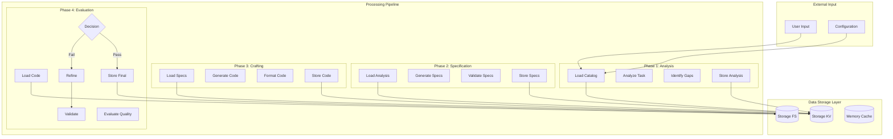
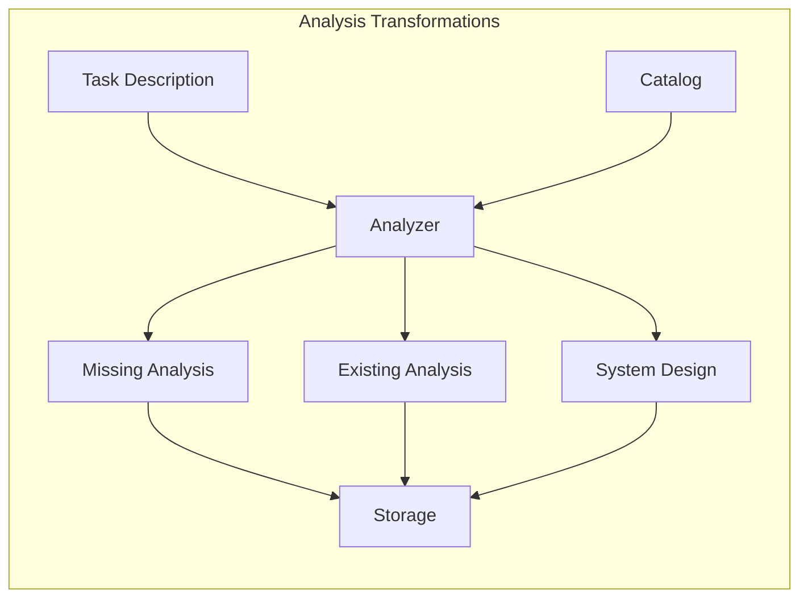
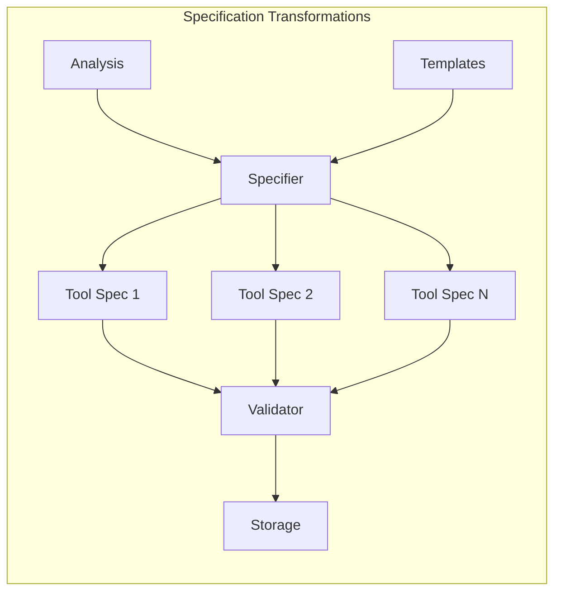
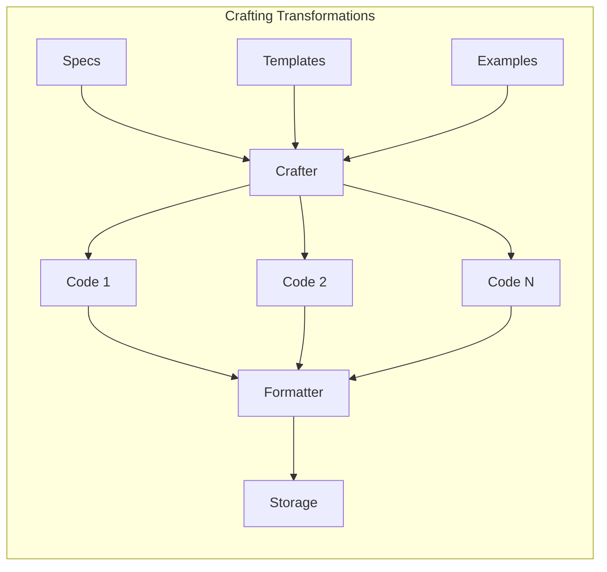
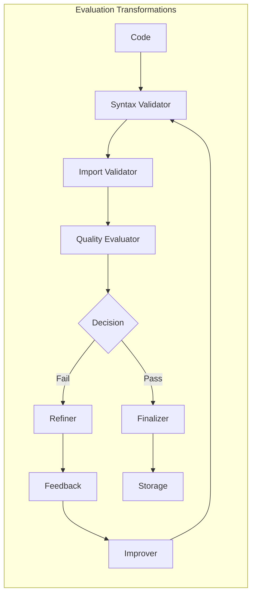
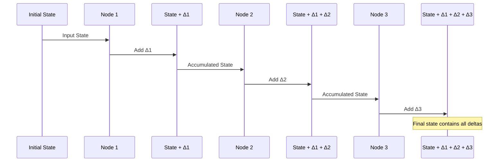
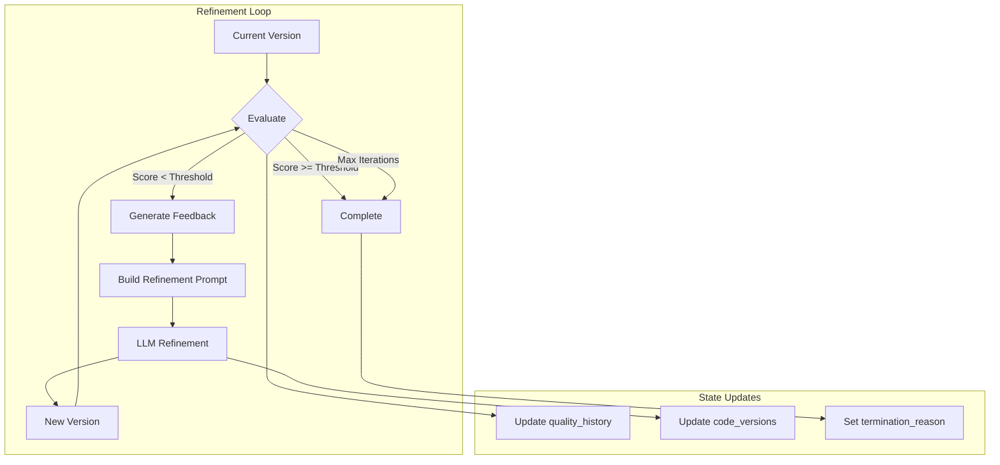

# Data Flow Requirements Specification

## References

- [Workflow Graph System](workflow-graph-system.md)
- [Graph Architecture](GRAPH_ARCHITECTURE.md)
- [Node Catalog](NODE_CATALOG.md)
- [Data Flow Requirements (this doc)](DATA_FLOW_REQUIREMENTS.md)
- [Graph Type Definitions](GRAPH_TYPE_DEFINITIONS.md)

## Overview

This document specifies the data requirements, flow patterns, and state transformations throughout the workflow graph system. It establishes the contracts between phases and defines how data moves through the system.

## Data Flow Architecture



## Phase Data Requirements

### Initial Input Requirements

```yaml
UserInput:
  task_description:
    type: str
    required: true
    description: "Natural language description of desired functionality"
    example: "Create a session management tool with TTL support"
  
  workflow_config:
    type: WorkflowConfig
    required: true
    fields:
      workflow_id: str  # Unique identifier
      models: ModelConfig  # LLM model configurations
      thresholds: QualityThresholds  # Quality gates
      max_iterations: int  # Refinement limit
      parallel_workers: int  # Concurrency limit
```

### Phase 1: Analysis Requirements

#### Input Data
```yaml
AnalysisInput:
  sources:
    - catalog_ref: "catalog"  # Full AgenTool catalog (key only)
    - task_description: str  # From user input
    - workflow_id: str  # From config
  
  required_state_fields:
    - workflow_id
    - task_description
    - catalog_loaded
```

#### Output Data
```yaml
AnalysisOutput:
  storage_refs:
    - analysis_ref: "workflow/{workflow_id}/analysis"  # Key only, no prefix
    - catalog_ref: "workflow/{workflow_id}/catalog"    # Key only, no prefix
  
  state_mutations:
    - analysis_complete: bool
    - missing_tools: List[str]
    - existing_tools: List[str]
    - system_design: str
    - guidelines: List[str]
```

#### Data Transformations


### Phase 2: Specification Requirements

#### Input Data
```yaml
SpecificationInput:
  sources:
    - analysis_ref: "storage_kv:workflow/{workflow_id}/analysis"
    - missing_tools: List[str]  # From state
    - existing_tools: List[str]  # From state
    - templates_ref: "storage_fs:templates/specs/*"
  
  required_state_fields:
    - analysis_complete: true
    - missing_tools: List[str]
    - workflow_id: str
```

#### Output Data
```yaml
SpecificationOutput:
  storage_refs:
    - specs_ref: "workflow/{workflow_id}/specs"  # Key only
    - individual_specs: "workflow/{workflow_id}/specifications/{tool_name}"  # Key only
  
  state_mutations:
    - specification_complete: bool
    - tool_specs: List[ToolSpec]
    - spec_count: int
    - spec_validation_results: Dict[str, bool]
```

#### Data Transformations


### Phase 3: Crafting Requirements

#### Input Data
```yaml
CraftingInput:
  sources:
    - specs_refs: List["storage_kv:workflow/{workflow_id}/specifications/*"]
    - templates_ref: "storage_fs:templates/code/*"
    - examples_ref: "storage_fs:examples/*"
  
  required_state_fields:
    - specification_complete: true
    - tool_specs: List[ToolSpec]
    - workflow_id: str
```

#### Output Data
```yaml
CraftingOutput:
  storage_refs:
    - code_files: "generated/{workflow_id}/*.py"  # Path only, no prefix
    - implementations: "workflow/{workflow_id}/implementations/{tool_name}"  # Key only
  
  state_mutations:
    - crafting_complete: bool
    - code_refs: Dict[str, str]  # tool_name -> file_path
    - lines_of_code: Dict[str, int]
    - implementation_metadata: Dict[str, Any]
```

#### Data Transformations


### Phase 4: Evaluation Requirements

#### Input Data
```yaml
EvaluationInput:
  sources:
    - code_refs: Dict["storage_fs:generated/{workflow_id}/*.py"]
    - specs_refs: List["storage_kv:workflow/{workflow_id}/specifications/*"]
    - reference_impl: "storage_fs:src/agentoolkit/*"
  
  required_state_fields:
    - crafting_complete: true
    - code_refs: Dict[str, str]
    - workflow_id: str
```

#### Output Data
```yaml
EvaluationOutput:
  storage_refs:
    - validations: "workflow/{workflow_id}/validations/{tool_name}"  # Key only
    - final_code: "generated/{workflow_id}/final/*.py"  # Path only
    - summary: "generated/{workflow_id}/SUMMARY.md"  # Path only
  
  state_mutations:
    - evaluation_complete: bool
    - validation_results: Dict[str, ValidationResult]
    - quality_scores: Dict[str, float]
    - needs_refinement: List[str]
    - refinement_count: Dict[str, int]
    - production_ready: bool
```

#### Data Transformations


## State Evolution Pattern

### State Accumulation Model



### State Schema Evolution

```yaml
WorkflowState:
  # Metadata (immutable after creation)
  metadata:
    workflow_id: str
    started_at: datetime
    task_description: str
  
  # Phase Completion Tracking
  phases:
    analysis_complete: bool
    specification_complete: bool
    crafting_complete: bool
    evaluation_complete: bool
  
  # Data References (accumulate over time)
  references:
    storage_kv: Dict[str, str]
    storage_fs: Dict[str, str]
  
  # Processing State (mutable)
  processing:
    current_phase: str
    current_tools: List[str]
    completed_tools: List[str]
    failed_tools: List[str]
  
  # Results (accumulate)
  results:
    missing_tools: List[str]
    tool_specs: List[ToolSpec]
    code_refs: Dict[str, str]
    validation_results: Dict[str, Any]
    quality_scores: Dict[str, float]
  
  # Refinement Tracking
  refinement:
    iteration_count: Dict[str, int]
    refinement_history: List[RefinementRecord]
    improvement_scores: Dict[str, float]
```

## Data Storage Patterns

### Storage Key Conventions

```yaml
StorageKeyPatterns:
  # Key-Value Storage (storage_kv)
  workflow_data:
    pattern: "workflow/{workflow_id}/{data_type}"
    examples:
      - "workflow/abc123/analysis"
      - "workflow/abc123/specifications/auth_tool"
      - "workflow/abc123/validations/auth_tool"
  
  catalog_data:
    pattern: "catalog"
    description: "Global AgenTool catalog"
  
  # File Storage (storage_fs)
  generated_code:
    pattern: "generated/{workflow_id}/{stage}/*.py"
    examples:
      - "generated/abc123/draft/auth_tool.py"
      - "generated/abc123/final/auth_tool.py"
  
  templates:
    pattern: "templates/{type}/*"
    examples:
      - "templates/specs/tool_spec.jinja"
      - "templates/code/agentool.jinja"
  
  summaries:
    pattern: "generated/{workflow_id}/*.md"
    examples:
      - "generated/abc123/SUMMARY.md"
      - "generated/abc123/TEST_REPORT.md"
```

### Reference Management

```python
# Pattern for storing references in state
@dataclass
class StateWithRefs:
    # Direct data (small, frequently accessed)
    workflow_id: str
    current_phase: str
    
    # References to external data (large, infrequently accessed)
    analysis_ref: str  # → "storage_kv:workflow/{id}/analysis"
    code_refs: Dict[str, str]  # → {"tool": "storage_fs:path"}
    
    def resolve_ref(self, ref: str) -> Any:
        """Resolve reference to actual data."""
        storage_type, key = ref.split(":", 1)
        ...
```

## Parallel Processing Data Requirements

### Parallel Map Pattern

```yaml
ParallelMapRequirements:
  input:
    items: List[Any]  # Items to process
    max_workers: int  # Concurrency limit
    timeout_per_item: float  # Seconds
  
  state_isolation:
    description: "Each parallel execution gets isolated state copy"
    pattern: |
      for item in items:
        item_state = copy.deepcopy(base_state)
        item_state.current_item = item
        results.append(process(item_state))
  
  output:
    results: List[Any]  # Ordered results
    execution_times: List[float]
    failed_indices: List[int]
```

### Data Aggregation Pattern

```yaml
AggregationRequirements:
  strategies:
    merge_dicts:
      input: List[Dict]
      output: Dict  # Merged dictionary
    
    concat_lists:
      input: List[List]
      output: List  # Concatenated list
    
    reduce_scores:
      input: List[float]
      output: float  # Aggregate score
    
    collect_errors:
      input: List[Optional[Error]]
      output: List[Error]  # Non-null errors
```

## Refinement Loop Data Flow

### Refinement State Tracking

```yaml
RefinementState:
  current_iteration: int
  max_iterations: int
  
  quality_history:
    - iteration: int
      score: float
      issues: List[str]
      improvements: List[str]
  
  code_versions:
    - iteration: int
      code_ref: str
      changes_made: List[str]
  
  termination_reason:
    type: Literal['quality_met', 'max_iterations', 'no_improvement']
    details: str
```

### Refinement Data Flow



## Data Validation Requirements

### Input Validation

```yaml
ValidationLevels:
  node_input:
    description: "Validate data before node execution"
    checks:
      - required_fields_present
      - type_conformance
      - reference_validity
      - size_limits
  
  phase_transition:
    description: "Validate state between phases"
    checks:
      - previous_phase_complete
      - required_data_available
      - state_consistency
  
  storage_operation:
    description: "Validate before storage operations"
    checks:
      - key_format_valid
      - data_serializable
      - size_within_limits
```

### Output Validation

```yaml
OutputValidation:
  node_output:
    checks:
      - output_schema_conformance
      - reference_creation_success
      - state_mutation_valid
  
  phase_output:
    checks:
      - all_tools_processed
      - storage_refs_valid
      - quality_thresholds_met
```

## Data Consistency Guarantees

### Atomicity

```yaml
AtomicOperations:
  storage_transaction:
    pattern: "All-or-nothing storage updates"
    implementation: |
      try:
        save_all_refs(data)
        commit()
      except:
        rollback()
  
  state_update:
    pattern: "Immutable state updates"
    implementation: |
      new_state = dataclasses.replace(
        old_state,
        **updates
      )
```

### Consistency

```yaml
ConsistencyRules:
  reference_integrity:
    rule: "All state references must point to existing storage items"
    enforcement: "Validate refs before state update"
  
  phase_ordering:
    rule: "Phases must complete in order"
    enforcement: "Check phase_complete flags"
  
  data_schema:
    rule: "All data must conform to defined schemas"
    enforcement: "Pydantic validation on all inputs/outputs"
```

### Isolation

```yaml
IsolationLevels:
  workflow_isolation:
    description: "Each workflow has isolated namespace"
    pattern: "workflow/{workflow_id}/*"
  
  parallel_execution:
    description: "Parallel nodes get isolated state copies"
    pattern: "Deep copy state for each parallel branch"
  
  storage_isolation:
    description: "No cross-workflow data access"
    pattern: "Enforce workflow_id in all keys"
```

### Durability

```yaml
DurabilityMechanisms:
  state_persistence:
    description: "Periodic state snapshots"
    pattern: |
      Every N nodes or T seconds:
        persist_state_to_storage()
  
  operation_logging:
    description: "Log all data mutations"
    pattern: |
      Before mutation:
        log_operation(op_type, data)
  
  recovery_points:
    description: "Checkpoint at phase boundaries"
    pattern: |
      After phase completion:
        create_recovery_point()
```

## Performance Considerations

### Data Size Limits

```yaml
SizeLimits:
  state_object: 1MB  # Maximum state size
  storage_kv_value: 10MB  # Per key limit
  storage_fs_file: 100MB  # Per file limit
  llm_prompt: 8000 tokens  # Model dependent
  llm_response: 4000 tokens  # Model dependent
```

### Caching Strategy

```yaml
CachingLayers:
  memory_cache:
    scope: "Node execution"
    ttl: 300  # seconds
    items:
      - template_renders
      - small_storage_reads
  
  disk_cache:
    scope: "Workflow execution"
    ttl: 3600  # seconds
    items:
      - llm_responses
      - large_computations
  
  no_cache:
    items:
      - state_mutations
      - storage_writes
      - validation_results
```

This specification provides the complete data flow architecture for Phase 1. Phase 2 will add detailed field definitions and concrete type specifications. Phase 3 will include implementation examples and integration patterns.