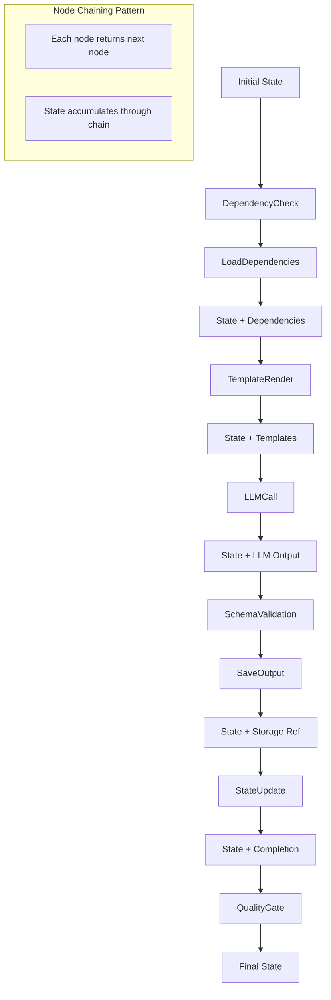
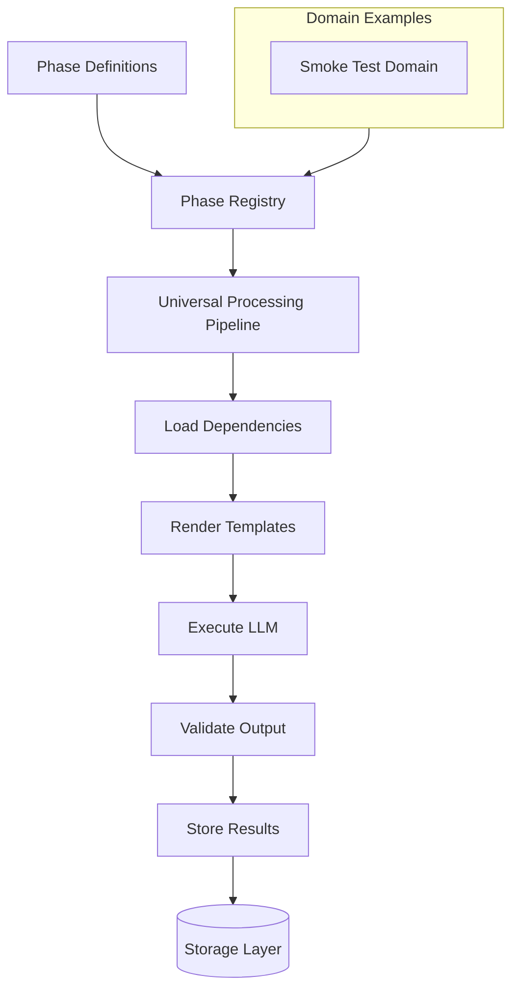
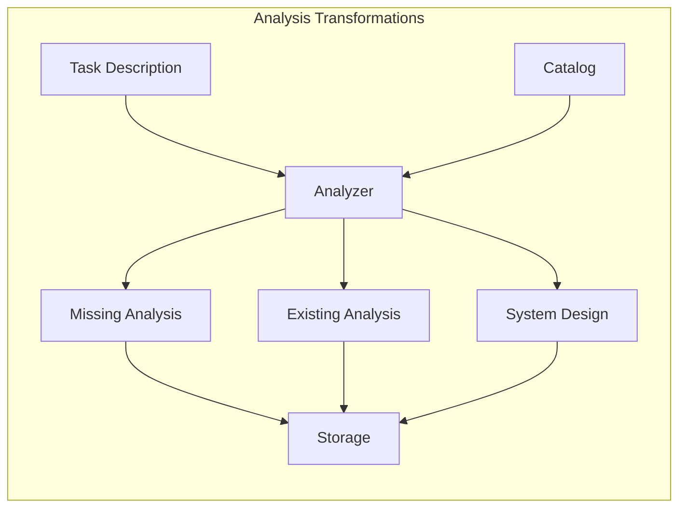
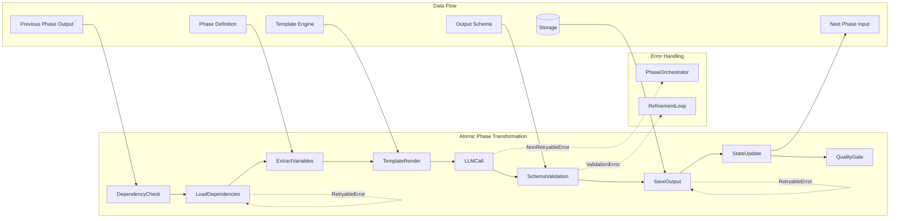
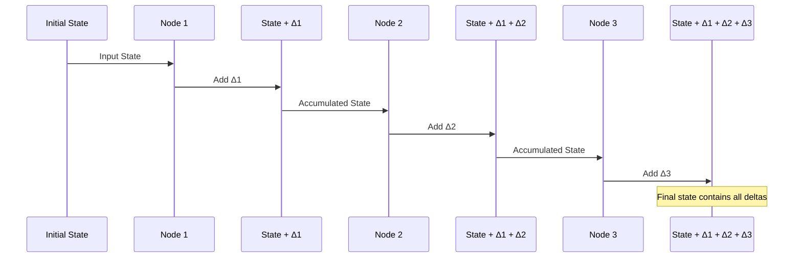
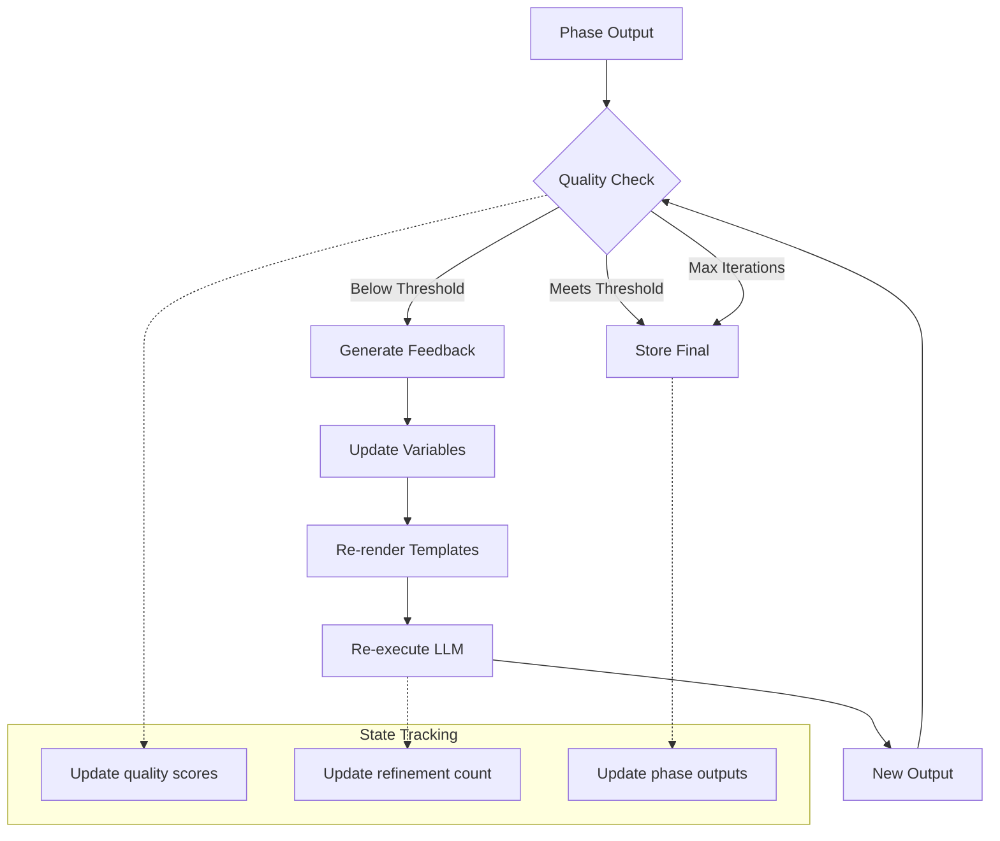

# Data Flow Requirements - Meta-Framework Specification

## References

- [Workflow Graph System](workflow-graph-system.md)
- [Graph Architecture](GRAPH_ARCHITECTURE.md)
- [Node Catalog](NODE_CATALOG.md)
- [Data Flow Requirements (this doc)](DATA_FLOW_REQUIREMENTS.md)
- [Graph Type Definitions](GRAPH_TYPE_DEFINITIONS.md)
- [State Mutations](STATE_MUTATIONS.md)

## Overview

This document specifies the data requirements, flow patterns, and state transformations for the **meta-framework workflow system**. Unlike traditional workflows with fixed phases, the meta-framework enables domain-agnostic data flows where phases are defined as configurations. Every phase follows the universal pattern:

### Data Flow Through Atomic Nodes



**`InputSchema → Variables → TemplateRender → LLM Call → OutputSchema → Storage`**

## Meta-Framework Data Flow Architecture



## Universal Phase Data Requirements

### Meta-Framework Input Pattern

```yaml
UniversalPhaseInput:
  # Core fields (all phases)
  workflow_id: str
  domain: str  # 'smoke', etc.
  phase_name: str
  
  # Dependencies from previous phases
  dependencies: Dict[str, Any]  # Loaded from phase_outputs
  
  # Domain-specific context
  domain_data: Dict[str, Any]  # Flexible per domain
  
  # Template variables
  template_vars:
    task_description: str
    existing_outputs: Dict[str, Any]
    configuration: Dict[str, Any]
```

### Atomic Node Data Flow

```yaml
AtomicNodeDataFlow:
  DependencyCheckNode:
    reads_from_state: phase_def.dependencies  # Gets deps from state
    output: bool  # All dependencies satisfied
    error: NonRetryableError  # Missing dependency
  
  LoadDependenciesNode:
    reads_from_state: phase_def.dependencies  # Gets deps from state
    output: Dict[str, Any]  # Loaded data
    error: RetryableError  # Storage failure
  
  TemplateRenderNode:
    reads_from_state: phase_def.templates, domain_data  # Templates and vars from state
    output: Tuple[str, str]  # (system_prompt, user_prompt)
    error: NonRetryableError  # Template syntax error
  
  LLMCallNode:
    reads_from_state: rendered_prompts, phase_def.output_schema  # From state
    output: BaseModel  # Validated response
    error: NonRetryableError  # API failure (orchestrator decides)
  
  SchemaValidationNode:
    reads_from_state: llm_output, phase_def.output_schema  # From state
    output: BaseModel  # Validated data
    error: NonRetryableError  # Triggers refinement
  
  SavePhaseOutputNode:
    reads_from_state: current_phase, domain_data  # Phase and data from state
    output: StorageRef  # Reference to stored data
    error: RetryableError  # Storage failure
  
  StateUpdateNode:
    reads_from_state: current_phase, phase_outputs  # From state
    output: WorkflowState  # Updated state
    error: Never  # Immutable operations don't fail
  
  QualityGateNode:
    reads_from_state: quality_scores, phase_def.quality_threshold  # From state
    output: bool  # Pass/fail
    error: Never  # Returns false on failure
```

### Generic Phase Data Pattern

#### Phase Definition Data Flow
```yaml
PhaseDefinition:
  # Identity and Sequence
  phase_name: str  # Phase identifier
  atomic_nodes: List[str]  # Ordered sequence of atomic node IDs
  
  # Input requirements
  input_schema: Type[BaseModel]  # Validates incoming data
  dependencies: List[str]  # Previous phases needed
  
  # Processing
  template_variables: List[str]  # Variables for templates
  system_template: str  # System prompt template path
  user_template: str  # User prompt template path
  
  # Output specification
  output_schema: Type[BaseModel]  # Validates LLM output
  storage_pattern: str  # Where to store results
  storage_type: Literal['kv', 'fs']  # Storage backend
```

#### Universal Output Pattern
```yaml
PhaseOutput:
  # Standard fields
  phase_name: str
  success: bool
  storage_ref: StorageRef
  
  # Domain-specific data
  data: Dict[str, Any]  # Validated by output_schema
  
  # Quality metrics
  quality_score: Optional[float]
  validation_results: Optional[ValidationResult]
```

#### Data Transformations


### Domain-Specific Phase Examples

#### Smoke Domain Phases

```yaml
IngredientAnalyzer:
  input_schema: IngredientAnalyzerInput
  dependencies: []
  template_variables: ['task_description', 'available_ingredients']
  output_schema: IngredientAnalyzerOutput
  storage_pattern: '{domain}/{workflow_id}/ingredient_analysis'

RecipeDesigner:
  input_schema: RecipeDesignerInput
  dependencies: ['ingredient_analyzer']
  template_variables: ['ingredient_analysis', 'recipe_requirements']
  output_schema: RecipeDesignerOutput
  storage_pattern: '{domain}/{workflow_id}/recipe_design'

RecipeCrafter:
  input_schema: RecipeCrafterInput
  dependencies: ['recipe_designer']
  template_variables: ['recipe_design', 'cooking_methods']
  output_schema: RecipeCrafterOutput
  storage_pattern: '{domain}/{workflow_id}/recipe_implementation'

RecipeEvaluator:
  input_schema: RecipeEvaluatorInput
  dependencies: ['recipe_crafter']
  template_variables: ['recipe', 'quality_criteria']
  output_schema: RecipeEvaluatorOutput
  storage_pattern: '{domain}/{workflow_id}/recipe_evaluation'
```

### Universal Data Transformation Pattern



## Meta-Framework State Evolution

### Universal State Pattern



### Domain-Agnostic State Schema

```yaml
WorkflowState:
  # Core Identity
  workflow_id: str
  domain: str  # 'smoke', etc.
  created_at: datetime
  
  # Universal Phase Tracking
  phase_sequence: List[str]  # Ordered phases to execute
  completed_phases: Set[str]  # Phases completed
  current_phase: Optional[str]  # Active phase
  
  # Universal Storage References
  phase_outputs: Dict[str, StorageRef]  # phase_name -> output location
  
  # Domain-Specific Data (flexible)
  domain_data: Dict[str, Any]  # Validated per domain
  
  # Quality and Refinement
  quality_scores: Dict[str, float]  # phase -> score
  refinement_count: Dict[str, int]  # phase -> iterations
  validation_results: Dict[str, ValidationResult]
  
  # Token Usage
  total_token_usage: Dict[str, TokenUsage]  # phase -> usage
```

## Meta-Framework Storage Patterns

### Universal Storage Key Convention

```yaml
UniversalStoragePattern:
  # Pattern: {domain}/{workflow_id}/{phase}/{item}
  
  # Key-Value Storage
  phase_outputs:
    pattern: "{domain}/{workflow_id}/{phase_name}"
    examples:
      - "smoke/abc123/ingredient_analyzer"
      - "smoke/xyz789/recipe_designer"
      - "smoke/def456/recipe_evaluator"
  
  versioned_outputs:
    pattern: "{domain}/{workflow_id}/{phase_name}/v{version}"
    examples:
      - "smoke/abc123/recipe_crafter/v0"  # Initial
      - "smoke/abc123/recipe_crafter/v1"  # After refinement
  
  # File Storage
  generated_artifacts:
    pattern: "{domain}/{workflow_id}/{phase_name}/*"
    examples:
      - "smoke/abc123/recipe_crafter/chocolate_cake.json"
      - "smoke/xyz789/recipe_designer/pasta_recipe.json"
      - "smoke/def456/recipe_evaluator/evaluation.json"
  
  # Templates (shared across domains)
  templates:
    pattern: "templates/{domain}/{phase_type}/*"
    examples:
      - "templates/smoke/analyzer.jinja"
      - "templates/smoke/designer.jinja"
      - "templates/shared/quality_criteria.jinja"
```

### Meta-Framework Reference Management

```python
@dataclass(frozen=True)
class WorkflowState:
    """Universal state with storage references."""
    # Identity
    workflow_id: str
    domain: str
    
    # Phase outputs stored as references
    phase_outputs: Dict[str, StorageRef]  # phase_name -> StorageRef
    
    def get_phase_data(self, phase: str, deps: WorkflowDeps) -> Any:
        """Load phase output from storage."""
        if phase not in self.phase_outputs:
            return None
        
        ref = self.phase_outputs[phase]
        if ref.storage_type == 'kv':
            return deps.storage_client.load_kv(ref.key)
        else:
            return deps.storage_client.load_fs(ref.key)
    
    def with_phase_output(self, phase: str, ref: StorageRef) -> 'WorkflowState':
        """Add phase output reference."""
        return replace(
            self,
            phase_outputs={**self.phase_outputs, phase: ref},
            completed_phases=self.completed_phases | {phase}
        )
```

## Parallel Processing Data Requirements

### Parallel Map Pattern with Atomic Nodes

```yaml
ParallelMapRequirements:
  input:
    items: List[Any]  # Items to process
    max_workers: int  # Concurrency limit
    timeout_per_item: float  # Seconds
  
  state_isolation:
    description: "Each parallel execution gets isolated state copy"
    pattern: |
      for item in items:
        # States are immutable - use replace() not deepcopy
        item_state = replace(
            base_state,
            iter_items=[item],
            iter_index=0
        )
        # Each item processed through atomic node chaining
        results.append(await item_graph.run(item_state))
  
  atomic_parallelization:
    storage_operations: "Parallel with rate limiting"
    llm_operations: "Sequential to control costs"
    template_operations: "Parallel with caching"
    validation_operations: "Parallel, no limits"
  
  output:
    results: List[Any]  # Ordered results
    execution_times: List[float]
    failed_indices: List[int]
    retry_counts: Dict[int, int]  # Item index -> retry count
```

### State-Based Node Configuration

```yaml
NodeConfigurationByType:
  LLMNodes:
    pattern: "Retryable with exponential backoff"
    retryable: true  # API can have transient failures
    max_retries: 3
    retry_backoff: "exponential"
    cacheable: true
    cache_ttl: 3600  # 1 hour
  
  LocalStorageNodes:
    pattern: "Usually not retryable (local operations)"
    retryable: false  # Local storage rarely fails
    max_retries: 0
    cacheable: false  # Always fetch fresh
  
  TemplateNodes:
    pattern: "Deterministic, cacheable"
    retryable: false  # Failures are bugs
    max_retries: 0
    cacheable: true
    cache_ttl: -1  # Session lifetime
  
  ValidationNodes:
    pattern: "Triggers refinement, not retry"
    retryable: false
    max_retries: 0
    failure_handling: "Return RefinementNode"
  
  IterationNodes:
    pattern: "Self-return for continuation"
    iter_enabled: true
    iter_in_type: List[Item]
    iter_out_type: List[Result]
```

### Data Aggregation Pattern

```yaml
AggregationRequirements:
  strategies:
    merge_dicts:
      input: List[Dict]
      output: Dict  # Merged dictionary
    
    concat_lists:
      input: List[List]
      output: List  # Concatenated list
    
    reduce_scores:
      input: List[float]
      output: float  # Aggregate score
    
    collect_errors:
      input: List[Optional[Error]]
      output: List[Error]  # Non-null errors
```

## Meta-Framework Refinement Pattern

### Universal Refinement Flow

```yaml
RefinementPattern:
  # Applied to any phase via configuration
  phase_definition:
    allow_refinement: bool
    quality_threshold: float
    max_refinements: int
  
  # Refinement state tracking
  refinement_state:
    phase_name: str
    iteration: int
    quality_scores: List[float]  # Score history
    refinement_feedback: List[str]  # Feedback history
    storage_refs: List[StorageRef]  # Version history
  
  # Termination conditions
  termination:
    quality_met: score >= threshold
    max_iterations: iteration >= max_refinements
    no_improvement: scores[-1] <= scores[-2]
```

### Meta-Framework Refinement Loop



## Data Validation Requirements

### Input Validation

```yaml
ValidationLevels:
  node_input:
    description: "Validate data before node execution"
    checks:
      - required_fields_present
      - type_conformance
      - reference_validity
      - size_limits
  
  phase_transition:
    description: "Validate state between phases"
    checks:
      - previous_phase_complete
      - required_data_available
      - state_consistency
  
  storage_operation:
    description: "Validate before storage operations"
    checks:
      - key_format_valid
      - data_serializable
      - size_within_limits
```

### Output Validation

```yaml
OutputValidation:
  node_output:
    checks:
      - output_schema_conformance
      - reference_creation_success
      - state_mutation_valid
  
  phase_output:
    checks:
      - all_tools_processed
      - storage_refs_valid
      - quality_thresholds_met
```

## Data Consistency Guarantees

### Atomicity at Node Level

```yaml
AtomicNodeOperations:
  # Each node is an atomic operation
  LoadDependenciesNode:
    pattern: "Load all or fail completely"
    implementation: |
      try:
        deps = {}
        for phase in required_phases:
          deps[phase] = await load_kv(get_key(phase))
        return deps
      except StorageError as e:
        raise RetryableError(f"Failed to load {phase}", retry_after=2.0)
  
  SavePhaseOutputNode:
    pattern: "Save with versioning or fail"
    implementation: |
      try:
        key = generate_key(phase, version)
        await save_kv(key, data)
        return StorageRef(key=key, version=version)
      except StorageError as e:
        raise RetryableError(f"Failed to save {phase}", retry_after=2.0)
  
  LLMCallNode:
    pattern: "Single expensive operation, no partial results"
    implementation: |
      try:
        response = await llm.generate(prompts, schema)
        return response  # Fully validated
      except APIError as e:
        # Don't retry at node level - too expensive
        raise NonRetryableError(f"LLM call failed: {e}")
  
  # State updates are always atomic (immutable)
  state_update:
    pattern: "Immutable state updates"
    implementation: |
      new_state = dataclasses.replace(
        old_state,
        **updates
      )
```

### Consistency

```yaml
ConsistencyRules:
  reference_integrity:
    rule: "All state references must point to existing storage items"
    enforcement: "Validate refs before state update"
  
  phase_ordering:
    rule: "Phases must complete in order"
    enforcement: "Check phase_complete flags"
  
  data_schema:
    rule: "All data must conform to defined schemas"
    enforcement: "Pydantic validation on all inputs/outputs"
```

### Isolation

```yaml
IsolationLevels:
  workflow_isolation:
    description: "Each workflow has isolated namespace"
    pattern: "workflow/{workflow_id}/*"
  
  parallel_execution:
    description: "Parallel nodes get isolated state copies"
    pattern: "Deep copy state for each parallel branch"
  
  storage_isolation:
    description: "No cross-workflow data access"
    pattern: "Enforce workflow_id in all keys"
```

### Durability

```yaml
DurabilityMechanisms:
  state_persistence:
    description: "Periodic state snapshots"
    pattern: |
      Every N nodes or T seconds:
        persist_state_to_storage()
  
  operation_logging:
    description: "Log all data mutations"
    pattern: |
      Before mutation:
        log_operation(op_type, data)
  
  recovery_points:
    description: "Checkpoint at phase boundaries"
    pattern: |
      After phase completion:
        create_recovery_point()
```

## Performance Considerations

### Data Size Limits

```yaml
SizeLimits:
  state_object: 1MB  # Maximum state size
  storage_kv_value: 10MB  # Per key limit
  storage_fs_file: 100MB  # Per file limit
  llm_prompt: 8000 tokens  # Model dependent
  llm_response: 4000 tokens  # Model dependent
```

### Caching Strategy for Atomic Nodes

```yaml
AtomicNodeCaching:
  # Cache by node type
  TemplateRenderNode:
    scope: "Session"
    key: "template_path + hash(variables)"
    ttl: "Session lifetime"
    reason: "Deterministic - same input always produces same output"
  
  LLMCallNode:
    scope: "Workflow"
    key: "model + hash(prompts + schema)"
    ttl: 3600  # 1 hour
    reason: "Expensive - avoid redundant API calls"
  
  LoadDependenciesNode:
    scope: "None"
    reason: "Always fetch fresh to ensure consistency"
  
  SavePhaseOutputNode:
    scope: "None"
    reason: "Must always write through"
  
  SchemaValidationNode:
    scope: "Request"
    key: "schema + hash(data)"
    ttl: 60  # 1 minute
    reason: "Cheap but frequent - short cache"
  
  DependencyCheckNode:
    scope: "Phase"
    key: "phase_name + deps_list"
    ttl: 300  # 5 minutes
    reason: "Dependencies unlikely to change mid-execution"
```

### Parallel Execution with Graph.iter()

```yaml
ParallelExecutionPattern:
  description: "Use Graph.iter() for controlled parallelism"
  implementation: |
    async with graph.iter(start_node, state=initial_state) as run:
      tasks = []
      async for node in run:
        if hasattr(node, 'iter_enabled') and node.iter_enabled:
          # Fork parallel tasks for items
          for item in state.iter_items:
            item_state = replace(state, iter_items=[item])
            task = asyncio.create_task(graph.run(node, state=item_state))
            tasks.append(task)
          
          # Gather results
          results = await asyncio.gather(*tasks)
          
          # Continue with aggregated results
          aggregated_state = replace(state, iter_results=results)
          next_node = node.get_next_node(aggregated_state)
          await run.next(next_node)
  
  benefits:
    - Fine-grained control over parallelism
    - No sub-graph execution within nodes
    - State isolation per parallel branch
    - Compatible with pydantic_graph patterns
```

## Meta-Framework Benefits

### Data Flow Advantages

1. **Universal Pattern**: All phases follow same data flow
2. **Domain Flexibility**: Any domain can define phases
3. **Type Safety**: Schemas validate all data transitions
4. **Storage Efficiency**: References minimize state size
5. **Version Control**: Built-in versioning for refinements
6. **Parallel Ready**: Isolated state enables parallelism