# Meta-Framework Mermaid Diagrams

This document contains the complete set of architectural diagrams for the meta-framework workflow system.

## 1. Master State-Driven Architecture

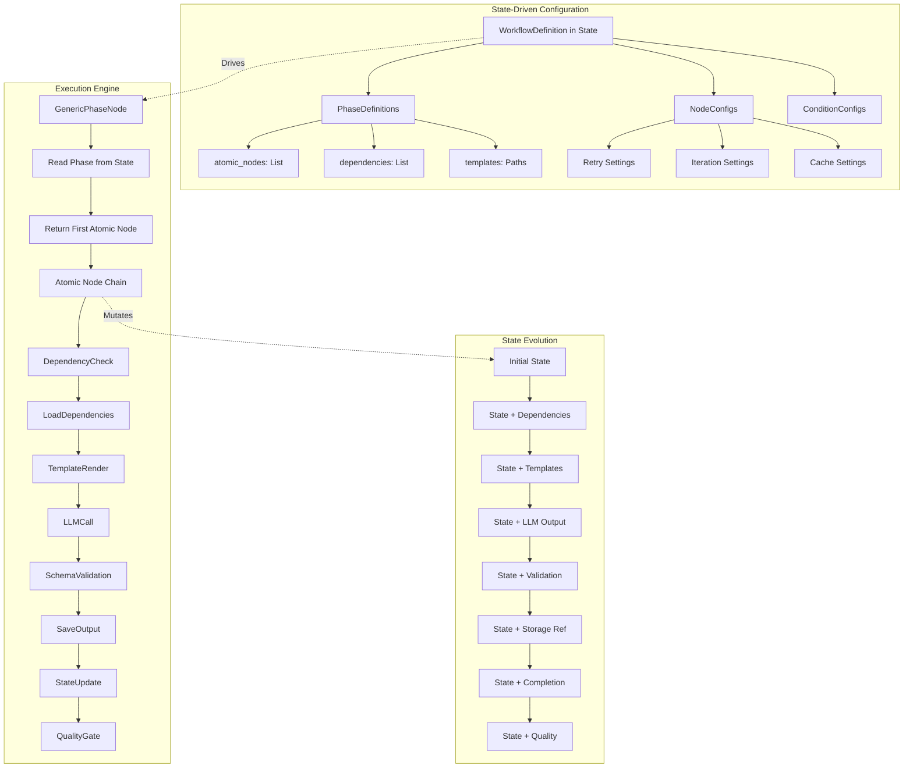

## 2. Atomic Node Chaining Pattern

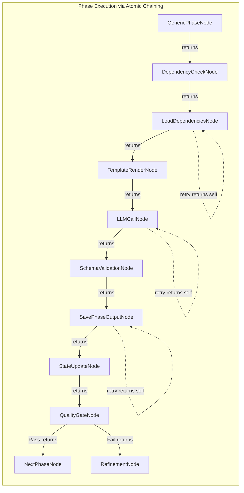

## 3. State-Based Retry Mechanism

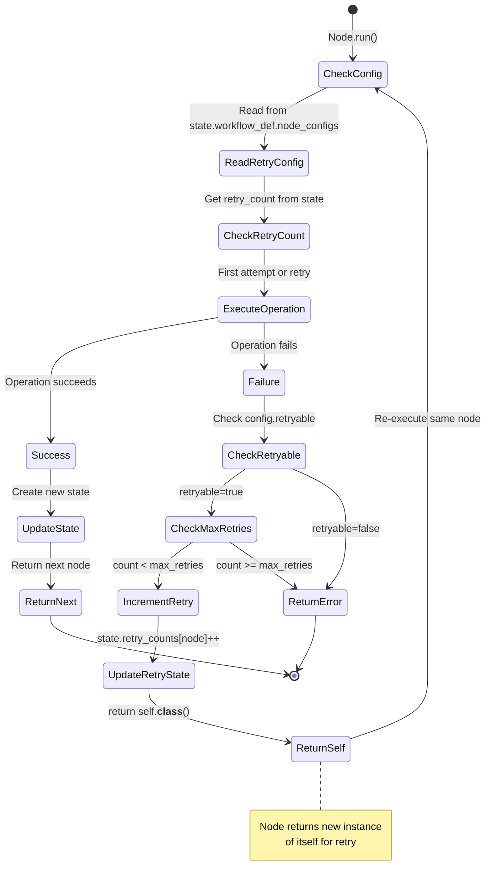

## 4. Node Factory Pattern

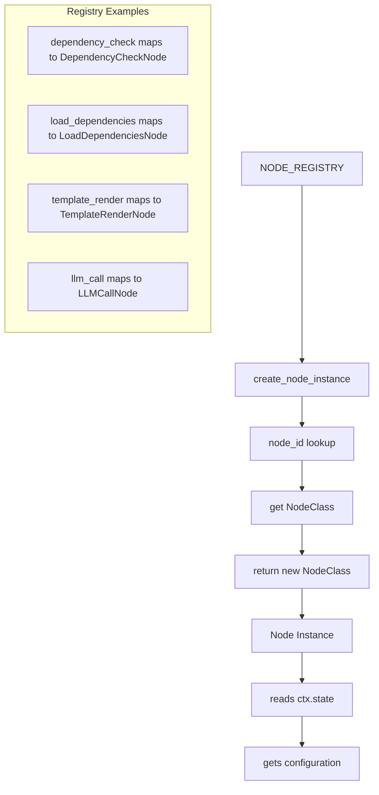

## 5. Parallel Execution with Graph.iter()

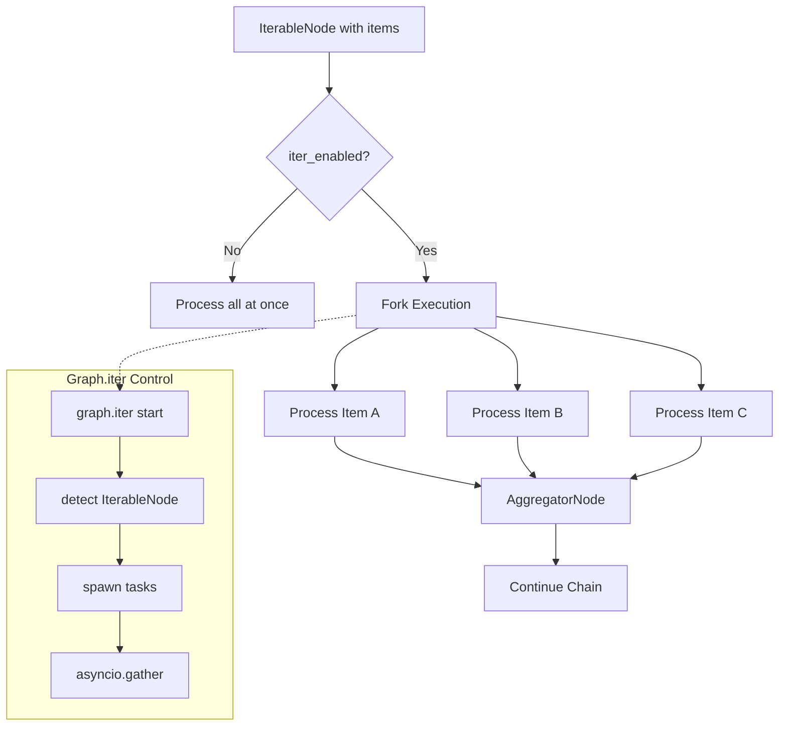

## 6. Complete AgenTool Workflow Example

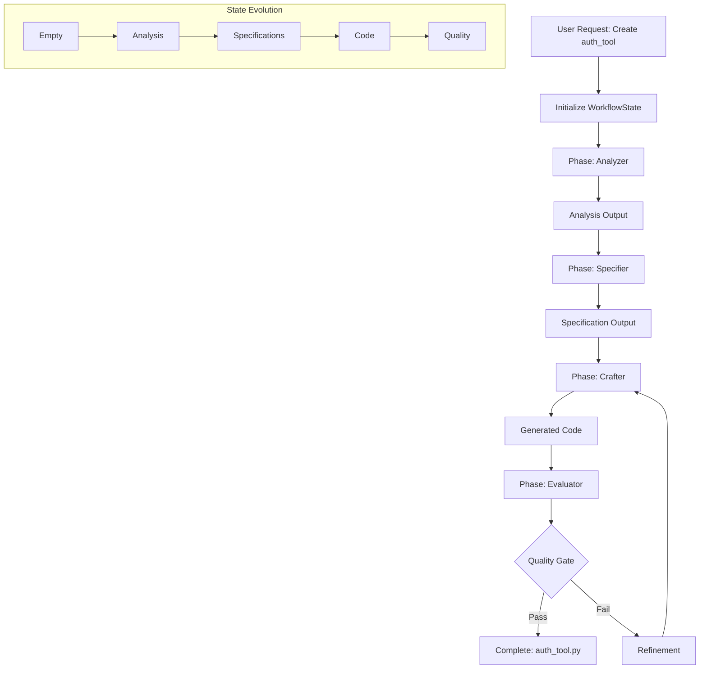

## 7. Error Handling Strategies

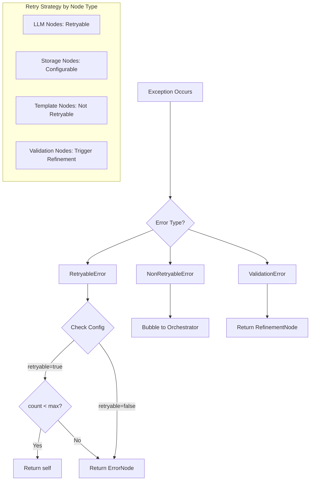

## 8. Storage Reference Pattern

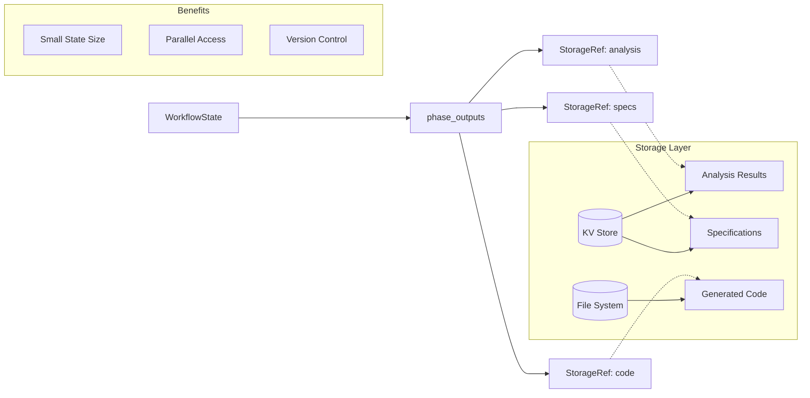

## 9a. NodeConfig Structure

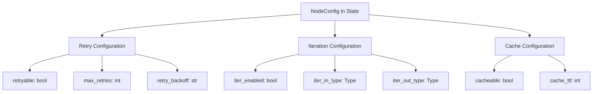

## 9b. Node Behavior Application

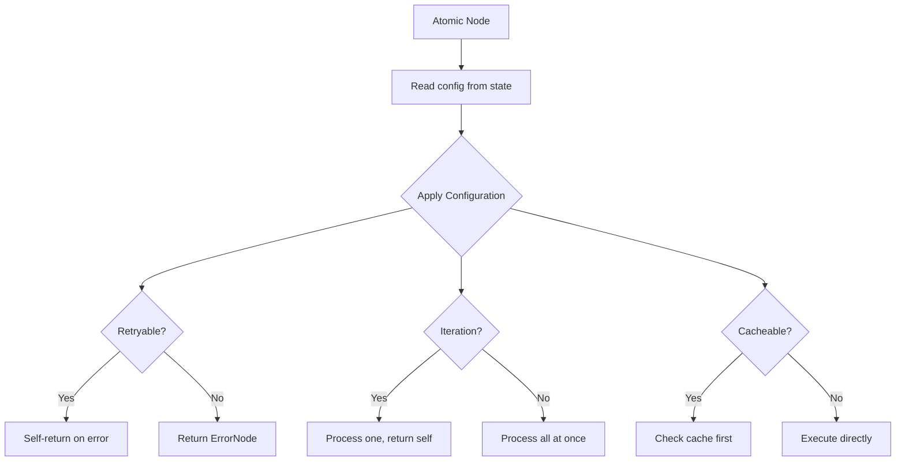

## 10. Quality Gate and Refinement Flow

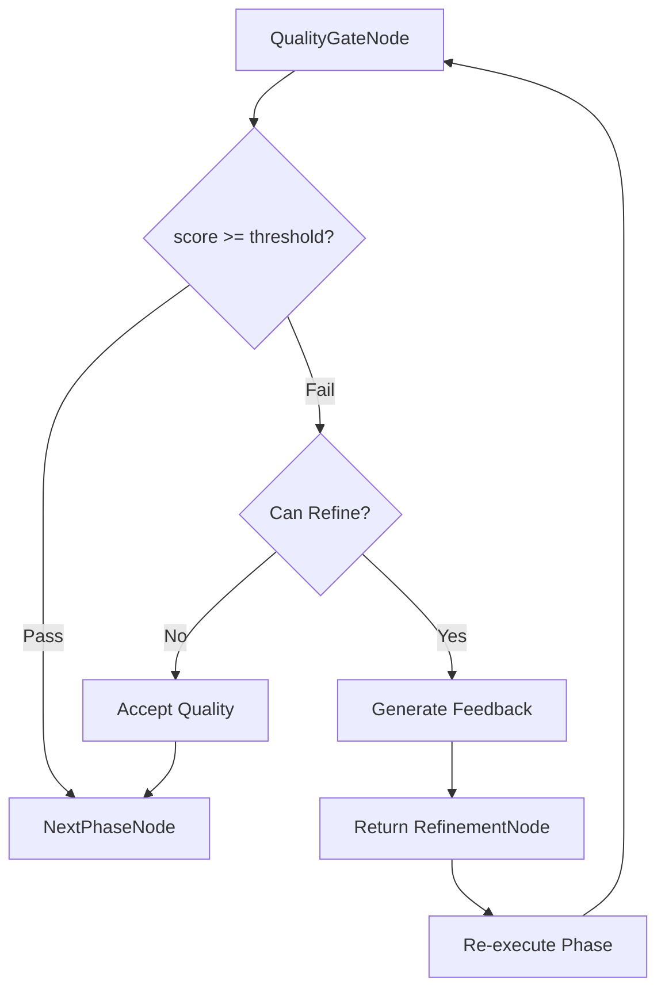

## 11. Meta-Framework Value Proposition

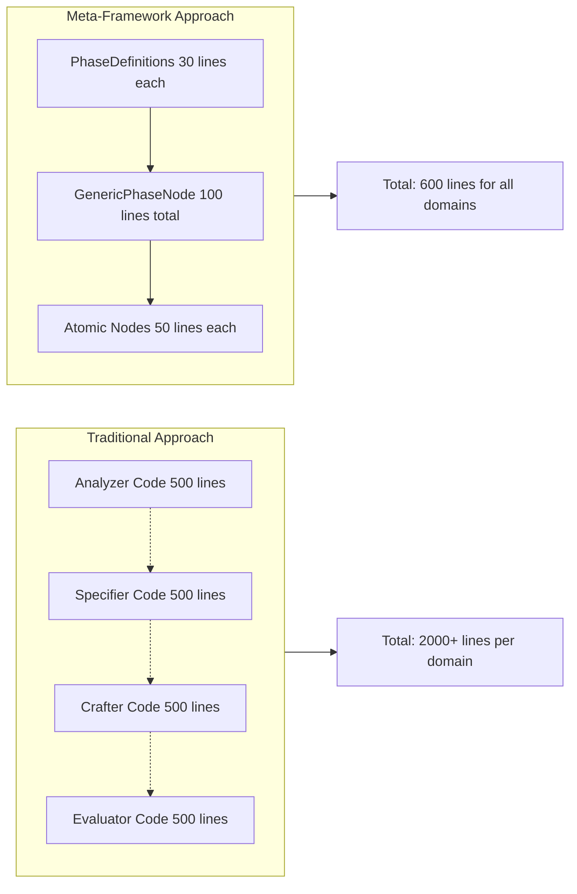

## 12. State-Driven Data Flow

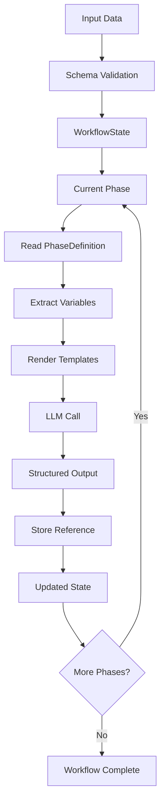

## Diagram Legend

- **Solid Arrows**: Direct execution flow
- **Dashed Arrows**: Reference/data relationships
- **Dotted Arrows**: Optional/retry paths