# Graph Architecture Documentation - Meta-Framework Design

## References

- [Workflow Graph System](workflow-graph-system.md)
- [Graph Architecture (this doc)](GRAPH_ARCHITECTURE.md)
- [Node Catalog](NODE_CATALOG.md)
- [Data Flow Requirements](DATA_FLOW_REQUIREMENTS.md)
- [Graph Type Definitions](GRAPH_TYPE_DEFINITIONS.md)
- [State Mutations](STATE_MUTATIONS.md)

## System Design Overview

### Traditional vs Meta-Framework Approach

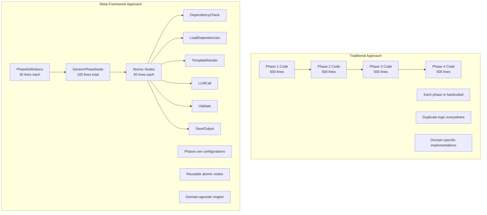

The Graph Architecture implements a **state-driven meta-framework** where the entire workflow structure, behavior, and configuration exist as a uniform plane in state. This eliminates code duplication by having nodes act as simple executors that read their configuration from state and chain together. The architecture enables any domain to define multi-phase workflows through state-driven composition:

**`WorkflowDefinition in State + Node Chaining + Type Safety = Complete Workflow`**

This document details the architectural patterns that enable this state-driven, configuration-based approach where the graph structure is fully defined in state.

## Architectural Layers

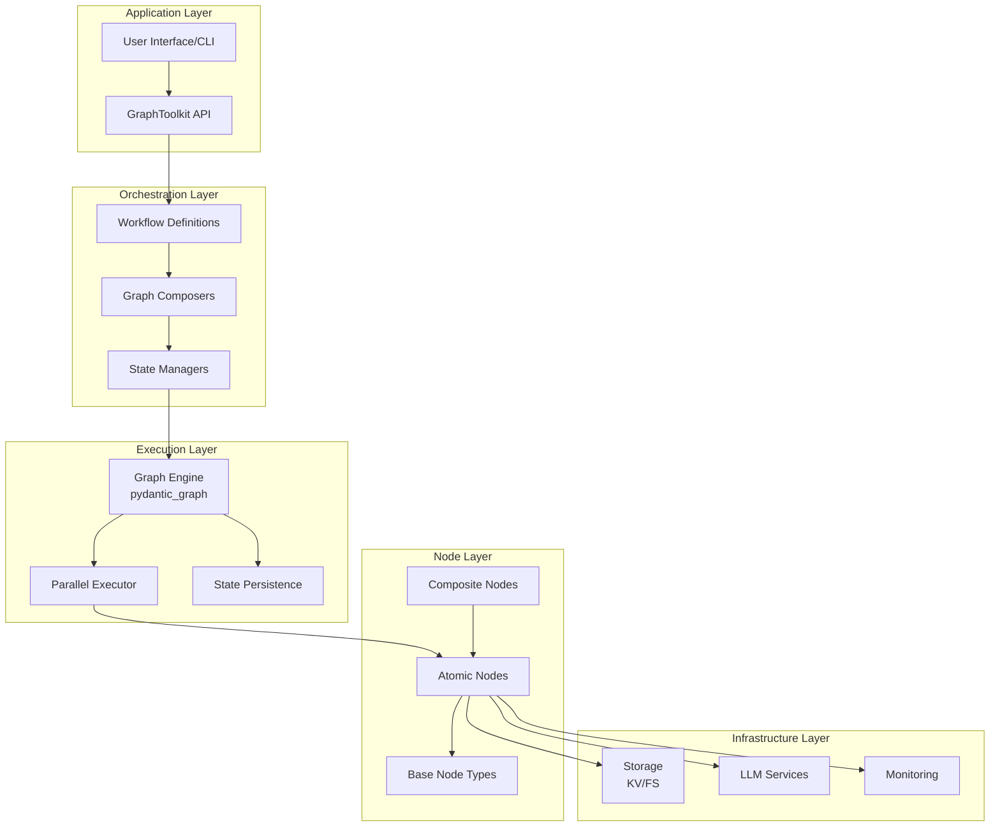

## Core Architectural Patterns

### 1. State-Driven Configuration Pattern

The entire workflow is defined in state as a uniform plane:

```python
# See [Graph Type Definitions](GRAPH_TYPE_DEFINITIONS.md#state-based-configuration-types-canonical)
# for the canonical definitions of WorkflowDefinition and NodeConfig.
# These types define the state-driven configuration pattern.

@dataclass(frozen=True)
class WorkflowState:
    """State drives all execution."""
    workflow_def: WorkflowDefinition        # The uniform plane
    current_phase: str                      # Where we are
    current_node: str                       # Current atomic node
    retry_counts: Dict[str, int]            # Retry tracking
    iter_items: List[Any]                   # Iteration state
    iter_results: List[Any]                 # Iteration results
```

**Benefits**:
- **Uniform Plane**: Everything defined in one place
- **State-Driven**: Nodes just read config and execute
- **Type Safety**: Full type checking through workflow
- **Flexible Retry**: Per-node retry configuration

### 2. Atomic Node Chaining

Nodes chain together by returning the next node:

```python
@dataclass
class GenericPhaseNode(BaseNode[WorkflowState, WorkflowDeps, WorkflowState]):
    """Starts a phase by returning first atomic node."""
    
    async def run(self, ctx: GraphRunContext[WorkflowState, WorkflowDeps]) -> BaseNode | End[WorkflowState]:
        # Read phase definition from state
        phase_def = ctx.state.workflow_def.phases[ctx.state.current_phase]
        
        # Update state to track current node
        new_state = replace(
            ctx.state,
            current_node=phase_def.atomic_nodes[0]
        )
        
        # Return first atomic node - it will chain to the rest
        return create_node_instance(phase_def.atomic_nodes[0])

@dataclass
class AtomicNode(BaseNode[WorkflowState, WorkflowDeps, WorkflowState]):
    """Base pattern for all atomic nodes."""
    
    async def run(self, ctx: GraphRunContext[WorkflowState, WorkflowDeps]) -> BaseNode | End[WorkflowState]:
        # Get configuration from state
        node_config = ctx.state.workflow_def.node_configs[ctx.state.current_node]
        retry_key = f"{ctx.state.current_phase}_{ctx.state.current_node}"
        retry_count = ctx.state.retry_counts.get(retry_key, 0)
        
        try:
            # Execute our operation
            result = await self.execute(ctx)
            
            # Update state
            new_state = self.update_state(ctx.state, result)
            
            # Get next node in chain
            phase_def = ctx.state.workflow_def.phases[ctx.state.current_phase]
            current_idx = phase_def.atomic_nodes.index(ctx.state.current_node)
            
            if current_idx + 1 < len(phase_def.atomic_nodes):
                # Continue chain
                next_node = phase_def.atomic_nodes[current_idx + 1]
                new_state = replace(new_state, current_node=next_node)
                return create_node_instance(next_node)
            else:
                # Phase complete
                return self.complete_phase(new_state)
                
        except Exception as e:
            if node_config.retryable and retry_count < node_config.max_retries:
                # Retry by returning ourselves
                new_state = replace(
                    ctx.state,
                    retry_counts={**ctx.state.retry_counts, retry_key: retry_count + 1}
                )
                return self.__class__()
            else:
                return ErrorNode(error=str(e))
```

**Chaining Characteristics**:
- **Direct Flow**: Each node returns the next
- **State-Based Retry**: Retry by returning self
- **Configuration-Driven**: Behavior from state
- **Type-Safe**: Types enforced through chain

### 3. State as Universal Container

State flows through the graph, accumulating transformations:

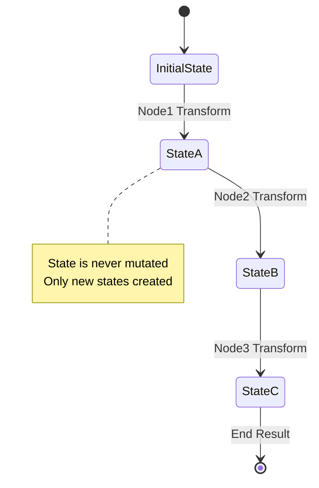

**State Principles:**
- **Immutable**: States are dataclasses with frozen=True
- **Accumulative**: Each node adds to state, doesn't remove
- **Referential**: Store references to data, not data itself
- **Versioned**: Each state transformation is tracked

### 4. State-Based Workflow Construction

Workflows are fully defined in state:

```python
def create_workflow_definition(domain: str, phase_definitions: List[PhaseDefinition]) -> WorkflowDefinition:
    """Create complete workflow definition for state."""
    
    phases = {}
    node_configs = {}
    
    for phase_def in phase_definitions:
        # Add phase to workflow
        phases[phase_def.phase_name] = phase_def
        
        # Configure nodes for this phase's atomic nodes
        for node_id in phase_def.atomic_nodes:
            # Set default configurations for node types
            if 'llm' in node_id:
                node_configs[node_id] = NodeConfig(
                    node_type='llm_call',
                    retryable=True,
                    max_retries=3,
                    retry_backoff='exponential'
                )
            elif 'load' in node_id:
                node_configs[node_id] = NodeConfig(
                    node_type='storage_load',
                    retryable=True,
                    max_retries=2,
                    retry_backoff='linear'
                )
            else:
                node_configs[node_id] = NodeConfig(
                    node_type='default',
                    retryable=False
                )
    
    return WorkflowDefinition(
        domain=domain,
        phases=phases,
        phase_sequence=[p.phase_name for p in phase_definitions],
        node_configs=node_configs
    )

# Usage - everything in state
async def run_workflow(domain: str, phase_definitions: List[PhaseDefinition]):
    workflow_def = create_workflow_definition(domain, phase_definitions)
    
    initial_state = WorkflowState(
        workflow_def=workflow_def,
        current_phase=workflow_def.phase_sequence[0],
        current_node=workflow_def.phases[workflow_def.phase_sequence[0]].atomic_nodes[0]
    )
    
    # Graph just executes what's in state
    graph = Graph(nodes=get_all_node_classes())
    result = await graph.run(GenericPhaseNode(), state=initial_state)
```

**Benefits**:
- **Uniform Plane**: All config in WorkflowDefinition
- **Dynamic Behavior**: Change behavior without code
- **Type Safety**: Types defined in state

## Meta-Framework Node Hierarchy

### Core Meta-Framework Nodes

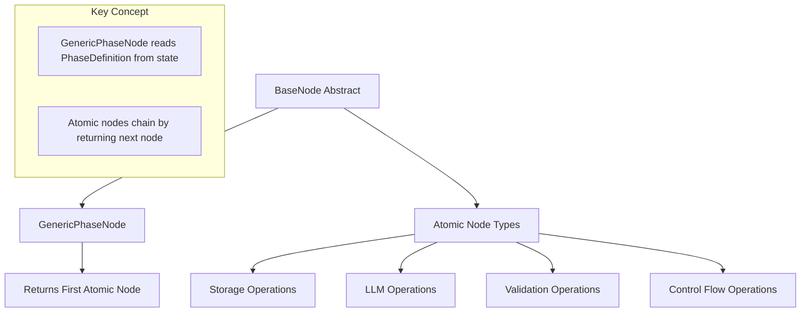

### Meta-Framework Node Responsibilities

#### GenericPhaseNode (Phase Starter)
**Purpose**: Starts a phase by returning its first atomic node
**Pattern**: Reads phase from state, returns first node in chain
```
Responsibilities:
- Read current phase definition from state
- Update state to mark phase as started  
- Return first atomic node of the phase
- Does NOT execute the phase work itself
- First atomic node will chain to rest automatically
```

**Atomic Node Chaining Structure**:
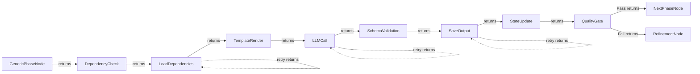

#### Phase Support Nodes
**Purpose**: Support GenericPhaseNode execution

**LoadDependenciesNode**:
```
- Load outputs from dependent phases
- Validate dependency data exists
- Merge dependency data for templates
```

**SavePhaseOutputNode**:
```
- Store phase output with versioning
- Update storage references in state
- Handle storage failures gracefully
```

**SchemaValidationNode**:
```
- Validate LLM output against output_schema
- Provide detailed validation errors
- Support partial validation for drafts
```


## Meta-Framework Execution Patterns

### Dynamic Phase Sequencing

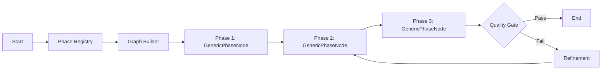

**Pattern Benefits**:
- Phases determined at runtime from registry
- Same node type executes all phases
- Quality gates between phases
- Automatic refinement loops

### Domain-Specific Workflow Construction

```python
# Smoke test workflow
smoke_workflow = build_domain_workflow(
    domain='smoke',
    phases=['ingredient_analyzer', 'recipe_designer', 'recipe_crafter', 'recipe_evaluator'],
    config=smoke_config
)

# Example of future domain extension
# new_workflow = build_domain_workflow(
#     domain='newdomain',
#     phases=['phase1', 'phase2', 'phase3'],
#     config=new_config
# )
```

### Template-Driven Execution

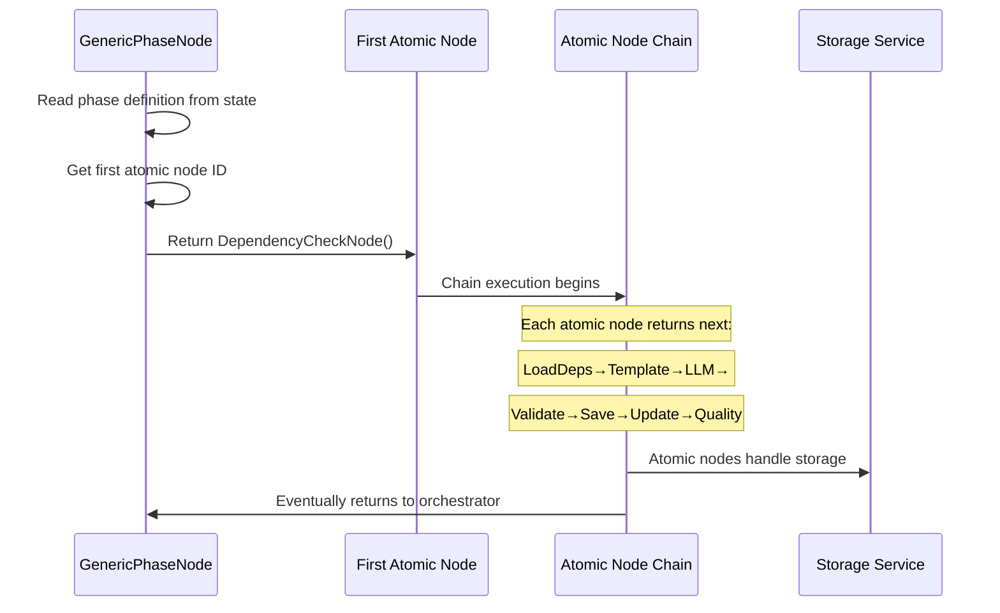

## Universal State Management

### Domain-Agnostic State Structure

```
WorkflowState (Universal)
├── Core Identity
│   ├── workflow_id: str
│   ├── domain: str ('smoke', etc.)
│   └── timestamp: datetime
├── Phase Tracking
│   ├── completed_phases: Set[str]
│   ├── current_phase: str
│   └── phase_sequence: List[str]
├── Universal References
│   └── phase_outputs: Dict[str, StorageRef]
├── Domain Data (Flexible)
│   └── domain_data: Dict[str, Any]
└── Quality Tracking
    ├── quality_scores: Dict[str, float]
    ├── refinement_count: Dict[str, int]
    └── validation_results: Dict[str, ValidationResult]
```

### State Evolution Pattern

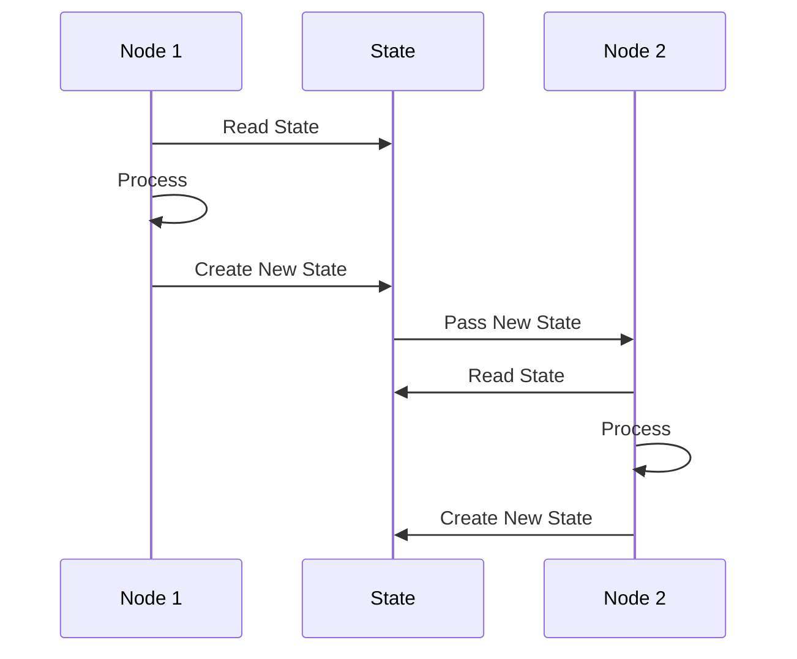

## Dependency Management

### Dependency Scopes

```
GraphDeps
├── Global (shared across all nodes)
│   ├── storage_client
│   ├── llm_client
│   └── monitoring
├── Phase-Specific
│   ├── analyzer_config
│   ├── crafter_config
│   └── evaluator_config
└── Resource Pools
    ├── process_executor
    ├── thread_executor
    └── async_semaphore
```

### Dependency Injection Flow

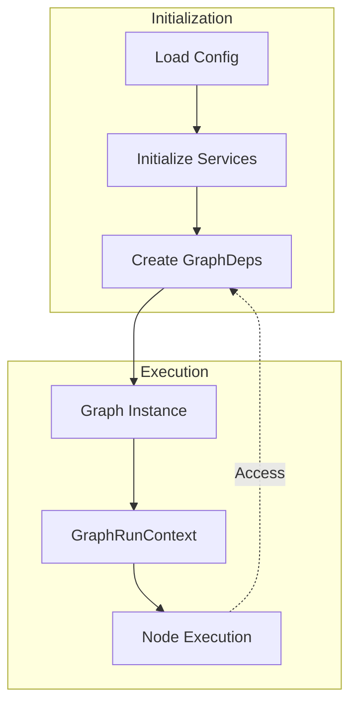

## State-Based Error Handling

### Error Handling Through State and Self-Return

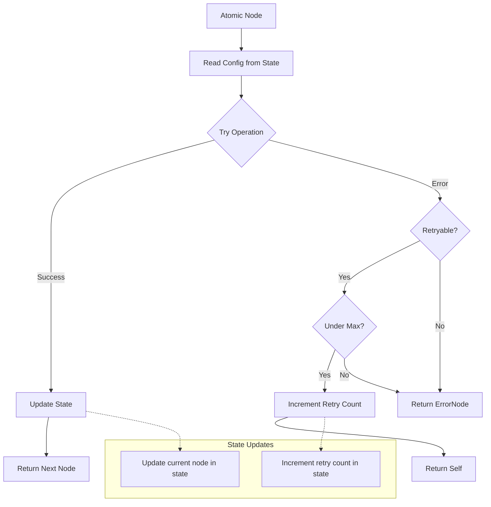

### Error Categories with State-Based Configuration

1. **LLM Nodes (Now Retryable via Config)**
   ```python
   node_configs["llm_call"] = NodeConfig(
       retryable=True,  # API can have transient failures
       max_retries=3,
       retry_backoff="exponential"
   )
   ```
   - API errors → Exponential backoff retry
   - Rate limits → Backoff and retry
   - Model unavailable → Retry with backoff

2. **Storage Nodes (Usually Not Retryable - Local)**
   ```python
   node_configs["load_local"] = NodeConfig(
       retryable=False,  # Local storage rarely fails
       max_retries=0
   )
   ```
   - Local file operations → Usually succeed
   - If remote storage → Make retryable

3. **Validation Nodes (Trigger Refinement)**
   ```python
   node_configs["quality_gate"] = NodeConfig(
       retryable=False,  # Don't retry, refine instead
       max_retries=0
   )
   ```
   - Quality failures → Return RefinementNode
   - Schema violations → Return with feedback

4. **Iteration Nodes (Self-Return Pattern)**
   ```python
   node_configs["process_items"] = NodeConfig(
       iter_enabled=True,
       iter_in_type=List[Item],
       iter_out_type=List[Result]
   )
   ```
   - Process one item → Return self for next
   - All items done → Return next node

## Performance Optimization

### Iteration Strategy with Graph.iter()

```
Iteration Pattern:
1. Node checks if iteration is enabled in config
2. Process one item and update state
3. Return self to continue iteration
4. When done, return next node in chain
5. Use Graph.iter() for parallel control
```

**Example: Iteration Through Self-Return**
```python
class IterationExampleNode(BaseNode):
    async def run(self, ctx):
        config = ctx.state.workflow_def.node_configs.get("iteration_example")
        
        if not config or not config.iter_enabled:
            # Single execution
            return await self.process_single(ctx)
        
        # Get current iteration state
        items = ctx.state.iter_items  # List[Any]
        idx = ctx.state.iter_index
        
        if idx >= len(items):
            # Done iterating
            return NextNode()
        
        # Process current item
        result = await self.process_item(items[idx])
        
        # Update state
        new_state = replace(
            ctx.state,
            iter_results=ctx.state.iter_results + [result],
            iter_index=idx + 1
        )
        
        # Return self to continue
        if idx + 1 < len(items):
            return IterationExampleNode()
        else:
            return SaveResultsNode()
```

**Example: Parallel Execution with Graph.iter()**
```python
async def parallel_process(graph, items):
    # Split items across parallel executions
    tasks = []
    
    async with graph.iter(StartNode(), state=initial_state) as run:
        async for node in run:
            if hasattr(node, 'iter_enabled') and node.iter_enabled:
                # Fork parallel processing
                for item in items:
                    item_state = replace(initial_state, iter_items=[item])
                    task = asyncio.create_task(
                        graph.run(node, state=item_state)
                    )
                    tasks.append(task)
                
                # Gather results
                results = await asyncio.gather(*tasks)
                
                # Continue with aggregated results
                next_node = AggregateResultsNode(results=results)
                await run.next(next_node)
```

### Caching Within Nodes (No Wrapper Nodes)

```
Caching Strategy:
├── Built into node execution
│   ├── Check cache before execute
│   └── Store result after execute
├── Cache location in deps or state
│   ├── deps.cache for shared cache
│   └── state.cache for workflow cache
└── Configuration-driven
    ├── NodeConfig.cacheable
    └── NodeConfig.cache_ttl
```

**In-Node Caching Pattern**:
```python
class LLMCallNode(BaseNode):
    async def run(self, ctx):
        config = ctx.state.workflow_def.node_configs["llm_call"]
        
        # Generate cache key
        cache_key = self.get_cache_key(ctx.state)
        
        # Check cache
        if cache_key and ctx.deps.cache:
            cached = await ctx.deps.cache.get(cache_key)
            if cached and not self.is_expired(cached):
                # Use cached result
                return self.process_cached(cached, ctx)
        
        # Execute operation
        result = await self.call_llm(ctx)
        
        # Store in cache
        if cache_key and ctx.deps.cache:
            await ctx.deps.cache.set(
                cache_key,
                result,
                ttl=config.cache_ttl
            )
        
        # Return next node
        return SchemaValidationNode()
    
    def get_cache_key(self, state):
        # Cache by prompt + model + schema
        prompt_hash = hash((state.domain_data.get('prompt'), state.current_phase))
        return f"llm:{state.workflow_def.domain}:{prompt_hash}"
```

### Resource Management

```python
@dataclass
class ResourceLimits:
    max_parallel_nodes: int = 10
    max_llm_concurrent: int = 5
    max_memory_mb: int = 2048
    max_execution_time: int = 3600
```

## Monitoring and Observability

### Execution Tracing

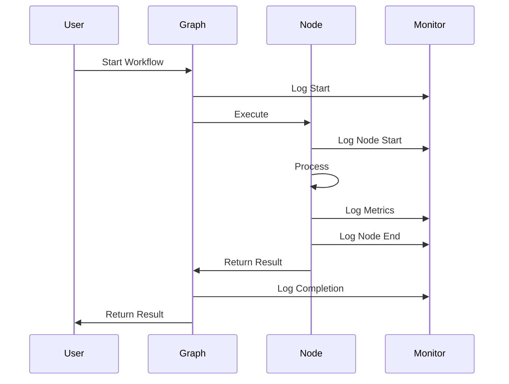

### Metrics Collection

```
Metrics Hierarchy:
├── Workflow Level
│   ├── Total Duration
│   ├── Node Count
│   └── Success Rate
├── Node Level
│   ├── Execution Time
│   ├── Memory Usage
│   └── Error Count
└── Resource Level
    ├── LLM Token Usage
    ├── Storage Operations
    └── CPU Utilization
```

## Integration Points

### With pydantic_graph

Following pydantic_graph patterns:
- `BaseNode[StateT, DepsT, OutputT]` for type safety
- `GraphRunContext` for state and dependency access
- `End[OutputT]` for graph termination
- Persistence via `FileStatePersistence` or custom

#### Graph Iteration with GraphRun

```python
from pydantic_graph import Graph, GraphRun

# Iterate through graph execution
async with graph.iter(start_node, state=state, deps=deps) as run:
    async for node in run:
        print(f"Executing: {node}")
    print(f"Result: {run.result}")

# Manual iteration control
async with graph.iter(start_node, state=state) as run:
    node = run.next_node
    while not isinstance(node, End):
        node = await run.next(node)
```

#### State Persistence

```python
from pydantic_graph import FileStatePersistence
from pathlib import Path

# File-based persistence
persistence = FileStatePersistence(Path('workflow_state.json'))

# Run with persistence
result = await graph.run(
    start_node=StartNode(),
    state=initial_state,
    deps=deps,
    persistence=persistence
)

# Resume from persisted state
async with graph.iter_from_persistence(persistence) as run:
    node = await run.next()
```

#### Edge Annotations for Diagrams

```python
from typing import Annotated
from pydantic_graph import Edge

@dataclass
class DecisionNode(BaseNode[State, Deps, Output]):
    async def run(self, ctx) -> Annotated[ApprovalNode, Edge(label='approved')] | Annotated[RejectionNode, Edge(label='rejected')]:
        if ctx.state.approved:
            return ApprovalNode()
        else:
            return RejectionNode()
```

### With GraphToolkit System

Direct integration pattern:
```python
class GraphToolkitIntegration:
    """Integrates graph workflows with GraphToolkit system."""
    
    def __init__(self, graph: Graph):
        self.graph = graph
    
    async def run(self, input_data: Dict) -> Any:
        # Convert input to WorkflowState
        # Execute graph with state
        # Return structured output
        ...
```

### With Storage Systems

Standardized interfaces:
```python
class StorageInterface:
    """Common interface for all storage operations."""
    
    async def load(self, key: str) -> Any: ...
    async def save(self, key: str, data: Any) -> None: ...
    async def exists(self, key: str) -> bool: ...
    async def delete(self, key: str) -> None: ...
```

## Security Considerations

### Input Validation
- All node inputs validated via Pydantic
- State mutations controlled and tracked
- External data sanitized before processing

### Resource Limits
- Execution timeouts per node
- Memory limits enforced
- Token usage caps for LLM calls

### Access Control
- Storage keys namespaced by workflow
- Sensitive data encrypted at rest
- Audit logging for all operations

## Future Extensibility

### Plugin Architecture
```
Planned Extensions:
├── Custom Node Types (via registration)
├── External Graph Imports
├── Dynamic Graph Composition
└── Real-time Graph Modification
```

### Version Management
```
Version Strategy:
1. Version all state schemas
2. Provide schema evolution support
3. Maintain schema compatibility
4. Document version changes
```