# Graph Architecture Documentation

## References

- [Workflow Graph System](workflow-graph-system.md)
- [Graph Architecture (this doc)](GRAPH_ARCHITECTURE.md)
- [Node Catalog](NODE_CATALOG.md)
- [Data Flow Requirements](DATA_FLOW_REQUIREMENTS.md)
- [Graph Type Definitions](GRAPH_TYPE_DEFINITIONS.md)

## System Design Overview

The Graph Architecture represents a fundamental shift from imperative, monolithic workflows to declarative, composable graphs. This document details the architectural decisions, patterns, and structures that enable this transformation.

## Architectural Layers

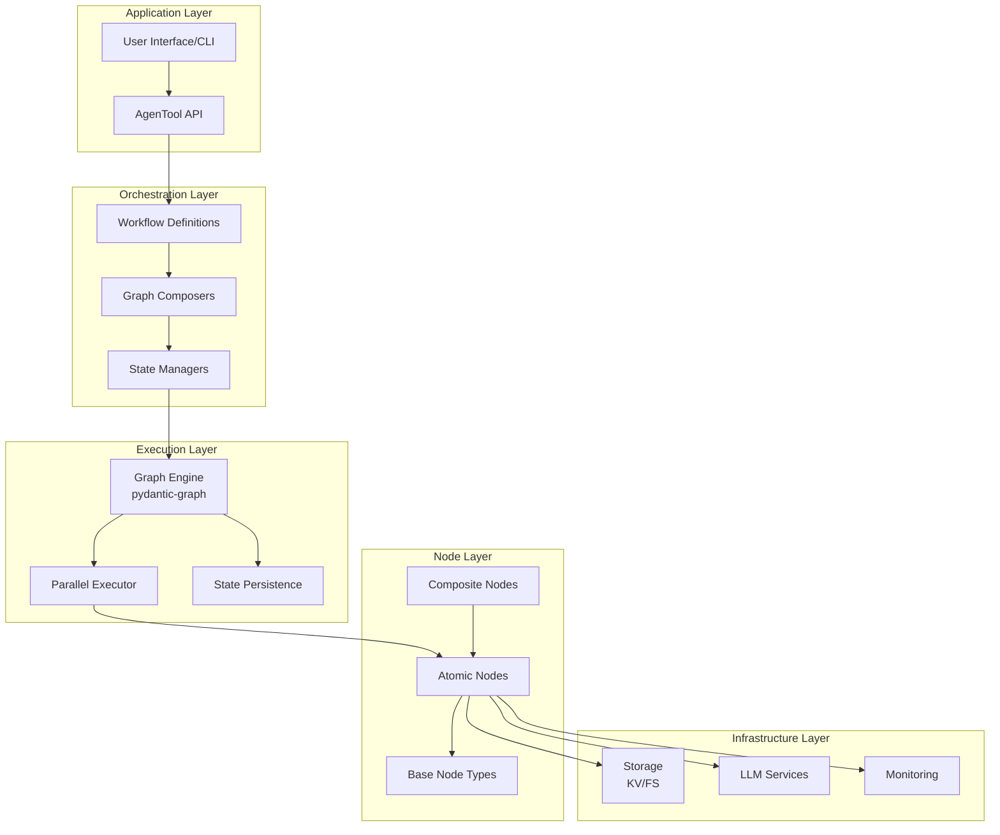

## Core Architectural Patterns

### 1. Node as Unit of Computation

Each node represents an atomic, deterministic operation:

```python
class SomeNode(BaseNode[StateT, DepsT, OutputT]):
    # Configuration (immutable)
    ...
    
    async def run(self, ctx: GraphRunContext[StateT, DepsT]) -> NextNode | End[OutputT]:
        # Single responsibility execution
        ...
```

**Characteristics:**
- **Stateless**: Nodes don't maintain internal state
- **Deterministic**: Same inputs produce same outputs
- **Composable**: Nodes combine into larger structures
- **Testable**: Each node tested in isolation

### 2. State as Immutable Data Flow

State flows through the graph, accumulating transformations:

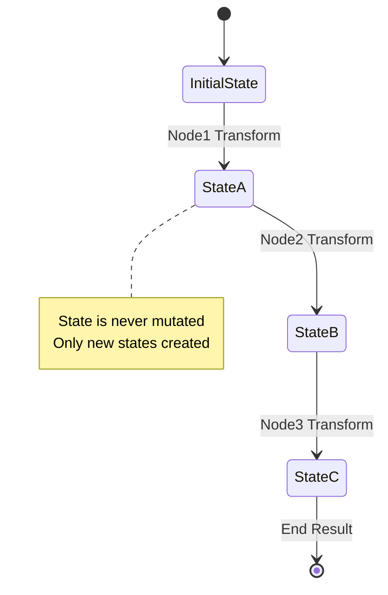

**State Principles:**
- **Immutable**: States are dataclasses with frozen=True
- **Accumulative**: Each node adds to state, doesn't remove
- **Referential**: Store references to data, not data itself
- **Versioned**: Each state transformation is tracked

### 3. Dependency Injection for Configuration

All external dependencies injected via GraphDeps:

```python
@dataclass
class GraphDeps:
    # Services
    storage: StorageService
    llm_client: LLMClient
    
    # Configuration
    models: ModelConfig
    thresholds: QualityThresholds
    
    # Resources
    executor: ProcessPoolExecutor
    ...
```

**Benefits:**
- **Testability**: Mock dependencies for testing
- **Flexibility**: Different configs for different environments
- **Reusability**: Same nodes, different dependencies

## Node Type Hierarchy

### Base Node Types

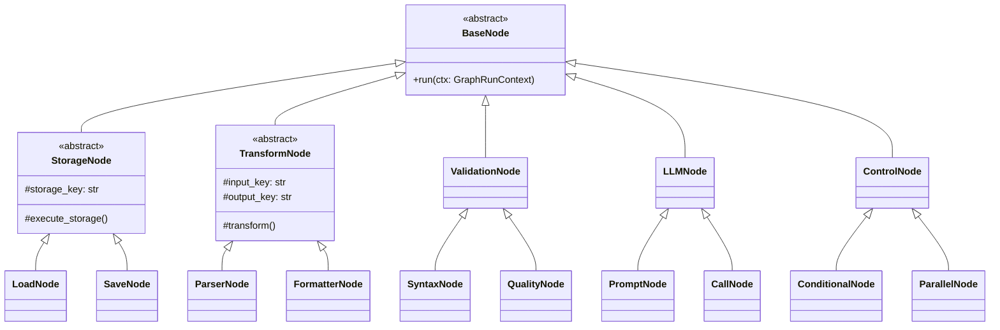

### Node Categories and Responsibilities

#### Storage Nodes
**Purpose**: Interface with persistence layers
**Pattern**: Load → Process → Save
```
Responsibilities:
- Data retrieval from storage_kv/storage_fs
- Data persistence to storage_kv/storage_fs
- Batch operations for efficiency
- Error handling for missing data
```

#### Transform Nodes
**Purpose**: Data transformation and formatting
**Pattern**: Input → Transform → Output
```
Responsibilities:
- Parse raw data into structured formats
- Serialize structured data to strings
- Format code and text
- Merge and filter data collections
```

#### Validation Nodes
**Purpose**: Ensure data quality and correctness
**Pattern**: Input → Validate → Pass/Fail
```
Responsibilities:
- Syntax validation (AST parsing)
- Schema validation (Pydantic models)
- Import checking
- Quality threshold enforcement
```

#### LLM Nodes
**Purpose**: AI model interactions
**Pattern**: Prompt → Call → Parse
```
Responsibilities:
- Prompt construction from templates
- Model API calls with retry logic
- Response parsing and validation
- Token usage tracking
```

#### Control Nodes
**Purpose**: Direct execution flow
**Pattern**: Condition → Branch/Loop/Parallel
```
Responsibilities:
- Conditional branching
- Parallel execution coordination
- Loop control with termination
- Result aggregation
```

## Execution Patterns

### Sequential Execution

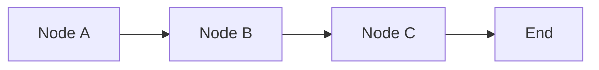

**Use When:**
- Operations have dependencies
- State builds incrementally
- Order matters for correctness

### Parallel Execution

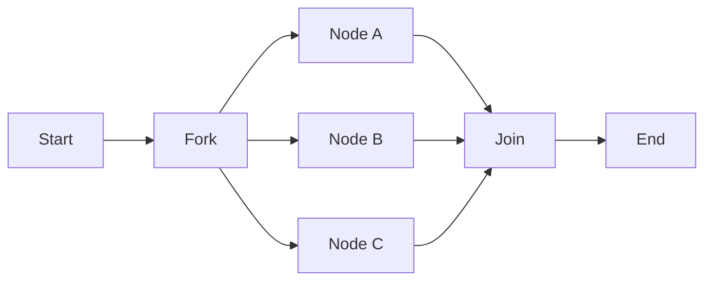

**Use When:**
- Operations are independent
- Processing multiple items
- Optimizing for performance

### Conditional Execution

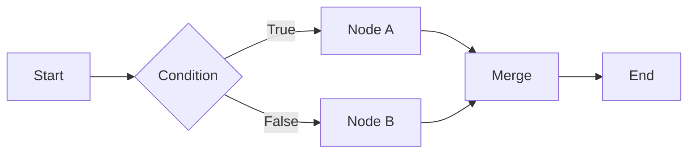

**Use When:**
- Different paths based on state
- Error handling with fallbacks
- Quality gates and thresholds

### Loop Execution

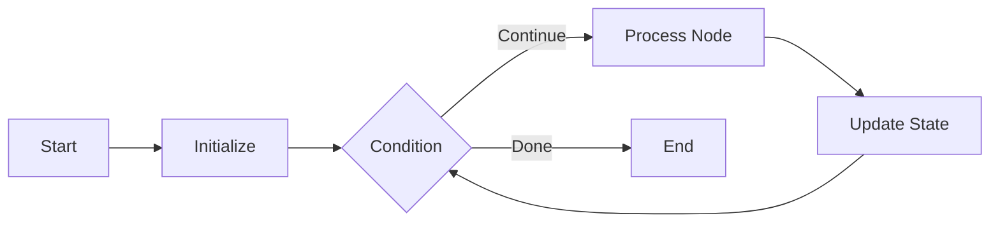

**Use When:**
- Iterative refinement needed
- Processing collections
- Polling or waiting operations

## State Management Architecture

### State Composition

```
WorkflowState
├── Metadata
│   ├── workflow_id
│   ├── timestamp
│   └── phase
├── DataRefs
│   ├── storage_kv_refs
│   └── storage_fs_refs
├── ProcessingState
│   ├── current_items
│   ├── completed_items
│   └── failed_items
└── Results
    ├── validation_results
    ├── quality_scores
    └── final_outputs
```

### State Evolution Pattern

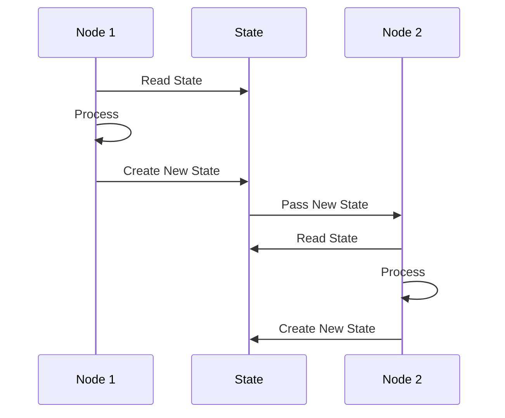

## Dependency Management

### Dependency Scopes

```
GraphDeps
├── Global (shared across all nodes)
│   ├── storage_client
│   ├── llm_client
│   └── monitoring
├── Phase-Specific
│   ├── analyzer_config
│   ├── crafter_config
│   └── evaluator_config
└── Resource Pools
    ├── process_executor
    ├── thread_executor
    └── async_semaphore
```

### Dependency Injection Flow

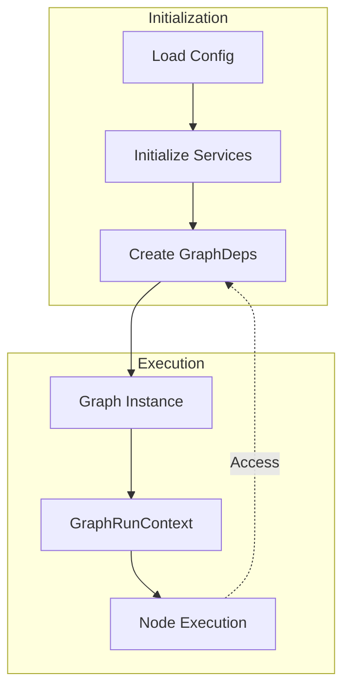

## Error Handling Architecture

### Error Propagation

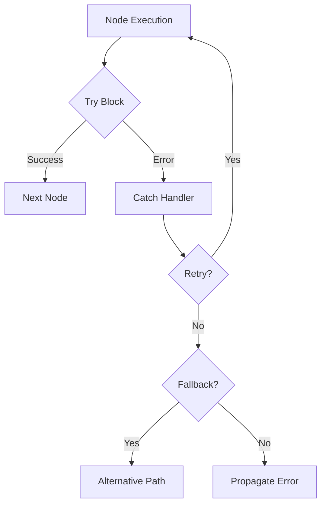

### Error Categories

1. **Recoverable Errors**
   - Network timeouts → Retry
   - Rate limits → Backoff
   - Temporary failures → Alternative path

2. **Validation Errors**
   - Syntax errors → Refinement
   - Quality failures → Iteration
   - Schema mismatches → Transformation

3. **Fatal Errors**
   - Missing dependencies → Fail fast
   - Invalid configuration → Abort
   - Resource exhaustion → Graceful shutdown

## Performance Optimization

### Parallelization Strategy

```
Parallel Execution Rules:
1. Identify independent node paths
2. Group by resource requirements
3. Limit concurrent executions
4. Aggregate results efficiently
```

### Caching Architecture

```
Cache Layers:
├── Node Result Cache (in-memory)
├── State Snapshot Cache (Redis/KV)
├── LLM Response Cache (disk/KV)
└── Template Cache (in-memory)
```

### Resource Management

```python
@dataclass
class ResourceLimits:
    max_parallel_nodes: int = 10
    max_llm_concurrent: int = 5
    max_memory_mb: int = 2048
    max_execution_time: int = 3600
```

## Monitoring and Observability

### Execution Tracing

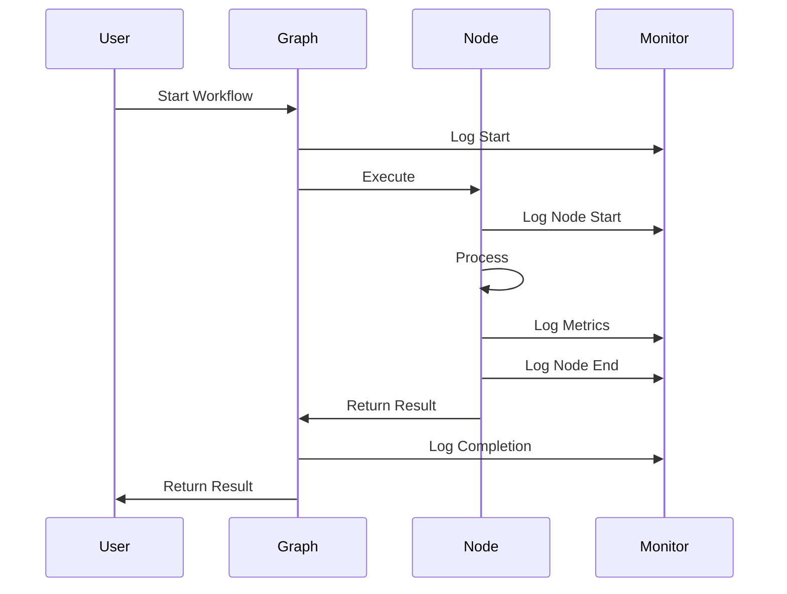

### Metrics Collection

```
Metrics Hierarchy:
├── Workflow Level
│   ├── Total Duration
│   ├── Node Count
│   └── Success Rate
├── Node Level
│   ├── Execution Time
│   ├── Memory Usage
│   └── Error Count
└── Resource Level
    ├── LLM Token Usage
    ├── Storage Operations
    └── CPU Utilization
```

## Integration Points

### With pydantic-graph

Following pydantic-graph patterns:
- `BaseNode[StateT, DepsT, OutputT]` for type safety
- `GraphRunContext` for state and dependency access
- `End[OutputT]` for graph termination
- Persistence via `FileStatePersistence` or custom

### With Existing AgenTools

Adapter pattern for backward compatibility:
```python
class GraphToAgenToolAdapter:
    """Wraps graph as AgenTool for injector."""
    
    def __init__(self, graph: Graph):
        self.graph = graph
    
    async def run(self, input_data: Dict) -> Any:
        # Convert input to state
        # Execute graph
        # Convert output to AgenTool format
        ...
```

### With Storage Systems

Standardized interfaces:
```python
class StorageInterface:
    """Common interface for all storage operations."""
    
    async def load(self, key: str) -> Any: ...
    async def save(self, key: str, data: Any) -> None: ...
    async def exists(self, key: str) -> bool: ...
    async def delete(self, key: str) -> None: ...
```

## Security Considerations

### Input Validation
- All node inputs validated via Pydantic
- State mutations controlled and tracked
- External data sanitized before processing

### Resource Limits
- Execution timeouts per node
- Memory limits enforced
- Token usage caps for LLM calls

### Access Control
- Storage keys namespaced by workflow
- Sensitive data encrypted at rest
- Audit logging for all operations

## Future Extensibility

### Plugin Architecture
```
Planned Extensions:
├── Custom Node Types (via registration)
├── External Graph Imports
├── Dynamic Graph Composition
└── Real-time Graph Modification
```

### Version Migration
```
Migration Strategy:
1. Version all state schemas
2. Provide migration nodes
3. Support parallel old/new execution
4. Gradual deprecation timeline
```

This architecture provides the foundation for a scalable, maintainable, and performant workflow system that leverages the full power of graph-based computation while maintaining compatibility with existing systems.