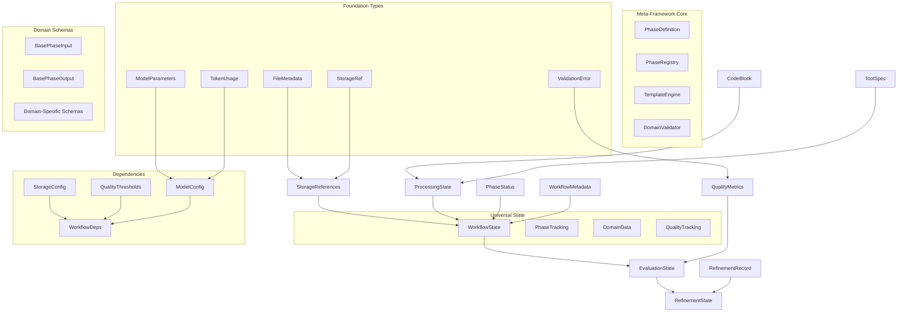

# Graph Type Definitions - Meta-Framework Types

## Overview

This document provides complete type definitions for the **meta-framework workflow system**, where phases are defined as data rather than code. The type system supports domain-agnostic workflows through a universal pattern:

**`PhaseDefinition + GenericPhaseNode + WorkflowState = Any Domain Workflow`**

All types follow a strict dependency order where base types are defined before dependent types.

## References

- [Workflow Graph System](workflow-graph-system.md)
- [Graph Architecture](GRAPH_ARCHITECTURE.md)
- [Node Catalog](NODE_CATALOG.md)
- [Data Flow Requirements](DATA_FLOW_REQUIREMENTS.md)
- [Graph Type Definitions (this doc)](GRAPH_TYPE_DEFINITIONS.md)
- [State Mutations](STATE_MUTATIONS.md)

## Type Dependency Hierarchy



## Meta-Framework Core Types

### PhaseDefinition (Canonical)

```python
from typing import Type, List, Dict, Any, Optional
from pydantic import BaseModel

@dataclass(frozen=True)
class PhaseDefinition:
    """Defines a workflow phase as configuration."""
    # Identity
    phase_name: str                    # e.g., 'analyzer', 'designer', 'generator'
    domain: str                        # e.g., 'smoke'
    
    # Atomic Node Sequence
    atomic_nodes: List[str]            # Ordered list of atomic node IDs to execute
    
    # Schemas
    input_schema: Type[BaseModel]      # Pydantic model for input validation
    output_schema: Type[BaseModel]     # Pydantic model for output validation
    
    # Templates
    system_template: str               # Path to system prompt template
    user_template: str                 # Path to user prompt template
    template_variables: List[str]     # Required variables for templates
    
    # Storage
    storage_pattern: str               # e.g., '{domain}/{workflow_id}/{phase}'
    storage_type: Literal['kv', 'fs'] = 'kv'  # Default to key-value storage
    
    # Dependencies
    dependencies: List[str]            # Required previous phases
    optional_dependencies: List[str] = field(default_factory=list)
    
    # Configuration
    model_config: ModelParameters      # LLM configuration for this phase
    retry_config: Dict[str, Any] = field(default_factory=lambda: {
        'max_retries': 3,
        'backoff_factor': 2
    })
    
    # Validation
    quality_threshold: float = 0.8    # Minimum quality score to pass
    allow_refinement: bool = True     # Whether phase supports refinement
    max_refinements: int = 3          # Maximum refinement iterations
    
    def get_storage_key(self, workflow_id: str) -> str:
        """Generate storage key for this phase."""
        return self.storage_pattern.format(
            domain=self.domain,
            workflow_id=workflow_id,
            phase=self.phase_name
        )
```

### PhaseRegistry

```python
@dataclass
class PhaseRegistry:
    """Central registry for all phase definitions."""
    phases: Dict[str, PhaseDefinition] = field(default_factory=dict)
    validators: Dict[str, DomainValidator] = field(default_factory=dict)
    
    def register(self, definition: PhaseDefinition) -> None:
        """Register a phase definition."""
        key = f"{definition.domain}.{definition.phase_name}"
        self.phases[key] = definition
    
    def get(self, domain: str, phase: str) -> PhaseDefinition:
        """Retrieve a phase definition."""
        key = f"{domain}.{phase}"
        if key not in self.phases:
            raise KeyError(f"Phase not found: {key}")
        return self.phases[key]
    
    def list_domains(self) -> List[str]:
        """List all registered domains."""
        domains = set()
        for key in self.phases.keys():
            domain, _ = key.split('.', 1)
            domains.add(domain)
        return sorted(domains)
    
    def list_phases(self, domain: str) -> List[str]:
        """List all phases for a domain."""
        phases = []
        for key, definition in self.phases.items():
            if key.startswith(f"{domain}."):
                phases.append(definition.phase_name)
        return phases
```

### TemplateEngine

```python
@dataclass
class TemplateEngine:
    """Template rendering engine for phase prompts."""
    template_dir: str = 'templates'
    cache_templates: bool = True
    _cache: Dict[str, str] = field(default_factory=dict)
    
    def render(self, template_path: str, variables: Dict[str, Any]) -> str:
        """Render a template with variables."""
        # Load template (with caching)
        template = self._load_template(template_path)
        
        # Render with Jinja2
        from jinja2 import Template
        jinja_template = Template(template)
        return jinja_template.render(**variables)
    
    def _load_template(self, path: str) -> str:
        """Load template from file system."""
        if self.cache_templates and path in self._cache:
            return self._cache[path]
        
        full_path = f"{self.template_dir}/{path}"
        with open(full_path, 'r') as f:
            template = f.read()
        
        if self.cache_templates:
            self._cache[path] = template
        
        return template
```

### DomainValidator

```python
@dataclass
class DomainValidator:
    """Validates domain-specific data and transitions."""
    domain: str
    validation_rules: Dict[str, Callable[[Any], bool]]
    
    def validate_phase_input(self, phase: str, data: Any) -> ValidationResult:
        """Validate input data for a phase."""
        errors = []
        warnings = []
        
        rule_key = f"{phase}_input"
        if rule_key in self.validation_rules:
            rule = self.validation_rules[rule_key]
            if not rule(data):
                errors.append(ValidationError(
                    error_type='schema',
                    message=f"Input validation failed for {phase}",
                    severity='error'
                ))
        
        return ValidationResult(
            valid=len(errors) == 0,
            errors=errors,
            warnings=warnings,
            metadata={'phase': phase, 'domain': self.domain}
        )
    
    def validate_phase_transition(self, from_phase: str, to_phase: str, state: WorkflowState) -> bool:
        """Validate transition between phases."""
        # Check dependencies satisfied
        # Validate required data present
        # Ensure domain consistency
        return True
```

## Foundation Types

### StorageRef

```python
from dataclasses import dataclass, field, replace
from typing import Literal, Optional, List, Dict, Any, Tuple
from datetime import datetime
import hashlib
import json

@dataclass(frozen=True)
class StorageRef:
    """Reference to data in storage systems."""
    storage_type: Literal['kv', 'fs']  # Storage system type
    key: str                            # Storage key or path (no prefix)
    version: Optional[int] = None       # Version number for versioned storage
    created_at: datetime = field(default_factory=datetime.now)
    size_bytes: Optional[int] = None    # Size of stored data
    content_hash: Optional[str] = None  # SHA256 hash for verification
    
    @property
    def full_ref(self) -> str:
        """Get full reference string like 'storage_kv:workflow/123/analysis'."""
        prefix = 'storage_kv' if self.storage_type == 'kv' else 'storage_fs'
        return f"{prefix}:{self.key}"
```

### TokenUsage

```python
@dataclass(frozen=True)
class TokenUsage:
    """LLM token usage tracking."""
    prompt_tokens: int      # Tokens in the prompt
    completion_tokens: int  # Tokens in the completion
    total_tokens: int      # Total tokens used
    model: str            # Model identifier (e.g., 'gpt-4o')
    cost_usd: Optional[float] = None  # Estimated cost in USD
    
    def __add__(self, other: 'TokenUsage') -> 'TokenUsage':
        """Combine token usage from multiple calls."""
        if self.model != other.model:
            raise ValueError(f"Cannot combine usage from different models: {self.model} != {other.model}")
        return TokenUsage(
            prompt_tokens=self.prompt_tokens + other.prompt_tokens,
            completion_tokens=self.completion_tokens + other.completion_tokens,
            total_tokens=self.total_tokens + other.total_tokens,
            model=self.model,
            cost_usd=(self.cost_usd or 0) + (other.cost_usd or 0) if self.cost_usd or other.cost_usd else None
        )
```

### FileMetadata

```python
@dataclass(frozen=True)
class FileMetadata:
    """Metadata for file storage operations."""
    path: str                   # File path
    size_bytes: int             # File size
    mime_type: str              # MIME type (e.g., 'text/x-python')
    encoding: str = 'utf-8'     # File encoding
    created_at: datetime = field(default_factory=datetime.now)
    modified_at: datetime = field(default_factory=datetime.now)
    checksum: Optional[str] = None  # MD5 or SHA256 checksum
    permissions: str = '644'     # Unix-style permissions
```

### ValidationError

```python
@dataclass(frozen=True)
class ValidationError:
    """Represents a validation error."""
    error_type: Literal['syntax', 'import', 'type', 'schema', 'quality']
    message: str                # Error message
    line_number: Optional[int] = None  # Line number in code
    column: Optional[int] = None       # Column position
    severity: Literal['error', 'warning', 'info'] = 'error'
    suggestion: Optional[str] = None    # Suggested fix
```

### ModelParameters

```python
@dataclass(frozen=True)
class ModelParameters:
    """LLM model call parameters."""
    temperature: float = 0.7
    max_tokens: int = 2000
    top_p: float = 1.0
    frequency_penalty: float = 0.0
    presence_penalty: float = 0.0
    stop_sequences: List[str] = field(default_factory=list)
    response_format: Optional[Literal['text', 'json']] = None
    seed: Optional[int] = None  # For reproducibility
```

## Universal Schema Types

### BasePhaseInput

```python
@dataclass(frozen=True)
class BasePhaseInput(BaseModel):
    """Base input schema for all phases."""
    workflow_id: str                   # Workflow identifier
    domain: str                        # Domain context
    phase: str                         # Current phase name
    dependencies: Dict[str, Any]       # Data from dependent phases
    context: Dict[str, Any] = field(default_factory=dict)  # Additional context
    
    class Config:
        extra = 'forbid'  # Strict validation
```

### BasePhaseOutput

```python
@dataclass(frozen=True)
class BasePhaseOutput(BaseModel):
    """Base output schema for all phases."""
    phase: str                         # Phase that generated this output
    success: bool                      # Whether phase succeeded
    data: Dict[str, Any]              # Phase-specific output data
    metadata: Dict[str, Any]          # Execution metadata
    quality_score: Optional[float] = None  # Quality assessment if applicable
    
    class Config:
        extra = 'forbid'
```

## Domain-Specific Types

### Smoke Domain Types

#### RecipeSpec

```python
@dataclass(frozen=True)
class RecipeSpec:
    """Complete specification for a recipe in smoke tests."""
    name: str                          # Recipe name
    description: str                   # One-line description
    ingredients: List[str]             # List of ingredients
    steps: List[str]                  # Recipe steps
    prep_time: int                     # Preparation time in minutes
    cook_time: int                     # Cooking time in minutes
    servings: int                      # Number of servings
    difficulty: Literal['easy', 'medium', 'hard']  # Recipe difficulty
    
    def get_total_time(self) -> int:
        """Get total recipe time."""
        return self.prep_time + self.cook_time
```

### CodeBlock

```python
@dataclass(frozen=True)
class CodeBlock:
    """Represents a block of code with metadata."""
    code: str                         # The actual code
    language: str = 'python'          # Programming language
    file_path: Optional[str] = None   # Target file path
    line_start: Optional[int] = None  # Starting line number
    line_end: Optional[int] = None    # Ending line number
    purpose: Optional[str] = None     # What this code does
    dependencies: List[str] = field(default_factory=list)  # Required imports
    
    @property
    def line_count(self) -> int:
        """Count lines in the code block."""
        return len(self.code.splitlines())
    
    @property
    def is_valid_python(self) -> bool:
        """Check if code is syntactically valid Python."""
        import ast
        try:
            ast.parse(self.code)
            return True
        except SyntaxError:
            return False
```

### QualityMetrics

```python
@dataclass(frozen=True)
class QualityMetrics:
    """Code quality metrics."""
    syntax_valid: bool                    # Passes syntax check
    imports_valid: bool                   # All imports resolve
    type_coverage: float                  # Percentage with type hints
    docstring_coverage: float             # Percentage with docstrings
    test_coverage: float                  # Test coverage percentage
    complexity_score: float               # Cyclomatic complexity
    maintainability_index: float          # Maintainability score (0-100)
    quality_score: float                  # Overall quality (0-1)
    issues: List[ValidationError]         # List of issues found
    
    @property
    def is_production_ready(self) -> bool:
        """Check if meets production standards."""
        return (
            self.syntax_valid and
            self.imports_valid and
            self.quality_score >= 0.8 and
            len([i for i in self.issues if i.severity == 'error']) == 0
        )
```

### ValidationResult

```python
@dataclass(frozen=True)
class ValidationResult:
    """Result of validation operations."""
    valid: bool                         # Overall validation status
    errors: List[ValidationError]       # List of validation errors
    warnings: List[ValidationError]     # List of warnings
    metadata: Dict[str, Any]            # Additional validation metadata
    
    @property
    def has_errors(self) -> bool:
        """Check if validation has any errors."""
        return len([e for e in self.errors if e.severity == 'error']) > 0
```

### RefinementRecord

```python
@dataclass(frozen=True)
class RefinementRecord:
    """Record of a refinement iteration."""
    iteration: int                        # Iteration number
    timestamp: datetime                   # When refinement occurred
    previous_score: float                 # Quality before refinement
    new_score: float                     # Quality after refinement
    feedback: str                        # Refinement feedback/prompt
    changes_made: List[str]              # List of changes
    code_before_ref: StorageRef         # Reference to code before
    code_after_ref: StorageRef          # Reference to code after
    token_usage: Optional[TokenUsage] = None  # LLM usage for refinement
    
    @property
    def improvement(self) -> float:
        """Calculate improvement percentage."""
        if self.previous_score == 0:
            return 100.0 if self.new_score > 0 else 0.0
        return ((self.new_score - self.previous_score) / self.previous_score) * 100
```

## State Components

### WorkflowMetadata

```python
@dataclass(frozen=True)
class WorkflowMetadata:
    """Immutable workflow identification and tracking."""
    workflow_id: str                     # Unique identifier
    task_description: str                # Original task description
    created_at: datetime                 # Creation timestamp
    created_by: Optional[str] = None    # User/system that created
    tags: List[str] = field(default_factory=list)  # Workflow tags
    parent_workflow_id: Optional[str] = None  # For sub-workflows
```

### PhaseStatus

```python
@dataclass(frozen=True)
class PhaseStatus:
    """Status tracking for workflow phases."""
    ingredient_analyzer_complete: bool = False
    recipe_designer_complete: bool = False
    recipe_crafter_complete: bool = False
    recipe_evaluator_complete: bool = False
    
    @property
    def current_phase(self) -> str:
        """Determine current phase based on completion status."""
        if not self.ingredient_analyzer_complete:
            return "ingredient_analyzer"
        elif not self.recipe_designer_complete:
            return "recipe_designer"
        elif not self.recipe_crafter_complete:
            return "recipe_crafter"
        elif not self.recipe_evaluator_complete:
            return "recipe_evaluator"
        else:
            return "completed"
```

### ProcessingState

```python
@dataclass(frozen=True)
class ProcessingState:
    """Current processing state within a phase."""
    current_item: Optional[str] = None           # Item being processed
    items_to_process: List[str] = field(default_factory=list)
    items_completed: List[str] = field(default_factory=list)
    items_failed: List[str] = field(default_factory=list)
    processing_errors: Dict[str, str] = field(default_factory=dict)  # item -> error
    
    @property
    def progress_percentage(self) -> float:
        """Calculate processing progress."""
        total = len(self.items_to_process)
        if total == 0:
            return 100.0
        completed = len(self.items_completed)
        return (completed / total) * 100
```

### StorageReferences

```python
@dataclass(frozen=True)
class StorageReferences:
    """Collection of storage references."""
    # Ingredient Analysis phase
    ingredients_ref: Optional[StorageRef] = None
    ingredient_analysis_ref: Optional[StorageRef] = None
    
    # Recipe Design phase
    recipe_design_ref: Optional[StorageRef] = None
    recipe_specs: Dict[str, StorageRef] = field(default_factory=dict)  # recipe_name -> ref
    
    # Recipe Crafting phase
    recipe_files: Dict[str, StorageRef] = field(default_factory=dict)  # recipe_name -> ref
    implementations: Dict[str, StorageRef] = field(default_factory=dict)
    
    # Recipe Evaluation phase
    evaluations: Dict[str, StorageRef] = field(default_factory=dict)
    final_recipes: Dict[str, StorageRef] = field(default_factory=dict)
```

## Universal State Types

### WorkflowState

```python
from typing import Optional, List, Dict, Any, Set
from dataclasses import dataclass, field, replace

@dataclass(frozen=True)
class WorkflowState:
    """Universal immutable state for any domain workflow."""
    # Identity
    workflow_id: str
    domain: str  # 'smoke', etc.
    created_at: datetime = field(default_factory=datetime.now)
    
    # Phase tracking
    phase_sequence: List[str]  # Ordered list of phases to execute
    completed_phases: Set[str] = field(default_factory=set)
    current_phase: Optional[str] = None
    
    # Universal storage
    phase_outputs: Dict[str, StorageRef] = field(default_factory=dict)
    
    # Domain-specific data (flexible per domain)
    domain_data: Dict[str, Any] = field(default_factory=dict)
    
    # Quality tracking
    quality_scores: Dict[str, float] = field(default_factory=dict)
    validation_results: Dict[str, ValidationResult] = field(default_factory=dict)
    
    # Refinement tracking
    refinement_count: Dict[str, int] = field(default_factory=dict)
    refinement_history: Dict[str, List[RefinementRecord]] = field(default_factory=dict)
    
    # Token usage tracking
    total_token_usage: Dict[str, TokenUsage] = field(default_factory=dict)  # phase -> usage
    
    def with_phase_complete(self, phase: str, output_ref: StorageRef) -> 'WorkflowState':
        """Return new state with phase marked complete."""
        return replace(
            self,
            completed_phases=self.completed_phases | {phase},
            phase_outputs={**self.phase_outputs, phase: output_ref},
            current_phase=self._get_next_phase(phase)
        )
    
    def _get_next_phase(self, current: str) -> Optional[str]:
        """Determine next phase in sequence."""
        try:
            idx = self.phase_sequence.index(current)
            if idx < len(self.phase_sequence) - 1:
                return self.phase_sequence[idx + 1]
        except ValueError:
            pass
        return None
    
    def with_storage_ref(self, ref_type: str, ref: StorageRef, tool_name: Optional[str] = None) -> 'WorkflowState':
        """Return new state with added storage reference."""
        new_storage = self.storage
        if tool_name:
            # Update dict field
            ref_dict = getattr(new_storage, ref_type)
            new_dict = {**ref_dict, tool_name: ref}
            new_storage = replace(new_storage, **{ref_type: new_dict})
        else:
            # Update single field
            new_storage = replace(new_storage, **{ref_type: ref})
        return replace(self, storage=new_storage)
```

### EvaluationState

```python
@dataclass(frozen=True)
class EvaluationState(WorkflowState):
    """Extended state for evaluation phase with refinement support."""
    # Current evaluation iteration
    evaluation_iteration: int = 0
    max_iterations: int = 3
    
    # Refinement tracking
    refinement_history: Dict[str, List[RefinementRecord]] = field(default_factory=dict)
    
    # Quality tracking
    quality_trajectory: Dict[str, List[float]] = field(default_factory=dict)  # tool -> [scores]
    
    # Termination conditions
    termination_reason: Optional[str] = None
    
    def should_refine(self, tool_name: str, threshold: float) -> bool:
        """Determine if tool needs refinement."""
        if self.evaluation_iteration >= self.max_iterations:
            return False
        
        metrics = self.quality_metrics.get(tool_name)
        if not metrics:
            return True  # No metrics yet, needs evaluation
        
        return metrics.quality_score < threshold
    
    def with_refinement(self, tool_name: str, record: RefinementRecord) -> 'EvaluationState':
        """Add refinement record and update state."""
        history = self.refinement_history.get(tool_name, [])
        new_history = {**self.refinement_history, tool_name: history + [record]}
        
        trajectory = self.quality_trajectory.get(tool_name, [])
        new_trajectory = {**self.quality_trajectory, tool_name: trajectory + [record.new_score]}
        
        return replace(
            self,
            refinement_history=new_history,
            quality_trajectory=new_trajectory,
            evaluation_iteration=self.evaluation_iteration + 1
        )
```

### RefinementState

```python
@dataclass(frozen=True)
class RefinementState:
    """State for a single refinement iteration."""
    tool_name: str                       # Tool being refined
    current_code: CodeBlock              # Current code version
    current_metrics: QualityMetrics     # Current quality metrics
    iteration: int                      # Refinement iteration
    feedback: str                       # Feedback for refinement
    previous_attempts: List[CodeBlock] = field(default_factory=list)
    
    @property
    def has_improved(self) -> bool:
        """Check if quality has improved in recent attempts."""
        if len(self.previous_attempts) < 2:
            return True  # Not enough history
        # Compare last two attempts
        # Implementation would parse metrics from attempts
        return True
```

## Dependency Types

### ModelConfig

```python
@dataclass(frozen=True)
class ModelConfig:
    """LLM model configuration."""
    default_model: str = 'openai:gpt-4o'
    phase_models: Dict[str, str] = field(default_factory=lambda: {
        'analysis': 'openai:gpt-4o',
        'specification': 'openai:gpt-4o',
        'crafting': 'anthropic:claude-3-5-sonnet-latest',
        'evaluation': 'openai:gpt-4o',
        'refinement': 'anthropic:claude-3-5-sonnet-latest'
    })
    parameters: Dict[str, ModelParameters] = field(default_factory=dict)
    retry_config: Dict[str, Any] = field(default_factory=lambda: {
        'max_retries': 3,
        'backoff_factor': 2,
        'max_wait': 60
    })
    
    def get_model_for_phase(self, phase: str) -> str:
        """Get model for specific phase."""
        return self.phase_models.get(phase, self.default_model)
```

### QualityThresholds

```python
@dataclass(frozen=True)
class QualityThresholds:
    """Quality gate thresholds."""
    min_quality_score: float = 0.8      # Minimum overall quality
    min_test_coverage: float = 0.7      # Minimum test coverage
    min_type_coverage: float = 0.9      # Minimum type hint coverage
    min_doc_coverage: float = 0.8       # Minimum docstring coverage
    max_complexity: float = 10.0        # Maximum cyclomatic complexity
    max_refinement_iterations: int = 3   # Maximum refinement attempts
    
    def check_metrics(self, metrics: QualityMetrics) -> Tuple[bool, List[str]]:
        """Check if metrics meet thresholds."""
        failures = []
        
        if metrics.quality_score < self.min_quality_score:
            failures.append(f"Quality score {metrics.quality_score:.2f} < {self.min_quality_score}")
        if metrics.test_coverage < self.min_test_coverage:
            failures.append(f"Test coverage {metrics.test_coverage:.1%} < {self.min_test_coverage:.1%}")
        if metrics.type_coverage < self.min_type_coverage:
            failures.append(f"Type coverage {metrics.type_coverage:.1%} < {self.min_type_coverage:.1%}")
        if metrics.complexity_score > self.max_complexity:
            failures.append(f"Complexity {metrics.complexity_score:.1f} > {self.max_complexity}")
        
        return len(failures) == 0, failures
```

### StorageConfig

```python
@dataclass(frozen=True)
class StorageConfig:
    """Storage system configuration."""
    kv_backend: Literal['memory', 'redis', 'dynamodb'] = 'memory'
    fs_backend: Literal['local', 's3', 'gcs'] = 'local'
    kv_prefix: str = 'workflow'
    fs_root: str = 'generated'
    enable_versioning: bool = True
    enable_compression: bool = False
    max_value_size_mb: int = 10
    max_file_size_mb: int = 100
    retention_days: int = 30
    
    def get_kv_key(self, workflow_id: str, key_type: str, tool_name: Optional[str] = None) -> str:
        """Generate storage key for KV store."""
        parts = [self.kv_prefix, workflow_id, key_type]
        if tool_name:
            parts.append(tool_name)
        return '/'.join(parts)
    
    def get_fs_path(self, workflow_id: str, stage: str, filename: str) -> str:
        """Generate file path for FS store."""
        return f"{self.fs_root}/{workflow_id}/{stage}/{filename}"
```

### WorkflowDeps

```python
from concurrent.futures import ProcessPoolExecutor, ThreadPoolExecutor
from typing import Optional
import asyncio

@dataclass(frozen=True)
class WorkflowDeps:
    """Dependencies injected into workflow execution."""
    # Configuration
    models: ModelConfig
    quality: QualityThresholds
    storage: StorageConfig
    
    # Services (these would be actual service instances)
    storage_client: Any  # StorageClient instance
    llm_client: Any      # LLMClient instance
    
    # Executors for parallelism
    process_executor: ProcessPoolExecutor = field(default_factory=lambda: ProcessPoolExecutor(max_workers=4))
    thread_executor: ThreadPoolExecutor = field(default_factory=lambda: ThreadPoolExecutor(max_workers=10))
    
    # Rate limiting
    max_concurrent_llm_calls: int = 5
    max_concurrent_storage_ops: int = 20
    
    # Monitoring
    enable_monitoring: bool = True
    metrics_client: Optional[Any] = None  # MetricsClient instance
    
    def get_semaphore(self, resource: str) -> asyncio.Semaphore:
        """Get semaphore for resource limiting."""
        limits = {
            'llm': self.max_concurrent_llm_calls,
            'storage': self.max_concurrent_storage_ops
        }
        return asyncio.Semaphore(limits.get(resource, 10))
```

## Atomic Node Types

### Error Hierarchy

```python
from typing import Optional, Any

class WorkflowError(Exception):
    """Base class for all workflow errors."""
    pass

class RetryableError(WorkflowError):
    """Error that can be retried (transient failures)."""
    def __init__(self, message: str, retry_after: Optional[float] = None):
        super().__init__(message)
        self.retry_after = retry_after  # Seconds to wait before retry

class NonRetryableError(WorkflowError):
    """Error that should not be retried (permanent failures)."""
    pass

class StorageError(RetryableError):
    """Storage operation failed (network, permissions, etc)."""
    pass

class LLMError(NonRetryableError):
    """LLM call failed (expensive, handle at orchestrator level)."""
    pass

class ValidationError(NonRetryableError):
    """Validation failed (triggers refinement, not retry)."""
    pass
```

### State-Based Configuration Types (Canonical)

These are the canonical type definitions for the state-driven architecture. Other documents should reference these definitions.

```python
@dataclass(frozen=True)
class WorkflowDefinition:
    """Complete workflow definition in state."""
    domain: str                             # Context (smoke, etc)
    phases: Dict[str, PhaseDefinition]      # All phase definitions
    phase_sequence: List[str]               # Execution order
    node_configs: Dict[str, NodeConfig]     # Node behavior configs
    conditions: Dict[str, ConditionConfig] = field(default_factory=dict)  # Conditional logic configs

@dataclass(frozen=True)
class PhaseDefinition:
    """Single phase configuration."""
    phase_name: str                    # Unique phase identifier
    atomic_nodes: List[str]            # Sequence of node IDs
    dependencies: List[str]            # Required previous phases
    input_schema: Type[BaseModel]      # Input validation
    output_schema: Type[BaseModel]     # Output validation
    templates: TemplateConfig          # Template paths
    storage_pattern: str               # Storage key pattern
    storage_type: Literal['kv', 'fs'] # Storage backend
    quality_threshold: float           # Quality gate threshold
    allow_refinement: bool             # Can refine on quality failure

@dataclass(frozen=True)
class ConditionConfig:
    """Configuration for conditional logic."""
    condition_type: Literal['state_path', 'quality_gate', 'threshold', 'custom'] 
    # State path conditions (e.g., "domain_data.complexity == 'high'")
    state_path: Optional[str] = None        # Path to state value
    operator: Optional[str] = None          # Comparison operator
    expected_value: Optional[Any] = None    # Value to compare against
    # Quality gate conditions
    quality_field: Optional[str] = None     # Quality metric field name
    threshold: Optional[float] = None       # Threshold value
    # Custom function conditions  
    function_name: Optional[str] = None     # Name of registered function
    parameters: Dict[str, Any] = field(default_factory=dict)  # Function parameters
    
    def evaluate(self, state: 'WorkflowState') -> bool:
        """Evaluate condition against workflow state."""
        if self.condition_type == 'state_path':
            return self._evaluate_state_path(state)
        elif self.condition_type == 'quality_gate':
            return self._evaluate_quality_gate(state)  
        elif self.condition_type == 'threshold':
            return self._evaluate_threshold(state)
        elif self.condition_type == 'custom':
            return self._evaluate_custom(state)
        return False
    
    def _evaluate_state_path(self, state: 'WorkflowState') -> bool:
        """Evaluate state path condition."""
        # Navigate state using path (e.g., "domain_data.complexity")
        value = state
        for part in self.state_path.split('.'):
            if hasattr(value, part):
                value = getattr(value, part)
            elif isinstance(value, dict) and part in value:
                value = value[part]
            else:
                return False
        
        # Apply operator comparison
        if self.operator == '==':
            return value == self.expected_value
        elif self.operator == '!=':
            return value != self.expected_value
        elif self.operator == '>':
            return value > self.expected_value
        elif self.operator == '<':
            return value < self.expected_value
        elif self.operator == '>=':
            return value >= self.expected_value
        elif self.operator == '<=':
            return value <= self.expected_value
        elif self.operator == 'in':
            return value in self.expected_value
        elif self.operator == 'not_in':
            return value not in self.expected_value
        return False
    
    def _evaluate_quality_gate(self, state: 'WorkflowState') -> bool:
        """Evaluate quality gate condition."""
        if self.quality_field not in state.quality_scores:
            return False
        score = state.quality_scores[self.quality_field]
        return score >= self.threshold
    
    def _evaluate_threshold(self, state: 'WorkflowState') -> bool:
        """Evaluate threshold condition."""
        # Generic threshold evaluation using state path
        return self._evaluate_state_path(state)
    
    def _evaluate_custom(self, state: 'WorkflowState') -> bool:
        """Evaluate custom function condition."""
        # This would call a registered function by name
        # For now, return False as placeholder
        return False

@dataclass(frozen=True)
class NodeConfig:
    """Configuration for node behavior."""
    node_type: str                          # Node category
    retryable: bool = False                 # Can retry on failure
    max_retries: int = 0                    # Max retry attempts
    retry_backoff: str = "exponential"      # Backoff strategy
    # Iteration support
    iter_enabled: bool = False              # Process items one by one
    iter_in_type: Optional[Type] = None     # Input items type
    iter_out_type: Optional[Type] = None    # Output items type
    # Caching
    cacheable: bool = False                 # Can cache results
    cache_ttl: int = 0                      # Cache time-to-live
```

### Atomic Storage Node Types

```python
@dataclass
class DependencyCheckNode(BaseNode[WorkflowState, WorkflowDeps, None]):
    """Validates dependencies are satisfied."""
    
    async def run(self, ctx: GraphRunContext[WorkflowState, WorkflowDeps]) -> BaseNode:
        # Read dependencies from phase definition in state
        phase_def = ctx.state.workflow_def.phases[ctx.state.current_phase]
        
        for dep in phase_def.dependencies:
            if dep not in ctx.state.completed_phases:
                raise NonRetryableError(f"Dependency {dep} not satisfied")
        return LoadDependenciesNode()  # Return next node in chain

@dataclass  
class StateUpdateNode(BaseNode[WorkflowState, WorkflowDeps, WorkflowState]):
    """Updates workflow state after phase completion."""
    
    async def run(self, ctx: GraphRunContext[WorkflowState, WorkflowDeps]) -> BaseNode:
        # Read current phase from state
        phase_name = ctx.state.current_phase
        
        # Mark phase complete
        new_state = replace(
            ctx.state,
            completed_phases=ctx.state.completed_phases | {phase_name},
            current_phase=self._get_next_phase(ctx.state)
        )
        return QualityGateNode()  # Return next node in chain

@dataclass
class NextPhaseNode(BaseNode[WorkflowState, WorkflowDeps, WorkflowState]):
    """Determines next phase to execute."""
    
    async def run(self, ctx: GraphRunContext[WorkflowState, WorkflowDeps]) -> BaseNode | End[WorkflowState]:
        # Find next incomplete phase
        for phase in ctx.state.phase_sequence:
            if phase not in ctx.state.completed_phases:
                # Update state to new phase
                new_state = replace(ctx.state, current_phase=phase)
                # GenericPhaseNode will read phase from state
                return GenericPhaseNode()
        
        # All phases complete
        return End(ctx.state)
```

## Inter-Type Contracts

### Node Input/Output Contracts

```python
# Atomic Storage Node Contracts
LoadDependenciesNode: (WorkflowState, WorkflowDeps) -> Dict[str, Any]
SavePhaseOutputNode: (WorkflowState, WorkflowDeps) -> StorageRef
DependencyCheckNode: (WorkflowState, WorkflowDeps) -> None (validation only)
StateUpdateNode: (WorkflowState, WorkflowDeps) -> WorkflowState

# Template Node Contracts  
TemplateRenderNode: (WorkflowState with templates) -> Dict[str, str] (rendered prompts)

# Validation Node Contracts
SchemaValidationNode: (Any data, Type[BaseModel]) -> ValidationResult
QualityGateNode: (WorkflowState with quality_scores) -> BaseNode (refine or continue)

# LLM Node Contracts
LLMCallNode: (WorkflowState with prompts) -> Any (LLM response)

# Control Node Contracts
NextPhaseNode: (WorkflowState) -> GenericPhaseNode | End[WorkflowState]
RefinementNode: (WorkflowState) -> GenericPhaseNode
```

### State Mutation Rules

1. **Immutability**: States are never mutated, only replaced
2. **Accumulation**: New data is added, existing data preserved
3. **Reference Storage**: Large data stored externally, only refs in state
4. **Versioning**: Each state change creates new version
5. **Validation**: All state changes validated against schemas

### Type Composition Examples

```python
# Example: Creating new state with analysis results
def update_with_analysis(state: WorkflowState, analysis: AnalyzerOutput) -> WorkflowState:
    """Update state with analysis results."""
    # Create storage reference
    analysis_ref = StorageRef(
        storage_type='kv',
        key=f'workflow/{state.metadata.workflow_id}/analysis',
        content_hash=hashlib.sha256(json.dumps(analysis.dict()).encode()).hexdigest()
    )
    
    # Update state immutably
    return replace(
        state,
        missing_tools=analysis.missing_tools,
        existing_tools=analysis.existing_tools,
        system_design=analysis.system_design,
        guidelines=analysis.guidelines,
        storage=replace(state.storage, analysis_ref=analysis_ref),
        phase_status=replace(state.phase_status, analysis_complete=True)
    )
```

## Type Validation Rules

### Field Validation

- All string fields: Non-empty, stripped of whitespace
- All list fields: No None values, no duplicates where applicable
- All dict fields: Valid keys (alphanumeric + underscore)
- All float fields: Range validation (0.0-1.0 for scores)
- All datetime fields: UTC timezone aware

### Cross-Field Validation

- If `phase_status.analysis_complete`, then `storage.analysis_ref` must exist
- If `quality_metrics[tool].is_production_ready`, then tool not in `needs_refinement`
- If `evaluation_iteration >= max_iterations`, then `termination_reason` must be set
- Sum of token usage across phases should match `total_token_usage`

### Invariants

- `len(tools_completed) + len(tools_failed) <= len(tools_to_process)`
- `evaluation_iteration <= max_iterations`
- All `StorageRef` keys must follow naming convention
- All `RecipeSpec` names must follow naming convention