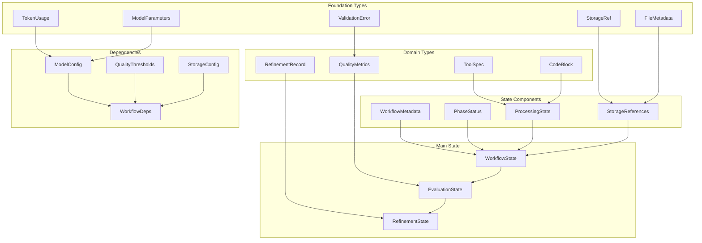

# Graph Type Definitions - Phase 2

## Overview

This document provides complete type definitions for the workflow graph system, establishing the data plane with full field specifications, type compositions, and inter-type dependencies. All types follow a strict dependency order where base types are defined before dependent types.

## References

- [Workflow Graph System](workflow-graph-system.md)
- [Graph Architecture](GRAPH_ARCHITECTURE.md)
- [Node Catalog](NODE_CATALOG.md)
- [Data Flow Requirements](DATA_FLOW_REQUIREMENTS.md)
- [Graph Type Definitions (this doc)](GRAPH_TYPE_DEFINITIONS.md)

## Type Dependency Hierarchy



## Foundation Types

### StorageRef

```python
from dataclasses import dataclass, field, replace
from typing import Literal, Optional, List, Dict, Any, Tuple
from datetime import datetime
import hashlib
import json

@dataclass(frozen=True)
class StorageRef:
    """Reference to data in storage systems."""
    storage_type: Literal['kv', 'fs']  # Storage system type
    key: str                            # Storage key or path (no prefix)
    version: Optional[int] = None       # Version number for versioned storage
    created_at: datetime = field(default_factory=datetime.now)
    size_bytes: Optional[int] = None    # Size of stored data
    content_hash: Optional[str] = None  # SHA256 hash for verification
    
    @property
    def full_ref(self) -> str:
        """Get full reference string like 'storage_kv:workflow/123/analysis'."""
        prefix = 'storage_kv' if self.storage_type == 'kv' else 'storage_fs'
        return f"{prefix}:{self.key}"
```

### TokenUsage

```python
@dataclass(frozen=True)
class TokenUsage:
    """LLM token usage tracking."""
    prompt_tokens: int      # Tokens in the prompt
    completion_tokens: int  # Tokens in the completion
    total_tokens: int      # Total tokens used
    model: str            # Model identifier (e.g., 'gpt-4o')
    cost_usd: Optional[float] = None  # Estimated cost in USD
    
    def __add__(self, other: 'TokenUsage') -> 'TokenUsage':
        """Combine token usage from multiple calls."""
        if self.model != other.model:
            raise ValueError(f"Cannot combine usage from different models: {self.model} != {other.model}")
        return TokenUsage(
            prompt_tokens=self.prompt_tokens + other.prompt_tokens,
            completion_tokens=self.completion_tokens + other.completion_tokens,
            total_tokens=self.total_tokens + other.total_tokens,
            model=self.model,
            cost_usd=(self.cost_usd or 0) + (other.cost_usd or 0) if self.cost_usd or other.cost_usd else None
        )
```

### FileMetadata

```python
@dataclass(frozen=True)
class FileMetadata:
    """Metadata for file storage operations."""
    path: str                   # File path
    size_bytes: int             # File size
    mime_type: str              # MIME type (e.g., 'text/x-python')
    encoding: str = 'utf-8'     # File encoding
    created_at: datetime = field(default_factory=datetime.now)
    modified_at: datetime = field(default_factory=datetime.now)
    checksum: Optional[str] = None  # MD5 or SHA256 checksum
    permissions: str = '644'     # Unix-style permissions
```

### ValidationError

```python
@dataclass(frozen=True)
class ValidationError:
    """Represents a validation error."""
    error_type: Literal['syntax', 'import', 'type', 'schema', 'quality']
    message: str                # Error message
    line_number: Optional[int] = None  # Line number in code
    column: Optional[int] = None       # Column position
    severity: Literal['error', 'warning', 'info'] = 'error'
    suggestion: Optional[str] = None    # Suggested fix
```

### ModelParameters

```python
@dataclass(frozen=True)
class ModelParameters:
    """LLM model call parameters."""
    temperature: float = 0.7
    max_tokens: int = 2000
    top_p: float = 1.0
    frequency_penalty: float = 0.0
    presence_penalty: float = 0.0
    stop_sequences: List[str] = field(default_factory=list)
    response_format: Optional[Literal['text', 'json']] = None
    seed: Optional[int] = None  # For reproducibility
```

## Domain Types

### ToolSpec

```python
@dataclass(frozen=True)
class ToolSpec:
    """Complete specification for an AgenTool."""
    name: str                          # Tool name (lowercase_underscore)
    description: str                   # One-line description
    operations: List[str]              # List of operations (e.g., ['get', 'set', 'delete'])
    input_schema: Dict[str, Any]      # JSON Schema for input
    output_schema: Dict[str, Any]     # JSON Schema for output
    required_tools: List[str]          # Dependencies on other tools
    external_dependencies: List[str]   # Python packages needed
    examples: List[Dict[str, Any]]    # Input/output examples
    error_conditions: List[str]        # Expected error cases
    implementation_notes: List[str]     # Implementation guidelines
    
    def get_operation_schema(self, operation: str) -> Optional[Dict[str, Any]]:
        """Get schema for specific operation."""
        # Extract operation-specific schema from input_schema
        ...
```

### CodeBlock

```python
@dataclass(frozen=True)
class CodeBlock:
    """Represents a block of code with metadata."""
    code: str                         # The actual code
    language: str = 'python'          # Programming language
    file_path: Optional[str] = None   # Target file path
    line_start: Optional[int] = None  # Starting line number
    line_end: Optional[int] = None    # Ending line number
    purpose: Optional[str] = None     # What this code does
    dependencies: List[str] = field(default_factory=list)  # Required imports
    
    @property
    def line_count(self) -> int:
        """Count lines in the code block."""
        return len(self.code.splitlines())
    
    @property
    def is_valid_python(self) -> bool:
        """Check if code is syntactically valid Python."""
        import ast
        try:
            ast.parse(self.code)
            return True
        except SyntaxError:
            return False
```

### QualityMetrics

```python
@dataclass(frozen=True)
class QualityMetrics:
    """Code quality metrics."""
    syntax_valid: bool                    # Passes syntax check
    imports_valid: bool                   # All imports resolve
    type_coverage: float                  # Percentage with type hints
    docstring_coverage: float             # Percentage with docstrings
    test_coverage: float                  # Test coverage percentage
    complexity_score: float               # Cyclomatic complexity
    maintainability_index: float          # Maintainability score (0-100)
    quality_score: float                  # Overall quality (0-1)
    issues: List[ValidationError]         # List of issues found
    
    @property
    def is_production_ready(self) -> bool:
        """Check if meets production standards."""
        return (
            self.syntax_valid and
            self.imports_valid and
            self.quality_score >= 0.8 and
            len([i for i in self.issues if i.severity == 'error']) == 0
        )
```

### ValidationResult

```python
@dataclass(frozen=True)
class ValidationResult:
    """Result of validation operations."""
    valid: bool                         # Overall validation status
    errors: List[ValidationError]       # List of validation errors
    warnings: List[ValidationError]     # List of warnings
    metadata: Dict[str, Any]            # Additional validation metadata
    
    @property
    def has_errors(self) -> bool:
        """Check if validation has any errors."""
        return len([e for e in self.errors if e.severity == 'error']) > 0
```

### RefinementRecord

```python
@dataclass(frozen=True)
class RefinementRecord:
    """Record of a refinement iteration."""
    iteration: int                        # Iteration number
    timestamp: datetime                   # When refinement occurred
    previous_score: float                 # Quality before refinement
    new_score: float                     # Quality after refinement
    feedback: str                        # Refinement feedback/prompt
    changes_made: List[str]              # List of changes
    code_before_ref: StorageRef         # Reference to code before
    code_after_ref: StorageRef          # Reference to code after
    token_usage: Optional[TokenUsage] = None  # LLM usage for refinement
    
    @property
    def improvement(self) -> float:
        """Calculate improvement percentage."""
        if self.previous_score == 0:
            return 100.0 if self.new_score > 0 else 0.0
        return ((self.new_score - self.previous_score) / self.previous_score) * 100
```

## State Components

### WorkflowMetadata

```python
@dataclass(frozen=True)
class WorkflowMetadata:
    """Immutable workflow identification and tracking."""
    workflow_id: str                     # Unique identifier
    task_description: str                # Original task description
    created_at: datetime                 # Creation timestamp
    created_by: Optional[str] = None    # User/system that created
    tags: List[str] = field(default_factory=list)  # Workflow tags
    parent_workflow_id: Optional[str] = None  # For sub-workflows
```

### PhaseStatus

```python
@dataclass(frozen=True)
class PhaseStatus:
    """Status tracking for workflow phases."""
    analysis_complete: bool = False
    specification_complete: bool = False
    crafting_complete: bool = False
    evaluation_complete: bool = False
    test_analysis_complete: bool = False
    test_stubbing_complete: bool = False
    test_crafting_complete: bool = False
    
    @property
    def current_phase(self) -> str:
        """Determine current phase based on completion status."""
        if not self.analysis_complete:
            return "analysis"
        elif not self.specification_complete:
            return "specification"
        elif not self.crafting_complete:
            return "crafting"
        elif not self.evaluation_complete:
            return "evaluation"
        elif not self.test_analysis_complete:
            return "test_analysis"
        elif not self.test_stubbing_complete:
            return "test_stubbing"
        elif not self.test_crafting_complete:
            return "test_crafting"
        else:
            return "completed"
```

### ProcessingState

```python
@dataclass(frozen=True)
class ProcessingState:
    """Current processing state within a phase."""
    current_tool: Optional[str] = None           # Tool being processed
    tools_to_process: List[str] = field(default_factory=list)
    tools_completed: List[str] = field(default_factory=list)
    tools_failed: List[str] = field(default_factory=list)
    processing_errors: Dict[str, str] = field(default_factory=dict)  # tool -> error
    
    @property
    def progress_percentage(self) -> float:
        """Calculate processing progress."""
        total = len(self.tools_to_process)
        if total == 0:
            return 100.0
        completed = len(self.tools_completed)
        return (completed / total) * 100
```

### StorageReferences

```python
@dataclass(frozen=True)
class StorageReferences:
    """Collection of storage references."""
    # Analysis phase
    catalog_ref: Optional[StorageRef] = None
    analysis_ref: Optional[StorageRef] = None
    
    # Specification phase
    specs_summary_ref: Optional[StorageRef] = None
    tool_specs: Dict[str, StorageRef] = field(default_factory=dict)  # tool_name -> ref
    
    # Crafting phase
    code_files: Dict[str, StorageRef] = field(default_factory=dict)  # tool_name -> ref
    implementations: Dict[str, StorageRef] = field(default_factory=dict)
    
    # Evaluation phase
    validations: Dict[str, StorageRef] = field(default_factory=dict)
    final_code: Dict[str, StorageRef] = field(default_factory=dict)
    
    # Test phases
    test_analyses: Dict[str, StorageRef] = field(default_factory=dict)
    test_stubs: Dict[str, StorageRef] = field(default_factory=dict)
    test_implementations: Dict[str, StorageRef] = field(default_factory=dict)
```

## Main State Types

### WorkflowState

```python
from typing import Optional, List, Dict, Any
from dataclasses import dataclass, field, replace

@dataclass(frozen=True)
class WorkflowState:
    """Immutable state for the entire workflow."""
    # Identity
    metadata: WorkflowMetadata
    
    # Progress tracking
    phase_status: PhaseStatus
    processing: ProcessingState
    
    # Data references
    storage: StorageReferences
    
    # Analysis results (accumulated)
    missing_tools: List[str] = field(default_factory=list)
    existing_tools: List[str] = field(default_factory=list)
    system_design: Optional[str] = None
    guidelines: List[str] = field(default_factory=list)
    
    # Specification results (accumulated)
    tool_specifications: List[ToolSpec] = field(default_factory=list)
    
    # Crafting results (accumulated)
    generated_code: Dict[str, CodeBlock] = field(default_factory=dict)
    
    # Evaluation results (accumulated)
    validation_results: Dict[str, ValidationResult] = field(default_factory=dict)
    quality_metrics: Dict[str, QualityMetrics] = field(default_factory=dict)
    needs_refinement: List[str] = field(default_factory=list)
    
    # Token usage tracking
    total_token_usage: Dict[str, TokenUsage] = field(default_factory=dict)  # phase -> usage
    
    def with_phase_complete(self, phase: str) -> 'WorkflowState':
        """Return new state with phase marked complete."""
        updates = {f"{phase}_complete": True}
        new_phase_status = replace(self.phase_status, **updates)
        return replace(self, phase_status=new_phase_status)
    
    def with_storage_ref(self, ref_type: str, ref: StorageRef, tool_name: Optional[str] = None) -> 'WorkflowState':
        """Return new state with added storage reference."""
        new_storage = self.storage
        if tool_name:
            # Update dict field
            ref_dict = getattr(new_storage, ref_type)
            new_dict = {**ref_dict, tool_name: ref}
            new_storage = replace(new_storage, **{ref_type: new_dict})
        else:
            # Update single field
            new_storage = replace(new_storage, **{ref_type: ref})
        return replace(self, storage=new_storage)
```

### EvaluationState

```python
@dataclass(frozen=True)
class EvaluationState(WorkflowState):
    """Extended state for evaluation phase with refinement support."""
    # Current evaluation iteration
    evaluation_iteration: int = 0
    max_iterations: int = 3
    
    # Refinement tracking
    refinement_history: Dict[str, List[RefinementRecord]] = field(default_factory=dict)
    
    # Quality tracking
    quality_trajectory: Dict[str, List[float]] = field(default_factory=dict)  # tool -> [scores]
    
    # Termination conditions
    termination_reason: Optional[str] = None
    
    def should_refine(self, tool_name: str, threshold: float) -> bool:
        """Determine if tool needs refinement."""
        if self.evaluation_iteration >= self.max_iterations:
            return False
        
        metrics = self.quality_metrics.get(tool_name)
        if not metrics:
            return True  # No metrics yet, needs evaluation
        
        return metrics.quality_score < threshold
    
    def with_refinement(self, tool_name: str, record: RefinementRecord) -> 'EvaluationState':
        """Add refinement record and update state."""
        history = self.refinement_history.get(tool_name, [])
        new_history = {**self.refinement_history, tool_name: history + [record]}
        
        trajectory = self.quality_trajectory.get(tool_name, [])
        new_trajectory = {**self.quality_trajectory, tool_name: trajectory + [record.new_score]}
        
        return replace(
            self,
            refinement_history=new_history,
            quality_trajectory=new_trajectory,
            evaluation_iteration=self.evaluation_iteration + 1
        )
```

### RefinementState

```python
@dataclass(frozen=True)
class RefinementState:
    """State for a single refinement iteration."""
    tool_name: str                       # Tool being refined
    current_code: CodeBlock              # Current code version
    current_metrics: QualityMetrics     # Current quality metrics
    iteration: int                      # Refinement iteration
    feedback: str                       # Feedback for refinement
    previous_attempts: List[CodeBlock] = field(default_factory=list)
    
    @property
    def has_improved(self) -> bool:
        """Check if quality has improved in recent attempts."""
        if len(self.previous_attempts) < 2:
            return True  # Not enough history
        # Compare last two attempts
        # Implementation would parse metrics from attempts
        return True
```

## Dependency Types

### ModelConfig

```python
@dataclass(frozen=True)
class ModelConfig:
    """LLM model configuration."""
    default_model: str = 'openai:gpt-4o'
    phase_models: Dict[str, str] = field(default_factory=lambda: {
        'analysis': 'openai:gpt-4o',
        'specification': 'openai:gpt-4o',
        'crafting': 'anthropic:claude-3-5-sonnet-latest',
        'evaluation': 'openai:gpt-4o',
        'refinement': 'anthropic:claude-3-5-sonnet-latest'
    })
    parameters: Dict[str, ModelParameters] = field(default_factory=dict)
    retry_config: Dict[str, Any] = field(default_factory=lambda: {
        'max_retries': 3,
        'backoff_factor': 2,
        'max_wait': 60
    })
    
    def get_model_for_phase(self, phase: str) -> str:
        """Get model for specific phase."""
        return self.phase_models.get(phase, self.default_model)
```

### QualityThresholds

```python
@dataclass(frozen=True)
class QualityThresholds:
    """Quality gate thresholds."""
    min_quality_score: float = 0.8      # Minimum overall quality
    min_test_coverage: float = 0.7      # Minimum test coverage
    min_type_coverage: float = 0.9      # Minimum type hint coverage
    min_doc_coverage: float = 0.8       # Minimum docstring coverage
    max_complexity: float = 10.0        # Maximum cyclomatic complexity
    max_refinement_iterations: int = 3   # Maximum refinement attempts
    
    def check_metrics(self, metrics: QualityMetrics) -> Tuple[bool, List[str]]:
        """Check if metrics meet thresholds."""
        failures = []
        
        if metrics.quality_score < self.min_quality_score:
            failures.append(f"Quality score {metrics.quality_score:.2f} < {self.min_quality_score}")
        if metrics.test_coverage < self.min_test_coverage:
            failures.append(f"Test coverage {metrics.test_coverage:.1%} < {self.min_test_coverage:.1%}")
        if metrics.type_coverage < self.min_type_coverage:
            failures.append(f"Type coverage {metrics.type_coverage:.1%} < {self.min_type_coverage:.1%}")
        if metrics.complexity_score > self.max_complexity:
            failures.append(f"Complexity {metrics.complexity_score:.1f} > {self.max_complexity}")
        
        return len(failures) == 0, failures
```

### StorageConfig

```python
@dataclass(frozen=True)
class StorageConfig:
    """Storage system configuration."""
    kv_backend: Literal['memory', 'redis', 'dynamodb'] = 'memory'
    fs_backend: Literal['local', 's3', 'gcs'] = 'local'
    kv_prefix: str = 'workflow'
    fs_root: str = 'generated'
    enable_versioning: bool = True
    enable_compression: bool = False
    max_value_size_mb: int = 10
    max_file_size_mb: int = 100
    retention_days: int = 30
    
    def get_kv_key(self, workflow_id: str, key_type: str, tool_name: Optional[str] = None) -> str:
        """Generate storage key for KV store."""
        parts = [self.kv_prefix, workflow_id, key_type]
        if tool_name:
            parts.append(tool_name)
        return '/'.join(parts)
    
    def get_fs_path(self, workflow_id: str, stage: str, filename: str) -> str:
        """Generate file path for FS store."""
        return f"{self.fs_root}/{workflow_id}/{stage}/{filename}"
```

### WorkflowDeps

```python
from concurrent.futures import ProcessPoolExecutor, ThreadPoolExecutor
from typing import Optional
import asyncio

@dataclass(frozen=True)
class WorkflowDeps:
    """Dependencies injected into workflow execution."""
    # Configuration
    models: ModelConfig
    quality: QualityThresholds
    storage: StorageConfig
    
    # Services (these would be actual service instances)
    storage_client: Any  # StorageClient instance
    llm_client: Any      # LLMClient instance
    
    # Executors for parallelism
    process_executor: ProcessPoolExecutor = field(default_factory=lambda: ProcessPoolExecutor(max_workers=4))
    thread_executor: ThreadPoolExecutor = field(default_factory=lambda: ThreadPoolExecutor(max_workers=10))
    
    # Rate limiting
    max_concurrent_llm_calls: int = 5
    max_concurrent_storage_ops: int = 20
    
    # Monitoring
    enable_monitoring: bool = True
    metrics_client: Optional[Any] = None  # MetricsClient instance
    
    def get_semaphore(self, resource: str) -> asyncio.Semaphore:
        """Get semaphore for resource limiting."""
        limits = {
            'llm': self.max_concurrent_llm_calls,
            'storage': self.max_concurrent_storage_ops
        }
        return asyncio.Semaphore(limits.get(resource, 10))
```

## Inter-Type Contracts

### Node Input/Output Contracts

```python
# Storage Node Contracts
LoadKVNode: (WorkflowState, WorkflowDeps) -> WorkflowState with loaded data
SaveKVNode: (WorkflowState, WorkflowDeps) -> WorkflowState with StorageRef

# Transform Node Contracts  
JSONParseNode: (WorkflowState with json_string) -> WorkflowState with parsed_data
TemplateRenderNode: (WorkflowState with template_ref) -> WorkflowState with rendered_text

# Validation Node Contracts
SyntaxValidationNode: (WorkflowState with CodeBlock) -> WorkflowState with ValidationError[]
QualityGateNode: (WorkflowState with QualityMetrics) -> ConditionalNode | End

# LLM Node Contracts
LLMCallNode: (WorkflowState with prompt) -> WorkflowState with response + TokenUsage
RefinementNode: (EvaluationState) -> EvaluationState with RefinementRecord

# Control Node Contracts
ParallelMapNode: (WorkflowState with List[items]) -> WorkflowState with List[results]
ConditionalNode: (WorkflowState) -> NodeA | NodeB based on condition
```

### State Mutation Rules

1. **Immutability**: States are never mutated, only replaced
2. **Accumulation**: New data is added, existing data preserved
3. **Reference Storage**: Large data stored externally, only refs in state
4. **Versioning**: Each state change creates new version
5. **Validation**: All state changes validated against schemas

### Type Composition Examples

```python
# Example: Creating new state with analysis results
def update_with_analysis(state: WorkflowState, analysis: AnalyzerOutput) -> WorkflowState:
    """Update state with analysis results."""
    # Create storage reference
    analysis_ref = StorageRef(
        storage_type='kv',
        key=f'workflow/{state.metadata.workflow_id}/analysis',
        content_hash=hashlib.sha256(json.dumps(analysis.dict()).encode()).hexdigest()
    )
    
    # Update state immutably
    return replace(
        state,
        missing_tools=analysis.missing_tools,
        existing_tools=analysis.existing_tools,
        system_design=analysis.system_design,
        guidelines=analysis.guidelines,
        storage=replace(state.storage, analysis_ref=analysis_ref),
        phase_status=replace(state.phase_status, analysis_complete=True)
    )
```

## Type Validation Rules

### Field Validation

- All string fields: Non-empty, stripped of whitespace
- All list fields: No None values, no duplicates where applicable
- All dict fields: Valid keys (alphanumeric + underscore)
- All float fields: Range validation (0.0-1.0 for scores)
- All datetime fields: UTC timezone aware

### Cross-Field Validation

- If `phase_status.analysis_complete`, then `storage.analysis_ref` must exist
- If `quality_metrics[tool].is_production_ready`, then tool not in `needs_refinement`
- If `evaluation_iteration >= max_iterations`, then `termination_reason` must be set
- Sum of token usage across phases should match `total_token_usage`

### Invariants

- `len(tools_completed) + len(tools_failed) <= len(tools_to_process)`
- `evaluation_iteration <= max_iterations`
- All `StorageRef` keys must follow naming convention
- All `ToolSpec` names must be lowercase_underscore

This completes the Phase 2 type definitions with full field specifications and type relationships.