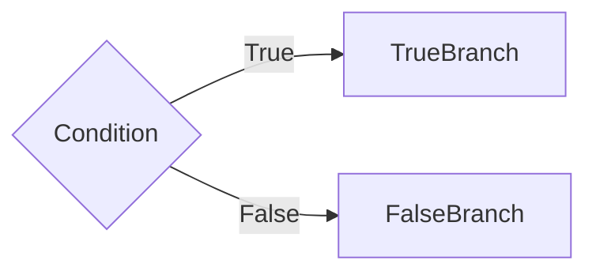
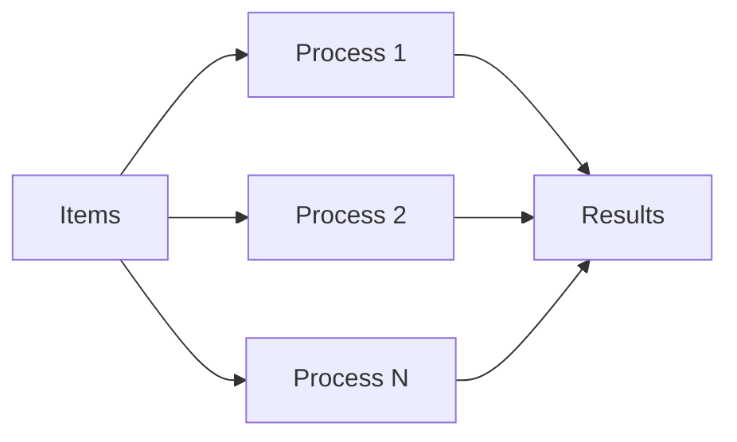
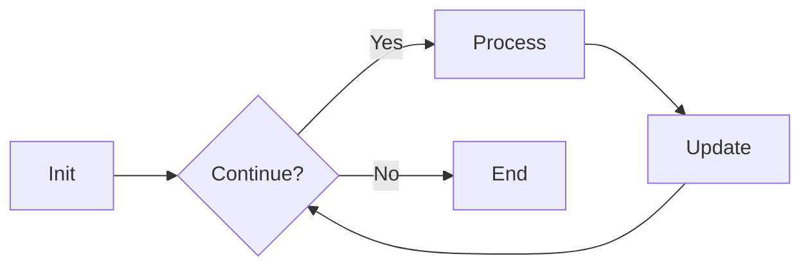
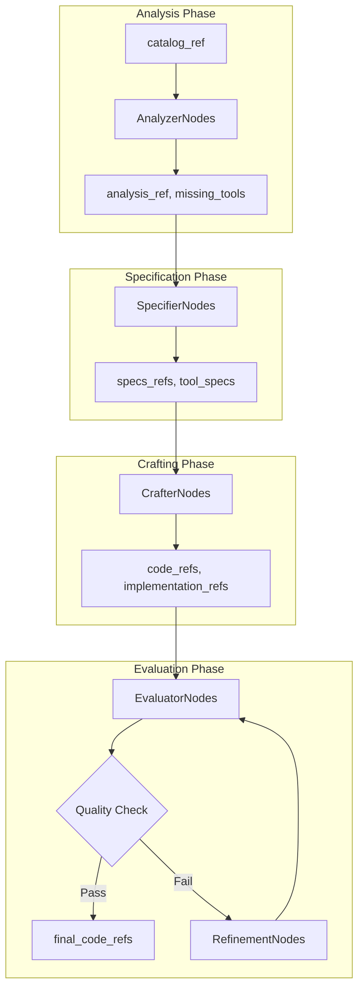

# Node Catalog - Phase 1 & 2 Specification

## References

- [Workflow Graph System](workflow-graph-system.md)
- [Graph Architecture](GRAPH_ARCHITECTURE.md)
- [Node Catalog (this doc)](NODE_CATALOG.md)
- [Data Flow Requirements](DATA_FLOW_REQUIREMENTS.md)
- [Graph Type Definitions](GRAPH_TYPE_DEFINITIONS.md)

## Overview

This catalog enumerates all node types in the workflow graph system, providing technical specifications without implementation details. Each node is designed as an atomic operation following the single responsibility principle.

## Node Type Hierarchy

```mermaid
graph TD
    BaseNode[BaseNode - Abstract]
    BaseNode --> StorageNode[StorageNode - Abstract]
    BaseNode --> TransformNode[TransformNode - Abstract]
    BaseNode --> ValidationNode[ValidationNode - Abstract]
    BaseNode --> LLMNode[LLMNode - Abstract]
    BaseNode --> ControlNode[ControlNode - Abstract]
    
    StorageNode --> LoadKVNode
    StorageNode --> SaveKVNode
    StorageNode --> LoadFSNode
    StorageNode --> SaveFSNode
    StorageNode --> BatchLoadNode
    StorageNode --> BatchSaveNode
    StorageNode --> ExistsCheckNode
    StorageNode --> DeleteNode
    
    TransformNode --> JSONParseNode
    TransformNode --> JSONSerializeNode
    TransformNode --> TemplateRenderNode
    TransformNode --> CodeFormatNode
    TransformNode --> DataMergeNode
    TransformNode --> DataFilterNode
    TransformNode --> DataMapNode
    TransformNode --> DataReduceNode
    
    ValidationNode --> SyntaxValidationNode
    ValidationNode --> ImportValidationNode
    ValidationNode --> SchemaValidationNode
    ValidationNode --> QualityGateNode
    ValidationNode --> DependencyCheckNode
    ValidationNode --> TypeCheckNode
    
    LLMNode --> PromptBuilderNode
    LLMNode --> LLMCallNode
    LLMNode --> ResponseParserNode
    LLMNode --> RefinementNode
    LLMNode --> BatchLLMNode
    LLMNode --> StreamingLLMNode
    
    ControlNode --> ConditionalNode
    ControlNode --> ParallelMapNode
    ControlNode --> SequentialMapNode
    ControlNode --> AggregatorNode
    ControlNode --> RetryNode
    ControlNode --> LoopNode
    ControlNode --> ForkNode
    ControlNode --> JoinNode
```



## Base Node Types

### BaseNode (Abstract)
**Purpose**: Root class for all nodes in the system  
**Signature**: `BaseNode[StateT, DepsT, OutputT]`  
**Required Method**: `async def run(self, ctx: GraphRunContext[StateT, DepsT]) -> NextNode | End[OutputT]`

**Data Requirements**:
- Input: GraphRunContext with state and dependencies
- Output: Next node or End with result

**Phase 2 Type Definition**:
```python
from pydantic_graph import BaseNode, GraphRunContext, NextNode, End
from typing import TypeVar, Generic

StateT = TypeVar('StateT', bound='WorkflowState')
DepsT = TypeVar('DepsT', bound='WorkflowDeps')
OutputT = TypeVar('OutputT')

@dataclass
class BaseNodeExtended(BaseNode[StateT, DepsT, OutputT]):
    """Extended base node with common functionality."""
    node_id: str = field(default_factory=lambda: uuid.uuid4().hex)
    node_name: str = "base_node"
    retry_config: Optional[Dict[str, Any]] = None
    
    async def run(self, ctx: GraphRunContext[StateT, DepsT]) -> NextNode | End[OutputT]:
        """Must be implemented by subclasses."""
        raise NotImplementedError
```

### StorageNode (Abstract)
**Purpose**: Base for all storage operation nodes  
**Extends**: BaseNode  
**Common Pattern**: Key-based operations on storage systems

### TransformNode (Abstract)
**Purpose**: Base for data transformation operations  
**Extends**: BaseNode  
**Common Pattern**: Input data → Transform → Output data

### ValidationNode (Abstract)
**Purpose**: Base for validation and checking operations  
**Extends**: BaseNode  
**Common Pattern**: Input → Validate → Pass/Fail result

### LLMNode (Abstract)
**Purpose**: Base for LLM interaction nodes  
**Extends**: BaseNode  
**Common Pattern**: Prompt → LLM Call → Response

### ControlNode (Abstract)
**Purpose**: Base for flow control operations  
**Extends**: BaseNode  
**Common Pattern**: Evaluate condition → Route execution

## Storage Nodes

### LoadKVNode
**Purpose**: Load data from storage_kv  
**Operation**: Retrieve value by key from key-value store

**Data Requirements**:
```
Input State:
  - key: str (reference to storage location)
Output State:
  - loaded_data: Any (deserialized data)
  - load_timestamp: datetime
```

**Phase 2 Type Definition**:
```python
@dataclass
class LoadKVNode(StorageNode[WorkflowState, WorkflowDeps, WorkflowState]):
    """Load data from key-value storage."""
    storage_key: str  # Key to load from
    target_field: str  # State field to populate
    required: bool = True  # Whether missing key is error
    
    async def run(self, ctx: GraphRunContext[WorkflowState, WorkflowDeps]) -> NextNode:
        # Access storage via deps
        storage_client = ctx.deps.storage_client
        
        # Load data
        data = await storage_client.load_kv(self.storage_key)
        
        if data is None and self.required:
            raise ValueError(f"Required key not found: {self.storage_key}")
        
        # Create storage reference
        ref = StorageRef(
            storage_type='kv',
            key=self.storage_key,
            created_at=datetime.now()
        )
        
        # Update state with reference
        new_state = ctx.state.with_storage_ref(
            ref_type=self.target_field,
            ref=ref
        )
        
        return self.next_node(new_state)
```

### SaveKVNode
**Purpose**: Save data to storage_kv  
**Operation**: Store value with key in key-value store

**Data Requirements**:
```
Input State:
  - key: str
  - data: Any (serializable)
Output State:
  - save_ref: str (storage reference)
  - save_timestamp: datetime
```

**Phase 2 Type Definition**:
```python
@dataclass
class SaveKVNode(StorageNode[WorkflowState, WorkflowDeps, WorkflowState]):
    """Save data to key-value storage."""
    storage_key: str  # Key to save to
    source_field: str  # State field to save from
    ttl_seconds: Optional[int] = None  # Time to live
    
    async def run(self, ctx: GraphRunContext[WorkflowState, WorkflowDeps]) -> NextNode:
        # Get data from state
        data = getattr(ctx.state, self.source_field)
        
        # Save to storage
        storage_client = ctx.deps.storage_client
        await storage_client.save_kv(
            key=self.storage_key,
            data=data,
            ttl=self.ttl_seconds
        )
        
        # Create storage reference
        ref = StorageRef(
            storage_type='kv',
            key=self.storage_key,
            created_at=datetime.now(),
            size_bytes=len(json.dumps(data))
        )
        
        # Update state with reference
        new_state = ctx.state.with_storage_ref(
            ref_type=f"{self.source_field}_ref",
            ref=ref
        )
        
        return self.next_node(new_state)
```

### LoadFSNode
**Purpose**: Load file from storage_fs  
**Operation**: Read file content from filesystem

**Data Requirements**:
```
Input State:
  - path: str (file path)
Output State:
  - content: str (file content)
  - metadata: FileMetadata
```

### SaveFSNode
**Purpose**: Save file to storage_fs  
**Operation**: Write content to filesystem

**Data Requirements**:
```
Input State:
  - path: str
  - content: str
  - create_parents: bool
Output State:
  - file_ref: str
  - bytes_written: int
```

### BatchLoadNode
**Purpose**: Load multiple items in parallel  
**Operation**: Parallel retrieval from storage

**Data Requirements**:
```
Input State:
  - keys: List[str]
  - storage_type: Literal['kv', 'fs']
Output State:
  - loaded_items: Dict[str, Any]
  - failed_keys: List[str]
```

### BatchSaveNode
**Purpose**: Save multiple items in parallel  
**Operation**: Parallel storage of multiple items

**Data Requirements**:
```
Input State:
  - items: Dict[str, Any]
  - storage_type: Literal['kv', 'fs']
Output State:
  - saved_refs: Dict[str, str]
  - failed_items: List[str]
```

### ExistsCheckNode
**Purpose**: Check if storage key/path exists  
**Operation**: Verify existence without loading

**Data Requirements**:
```
Input State:
  - key_or_path: str
  - storage_type: Literal['kv', 'fs']
Output State:
  - exists: bool
  - metadata: Optional[Dict]
```

### DeleteNode
**Purpose**: Remove item from storage  
**Operation**: Delete by key or path

**Data Requirements**:
```
Input State:
  - key_or_path: str
  - storage_type: Literal['kv', 'fs']
Output State:
  - deleted: bool
  - error: Optional[str]
```

## Transform Nodes

### JSONParseNode
**Purpose**: Parse JSON string to object  
**Operation**: Deserialize JSON with validation

**Data Requirements**:
```
Input State:
  - json_string: str
Output State:
  - parsed_data: Any
  - parse_errors: List[str]
```

### JSONSerializeNode
**Purpose**: Serialize object to JSON string  
**Operation**: Convert Python object to JSON

**Data Requirements**:
```
Input State:
  - data: Any
  - indent: Optional[int]
Output State:
  - json_string: str
  - serialization_metadata: Dict
```

### TemplateRenderNode
**Purpose**: Render Jinja2 templates  
**Operation**: Template + context → rendered output

**Data Requirements**:
```
Input State:
  - template_name: str
  - context: Dict[str, Any]
Output State:
  - rendered: str
  - template_metadata: Dict
```

### CodeFormatNode
**Purpose**: Format Python code  
**Operation**: Apply code formatting standards

**Data Requirements**:
```
Input State:
  - code: str
  - style: Literal['black', 'yapf', 'autopep8']
Output State:
  - formatted_code: str
  - changes_made: bool
```

### DataMergeNode
**Purpose**: Merge multiple data sources  
**Operation**: Combine dictionaries/lists with strategy

**Data Requirements**:
```
Input State:
  - sources: List[Dict]
  - merge_strategy: Literal['override', 'append', 'deep']
Output State:
  - merged_data: Dict
  - conflicts: List[str]
```

### DataFilterNode
**Purpose**: Filter collection by criteria  
**Operation**: Apply predicate to collection

**Data Requirements**:
```
Input State:
  - collection: List[Any]
  - filter_criteria: Dict
Output State:
  - filtered: List[Any]
  - removed_count: int
```

### DataMapNode
**Purpose**: Transform each item in collection  
**Operation**: Apply function to each element

**Data Requirements**:
```
Input State:
  - collection: List[Any]
  - map_operation: str (operation identifier)
Output State:
  - mapped: List[Any]
  - transform_errors: List[str]
```

### DataReduceNode
**Purpose**: Reduce collection to single value  
**Operation**: Aggregate collection elements

**Data Requirements**:
```
Input State:
  - collection: List[Any]
  - reduce_operation: str
  - initial_value: Any
Output State:
  - reduced_value: Any
  - reduction_metadata: Dict
```

## Validation Nodes

### SyntaxValidationNode
**Purpose**: Validate Python syntax  
**Operation**: AST parsing and syntax checking

**Data Requirements**:
```
Input State:
  - code: str
  - python_version: str
Output State:
  - syntax_valid: bool
  - syntax_errors: List[SyntaxError]
  - ast_metadata: Dict
```

### ImportValidationNode
**Purpose**: Check import availability  
**Operation**: Verify imports can be resolved

**Data Requirements**:
```
Input State:
  - code: str
  - allowed_packages: List[str]
Output State:
  - imports_valid: bool
  - missing_imports: List[str]
  - forbidden_imports: List[str]
```

### SchemaValidationNode
**Purpose**: Validate against Pydantic schema  
**Operation**: Type checking with Pydantic models

**Data Requirements**:
```
Input State:
  - data: Any
  - schema_ref: str (reference to schema)
Output State:
  - schema_valid: bool
  - validation_errors: List[ValidationError]
  - coerced_data: Any
```

### QualityGateNode
**Purpose**: Check quality thresholds  
**Operation**: Compare metrics against thresholds

**Data Requirements**:
```
Input State:
  - metrics: Dict[str, float]
  - thresholds: Dict[str, float]
Output State:
  - passed: bool
  - failed_metrics: List[str]
  - quality_report: Dict
```

### DependencyCheckNode
**Purpose**: Verify dependencies available  
**Operation**: Check required dependencies exist

**Data Requirements**:
```
Input State:
  - dependencies: List[str]
  - check_type: Literal['import', 'pip', 'system']
Output State:
  - dependencies_met: bool
  - missing: List[str]
  - versions: Dict[str, str]
```

### TypeCheckNode
**Purpose**: Static type checking  
**Operation**: Validate type annotations

**Data Requirements**:
```
Input State:
  - code: str
  - strict_mode: bool
Output State:
  - type_valid: bool
  - type_errors: List[TypeError]
  - type_coverage: float
```

## LLM Nodes

### PromptBuilderNode
**Purpose**: Construct prompts from templates  
**Operation**: Template + data → formatted prompt

**Data Requirements**:
```
Input State:
  - template_ref: str
  - prompt_data: Dict[str, Any]
  - system_prompt: Optional[str]
Output State:
  - prompt: str
  - token_estimate: int
  - prompt_metadata: Dict
```

### LLMCallNode
**Purpose**: Execute LLM API call  
**Operation**: Send prompt, receive response

**Data Requirements**:
```
Input State:
  - prompt: str
  - model: str (model identifier)
  - parameters: ModelParameters
Output State:
  - response: str
  - usage: TokenUsage
  - model_metadata: Dict
```

**Phase 2 Type Definition**:
```python
@dataclass
class LLMCallNode(LLMNode[WorkflowState, WorkflowDeps, WorkflowState]):
    """Execute LLM API call."""
    prompt_field: str  # State field containing prompt
    response_field: str  # State field to store response
    model_override: Optional[str] = None  # Override default model
    parameters_override: Optional[ModelParameters] = None
    
    async def run(self, ctx: GraphRunContext[WorkflowState, WorkflowDeps]) -> NextNode:
        # Get prompt from state
        prompt = getattr(ctx.state, self.prompt_field)
        
        # Determine model and parameters
        model = self.model_override or ctx.deps.models.default_model
        params = self.parameters_override or ctx.deps.models.parameters.get(
            ctx.state.phase_status.current_phase,
            ModelParameters()
        )
        
        # Call LLM with rate limiting
        async with ctx.deps.get_semaphore('llm'):
            response = await ctx.deps.llm_client.call(
                prompt=prompt,
                model=model,
                **params.model_dump()
            )
        
        # Track token usage
        usage = TokenUsage(
            prompt_tokens=response.prompt_tokens,
            completion_tokens=response.completion_tokens,
            total_tokens=response.total_tokens,
            model=model
        )
        
        # Update state
        new_state = replace(
            ctx.state,
            **{self.response_field: response.text},
            total_token_usage={
                **ctx.state.total_token_usage,
                ctx.state.phase_status.current_phase: 
                    ctx.state.total_token_usage.get(
                        ctx.state.phase_status.current_phase, 
                        TokenUsage(0, 0, 0, model)
                    ) + usage
            }
        )
        
        return self.next_node(new_state)
```

### ResponseParserNode
**Purpose**: Parse structured LLM response  
**Operation**: Extract structured data from text

**Data Requirements**:
```
Input State:
  - response: str
  - expected_format: str (schema reference)
Output State:
  - parsed_response: Any
  - parse_confidence: float
  - extraction_errors: List[str]
```

### RefinementNode
**Purpose**: Iterative improvement with LLM  
**Operation**: Apply feedback to improve output

**Data Requirements**:
```
Input State:
  - current_output: str
  - feedback: str
  - iteration: int
Output State:
  - refined_output: str
  - changes_made: List[str]
  - improvement_score: float
```

### BatchLLMNode
**Purpose**: Parallel LLM calls  
**Operation**: Process multiple prompts concurrently

**Data Requirements**:
```
Input State:
  - prompts: List[str]
  - model: str
  - max_concurrent: int
Output State:
  - responses: List[str]
  - total_usage: TokenUsage
  - failed_indices: List[int]
```

### StreamingLLMNode
**Purpose**: Stream LLM responses  
**Operation**: Progressive response generation

**Data Requirements**:
```
Input State:
  - prompt: str
  - model: str
  - stream_callback: str (callback reference)
Output State:
  - final_response: str
  - chunks_received: int
  - stream_metadata: Dict
```

## Control Flow Nodes

### ConditionalNode
**Purpose**: Branch execution based on condition  
**Operation**: Evaluate condition, choose path

**Data Requirements**:
```
Input State:
  - condition_data: Any
  - condition_type: str
Output State:
  - branch_taken: Literal['true', 'false']
  - condition_result: bool
```

**Flow Pattern**:


**Phase 2 Type Definition**:
```python
@dataclass
class ConditionalNode(ControlNode[WorkflowState, WorkflowDeps, WorkflowState]):
    """Branch execution based on condition."""
    condition: Callable[[WorkflowState], bool]  # Condition function
    true_node: BaseNode  # Node if condition is true
    false_node: BaseNode  # Node if condition is false
    
    async def run(self, ctx: GraphRunContext[WorkflowState, WorkflowDeps]) -> NextNode:
        # Evaluate condition
        result = self.condition(ctx.state)
        
        # Choose next node
        next_node = self.true_node if result else self.false_node
        
        # Track branch taken (optional)
        new_state = replace(
            ctx.state,
            processing=replace(
                ctx.state.processing,
                last_condition_result=result
            )
        )
        
        return next_node.with_state(new_state)
```

### ParallelMapNode
**Purpose**: Execute sub-graph for each item in parallel  
**Operation**: Parallel processing of collection

**Data Requirements**:
```
Input State:
  - items: List[Any]
  - max_workers: int
Output State:
  - results: List[Any]
  - execution_times: List[float]
  - failed_items: List[int]
```

**Phase 2 Type Definition**:
```python
@dataclass
class ParallelMapNode(ControlNode[WorkflowState, WorkflowDeps, WorkflowState]):
    """Execute sub-graph for each item in parallel."""
    items_field: str  # State field containing items list
    sub_graph: Graph  # Graph to execute per item
    max_workers: int = 4  # Max parallel executions
    results_field: str = "parallel_results"  # Where to store results
    
    async def run(self, ctx: GraphRunContext[WorkflowState, WorkflowDeps]) -> NextNode:
        # Get items from state
        items = getattr(ctx.state, self.items_field)
        
        # Execute sub-graph for each item in parallel
        async def process_item(item: Any) -> Tuple[Any, float]:
            start_time = time.time()
            # Create item-specific state
            item_state = replace(
                ctx.state,
                processing=replace(
                    ctx.state.processing,
                    current_item=item
                )
            )
            # Run sub-graph
            result = await self.sub_graph.run(
                state=item_state,
                deps=ctx.deps
            )
            return result, time.time() - start_time
        
        # Use ProcessPoolExecutor from deps
        with ctx.deps.process_executor as executor:
            futures = [process_item(item) for item in items]
            results = await asyncio.gather(*futures, return_exceptions=True)
        
        # Separate successful results and failures
        successful_results = []
        execution_times = []
        failed_indices = []
        
        for i, result in enumerate(results):
            if isinstance(result, Exception):
                failed_indices.append(i)
            else:
                successful_results.append(result[0])
                execution_times.append(result[1])
        
        # Update state with results
        new_state = replace(
            ctx.state,
            **{self.results_field: successful_results},
            processing=replace(
                ctx.state.processing,
                parallel_execution_times=execution_times,
                parallel_failed_indices=failed_indices
            )
        )
        
        return self.next_node(new_state)
```

**Flow Pattern**:


### SequentialMapNode
**Purpose**: Process items one by one  
**Operation**: Sequential processing with state accumulation

**Data Requirements**:
```
Input State:
  - items: List[Any]
  - accumulate_state: bool
Output State:
  - results: List[Any]
  - accumulated_state: Any
  - processing_order: List[int]
```

### AggregatorNode
**Purpose**: Combine results from parallel operations  
**Operation**: Merge parallel execution results

**Data Requirements**:
```
Input State:
  - partial_results: List[Any]
  - aggregation_strategy: str
Output State:
  - aggregated_result: Any
  - aggregation_metadata: Dict
```

### RetryNode
**Purpose**: Retry failed operations  
**Operation**: Exponential backoff retry logic

**Data Requirements**:
```
Input State:
  - operation_state: Any
  - retry_count: int
  - max_retries: int
Output State:
  - result: Any
  - attempts_made: int
  - retry_errors: List[str]
```

### LoopNode
**Purpose**: Iterate until condition met  
**Operation**: Conditional loop execution

**Data Requirements**:
```
Input State:
  - loop_state: Any
  - iteration: int
  - max_iterations: int
Output State:
  - final_state: Any
  - iterations_completed: int
  - termination_reason: str
```

**Flow Pattern**:


### ForkNode
**Purpose**: Split execution into multiple paths  
**Operation**: Create parallel execution branches

**Data Requirements**:
```
Input State:
  - fork_data: Any
  - branch_count: int
Output State:
  - branch_states: List[Any]
  - fork_metadata: Dict
```

### JoinNode
**Purpose**: Synchronize parallel branches  
**Operation**: Wait for all branches to complete

**Data Requirements**:
```
Input State:
  - branch_results: List[Any]
  - join_strategy: str
Output State:
  - joined_result: Any
  - join_metadata: Dict
```

## Node Composition Patterns

### Sub-Graph Composition

Nodes can contain sub-graphs for complex operations:

```python
@dataclass
class ComplexOperationNode(BaseNode[...]):
    sub_graph: Graph  # Contains other nodes
    
    async def run(self, ctx):
        # Execute sub-graph with current state
        result = await self.sub_graph.run(...)
        return NextNode(result)
```

### Dynamic Node Selection

Nodes can dynamically choose next node based on state:

```python
async def run(self, ctx):
    if ctx.state.quality_score > 0.8:
        return ApprovalNode(...)
    elif ctx.state.iteration < 3:
        return RefinementNode(...)
    else:
        return FallbackNode(...)
```

### State Accumulation Pattern

Nodes add to state without removing:

```python
async def run(self, ctx):
    # Add new data to state
    new_state = dataclasses.replace(
        ctx.state,
        new_field=computed_value,
        # Existing fields preserved
    )
    # Pass accumulated state forward
    return NextNode(state=new_state)
```

## Data Flow Requirements

### Phase Transitions



### Storage Reference Pattern

All data stored externally, only references in state:

```
State Contains:
  - storage_kv:workflow/{id}/analysis → analysis_ref
  - storage_kv:workflow/{id}/specs/* → specs_refs
  - storage_fs:generated/{id}/*.py → code_refs
  
Benefits:
  - Small state size
  - Parallel access
  - Persistence friendly
  - Memory efficient
```

## Phase 2 Summary

Phase 2 has added:
- Complete type definitions for base node types
- Detailed field specifications with type annotations
- State mutation patterns showing immutable updates
- Inter-node contracts via typed method signatures
- Dependency injection through WorkflowDeps

Key patterns established:
- All nodes extend typed base classes
- State is immutable (using `replace` from dataclasses)
- Storage operations return references, not data
- LLM calls track token usage automatically
- Parallel operations use executor from deps
- Conditional nodes use callable predicates

## Phase 3 Specifications

Phase 3 will add:
- Complete implementation examples for all node types
- Integration test scenarios with real workflows
- Performance benchmarks for parallel execution
- Migration guides from monolithic to graph-based