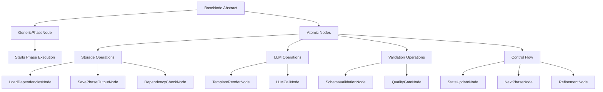
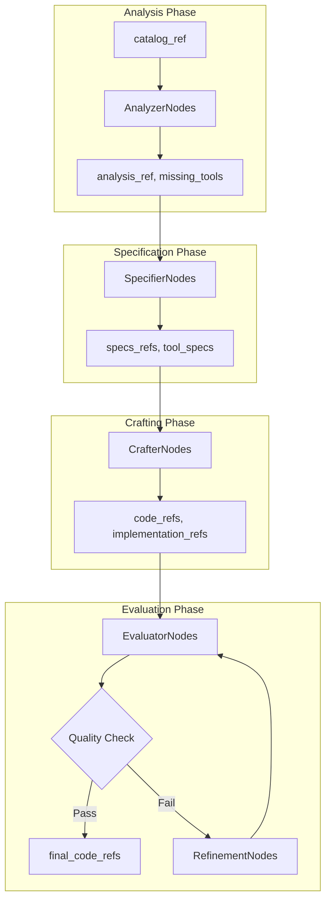
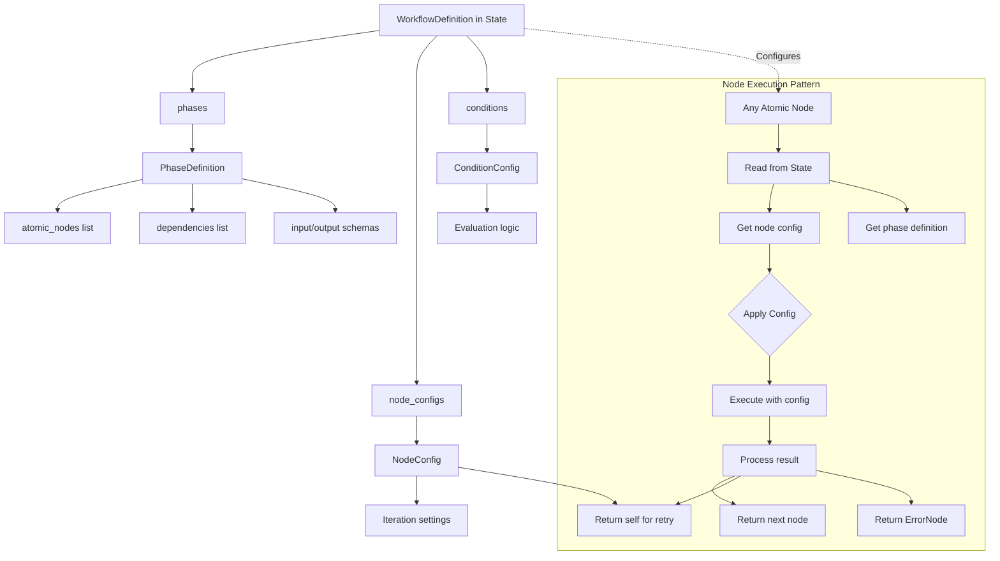
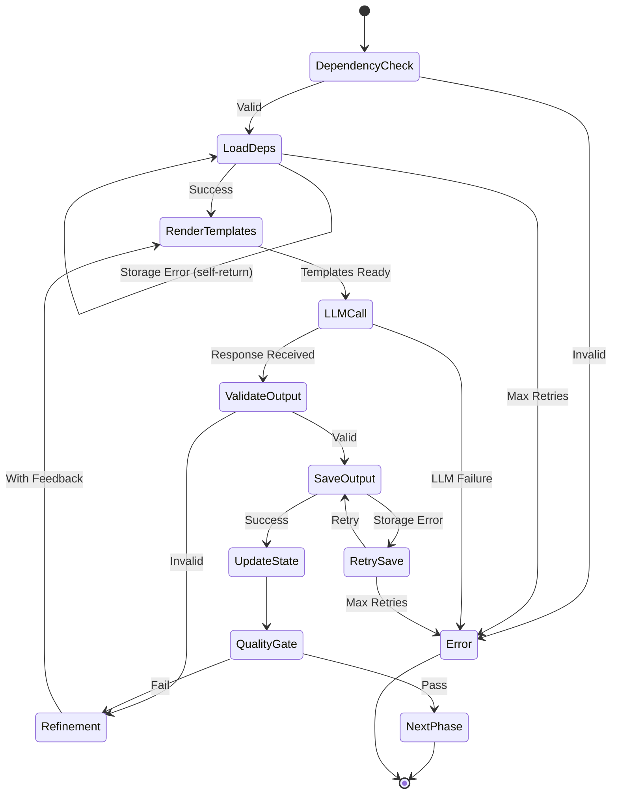

# Node Catalog - Meta-Framework Specification

## References

- [Workflow Graph System](workflow-graph-system.md)
- [Graph Architecture](GRAPH_ARCHITECTURE.md)
- [Node Catalog (this doc)](NODE_CATALOG.md)
- [Data Flow Requirements](DATA_FLOW_REQUIREMENTS.md)
- [Graph Type Definitions](GRAPH_TYPE_DEFINITIONS.md)
- [State Mutations](STATE_MUTATIONS.md)

## Overview

This catalog enumerates node types in the **meta-framework workflow system**. The primary innovation is the **GenericPhaseNode** which starts phases by returning the first atomic node, which then chains to subsequent nodes. This atomic node chaining ensures:

- **Resilience**: Storage failures don't require re-running LLM inference
- **Reusability**: Same atomic nodes used across all phases
- **Observability**: Fine-grained execution tracking
- **Parallelism**: Independent operations run concurrently

## Meta-Framework Node Hierarchy



## Base Node Types

### BaseNode (Abstract)
**Purpose**: Root class for all nodes in the system  
**Signature**: `BaseNode[StateT, DepsT, OutputT]`  
**Required Method**: `async def run(self, ctx: GraphRunContext[StateT, DepsT]) -> BaseNode | End[OutputT]`

**Data Requirements**:
- Input: GraphRunContext with state and dependencies
- Output: Next node or End with result

**Phase 2 Type Definition**:
```python
from pydantic_graph import BaseNode, GraphRunContext, End
from typing import TypeVar, Generic, Optional, Dict, Any, List, Tuple
from dataclasses import dataclass, field, replace
import uuid

StateT = TypeVar('StateT', bound='WorkflowState')
DepsT = TypeVar('DepsT', bound='WorkflowDeps')
OutputT = TypeVar('OutputT')

@dataclass
class BaseNodeExtended(BaseNode[StateT, DepsT, OutputT]):
    """Extended base node with common functionality."""
    node_id: str = field(default_factory=lambda: uuid.uuid4().hex)
    node_name: str = "base_node"
    retry_config: Optional[Dict[str, Any]] = None
    
    async def run(self, ctx: GraphRunContext[StateT, DepsT]) -> BaseNode | End[OutputT]:
        """Must be implemented by subclasses."""
        raise NotImplementedError
```

### GenericPhaseNode (Phase Starter)
**Purpose**: Starts any workflow phase by returning first atomic node  
**Extends**: BaseNode  
**Pattern**: Returns first node which chains to rest - no sub-graphs

**Atomic Decomposition**:
```python
@dataclass
class GenericPhaseNode(BaseNode[WorkflowState, WorkflowDeps, WorkflowState]):
    """Starts a phase by returning its first atomic node."""
    
    async def run(self, ctx: GraphRunContext[WorkflowState, WorkflowDeps]) -> BaseNode | End[WorkflowState]:
        """Start phase by returning first atomic node - does NOT do the work itself."""
        # Read phase definition from state
        phase_def = ctx.state.workflow_def.phases[ctx.state.current_phase]
        
        # Update state to track current node
        new_state = replace(
            ctx.state,
            current_node=phase_def.atomic_nodes[0] if phase_def.atomic_nodes else None
        )
        
        # Return first atomic node - it will chain to the rest
        # Each node reads its configuration from state
        if phase_def.atomic_nodes:
            return create_node_instance(phase_def.atomic_nodes[0])
        else:
            return End(new_state)

def create_node_instance(node_id: str) -> BaseNode:
    """Create node instance without constructor params."""
    NODE_REGISTRY = {
        'dependency_check': DependencyCheckNode,
        'load_dependencies': LoadDependenciesNode,
        'template_render': TemplateRenderNode,
        'llm_call': LLMCallNode,
        'schema_validation': SchemaValidationNode,
        'save_phase_output': SavePhaseOutputNode,
        'state_update': StateUpdateNode,
        'quality_gate': QualityGateNode,
    }
    return NODE_REGISTRY[node_id]()
```

### Example Atomic Node Sequence
```python
# Phase defines the sequence
phase_def = PhaseDefinition(
    phase_name='analyzer',
    atomic_nodes=[
        'dependency_check',
        'load_dependencies', 
        'template_render',
        'llm_call',
        'schema_validation',
        'save_output',
        'state_update',
        'quality_gate'
    ],
    # ... other config
)
            phase_name=self.phase_def.phase_name
        ))
        
        # 8. Quality gate (determines next action)
        if self.phase_def.allow_refinement:
            nodes.append(QualityGateNode(
                threshold=self.phase_def.quality_threshold,
                refine_node=self,  # Loop back to this phase
                continue_node=NextPhaseNode()
            ))
        
        return Graph(nodes=nodes)
    
    async def run(self, ctx: GraphRunContext[WorkflowState, WorkflowDeps]) -> BaseNode | End[WorkflowState]:
        """Return first atomic node to start phase execution."""
        # In pydantic_graph, we don't execute sub-graphs within nodes
        # Instead, we return the first node of the atomic sequence
        # The graph execution engine handles the flow
        
        # Start with dependency check
        return DependencyCheckNode(self.phase_def.dependencies)
```

### StorageNode (Abstract)
**Purpose**: Base for storage operations  
**Extends**: BaseNode  
**Used By**: GenericPhaseNode for loading/storing phase data

### ValidationNode (Abstract)
**Purpose**: Base for validation operations  
**Extends**: BaseNode  
**Used By**: GenericPhaseNode for schema validation

### ControlNode (Abstract)
**Purpose**: Base for flow control  
**Extends**: BaseNode  
**Used By**: Graph orchestration for refinement and sequencing

## Atomic Storage Nodes (Used by Smoke Domain)

### DependencyCheckNode
**Purpose**: Validate phase dependencies are satisfied  
**Operation**: Check previous phases completed  
**Retry**: No - missing dependencies are non-retryable

**Type Definition**:
```python
@dataclass
class DependencyCheckNode(BaseNode[WorkflowState, WorkflowDeps, None]):
    """Validate phase dependencies."""
    
    async def run(self, ctx: GraphRunContext[WorkflowState, WorkflowDeps]) -> BaseNode:
        phase_def = ctx.state.workflow_def.phases[ctx.state.current_phase]
        missing = []
        for dep in phase_def.dependencies:
            if dep not in ctx.state.completed_phases:
                missing.append(dep)
        
        if missing:
            raise NonRetryableError(
                f"Missing dependencies: {missing}. "
                f"Completed: {ctx.state.completed_phases}"
            )
        
        # All dependencies satisfied
        return LoadDependenciesNode()  # Continue to loading
```

### LoadDependenciesNode
**Purpose**: Load dependencies from previous phases  
**Operation**: Loads data from storage based on phase dependencies  
**Retry**: Configurable via state

**Type Definition**:
```python
@dataclass
class LoadDependenciesNode(BaseNode[WorkflowState, WorkflowDeps, Dict[str, Any]]):
    """Orchestrates loading of phase dependencies."""
    # Reads dependencies from state.workflow_def.phases[current_phase].dependencies
    
    def build_load_graph(self) -> Graph:
        """Build sub-graph for parallel dependency loading."""
        nodes = []
        for dep in self.dependencies:
            # Each dependency loaded by atomic node with state-based retry
            pass
        
        # No longer building sub-graphs - load directly with state-based retry
        return None
    
    async def run(self, ctx: GraphRunContext[WorkflowState, WorkflowDeps]) -> BaseNode:
        # Load dependencies directly with state-based retry
        config = ctx.state.workflow_def.node_configs.get("load_dependencies")
        retry_key = f"{ctx.state.current_phase}_load_dependencies"
        retry_count = ctx.state.retry_counts.get(retry_key, 0)
        
        try:
            # Load all dependencies
            dependency_data = {}
            for dep in self.dependencies:
                key = f'{ctx.state.domain}/{ctx.state.workflow_id}/{dep}'
                result = await ctx.deps.storage_client.load_kv(key)
                dependency_data[dep] = result
            
            # Update state with loaded dependencies
            new_state = replace(
                ctx.state,
                domain_data={
                    **ctx.state.domain_data,
                    'loaded_dependencies': dependency_data
                }
            )
            
            # Chain to next node
            return TemplateRenderNode()
            
        except Exception as e:
            if config and config.retryable and retry_count < config.max_retries:
                # Retry by returning self with updated retry count
                new_state = replace(
                    ctx.state,
                    retry_counts={**ctx.state.retry_counts, retry_key: retry_count + 1}
                )
                return LoadDependenciesNode()
            else:
                return ErrorNode(error=str(e))
```

### SavePhaseOutputNode (Atomic)
**Purpose**: Save phase output with state-based retry  
**Operation**: Save to storage, chain to next node  
**Retry**: Configurable via state (usually False for local storage)

**Type Definition**:
```python
@dataclass
class SavePhaseOutputNode(BaseNode[WorkflowState, WorkflowDeps, StorageRef]):
    """Orchestrates saving phase output."""
    phase_name: str
    storage_pattern: str
    storage_type: Literal['kv', 'fs'] = 'kv'
    enable_versioning: bool = True
    
    async def run(self, ctx: GraphRunContext[WorkflowState, WorkflowDeps]) -> BaseNode:
        # Get output data from domain_data
        output_key = f'{self.phase_name}_llm_response'
        output_data = ctx.state.domain_data.get(output_key)
        
        if not output_data:
            raise NonRetryableError(f"No output data for {self.phase_name}")
        
        # Generate storage key
        storage_key = self.storage_pattern.format(
            domain=ctx.state.domain,
            workflow_id=ctx.state.workflow_id,
            phase=self.phase_name
        )
        
        # Add version if refinement occurred
        if self.enable_versioning:
            version = ctx.state.refinement_count.get(self.phase_name, 0)
            storage_key = f"{storage_key}/v{version}"
        
        # Use appropriate atomic save node
        if self.storage_type == 'kv':
            save_node = SaveKVNode(
                storage_key=storage_key,
                data_field=output_key
            )
        else:
            save_node = SaveFSNode(
                file_path=storage_key,
                data_field=output_key
            )
        
        # Save directly with state-based retry configuration
        config = ctx.state.workflow_def.node_configs.get("save_phase_output")
        retry_key = f"{ctx.state.current_phase}_save"
        retry_count = ctx.state.retry_counts.get(retry_key, 0)
        
        try:
            # Execute save
            if self.storage_type == 'kv':
                await ctx.deps.storage_client.save_kv(storage_key, output_data)
            else:
                await ctx.deps.storage_client.save_fs(storage_key, output_data)
                
            # Create storage reference
            ref = StorageRef(
                storage_type=self.storage_type,
                key=storage_key,
                created_at=datetime.now()
            )
            
            # Chain to next node
            return StateUpdateNode()
            
        except Exception as e:
            if config and config.retryable and retry_count < config.max_retries:
                # Retry by returning self
                new_state = replace(
                    ctx.state,
                    retry_counts={**ctx.state.retry_counts, retry_key: retry_count + 1}
                )
                return SavePhaseOutputNode()
            else:
                return ErrorNode(error=str(e))
```


## Template Nodes

### TemplateRenderNode (Atomic)
**Purpose**: Deterministic template rendering  
**Operation**: Render Jinja2 templates with variables  
**Retry**: No - deterministic operation, failures are bugs
**Cache**: Yes - same input always produces same output

**Type Definition**:
```python
@dataclass
class TemplateRenderNode(TransformNode[WorkflowState, WorkflowDeps, Dict[str, str]]):
    """Atomic template rendering operation."""
    system_template: str  # Path to system template
    user_template: str    # Path to user template
    
    async def run(self, ctx: GraphRunContext[WorkflowState, WorkflowDeps]) -> BaseNode:
        # Get dependencies from domain_data
        dependencies = ctx.state.domain_data.get('loaded_dependencies', {})
        
        # Extract variables for templates
        variables = {
            'workflow_id': ctx.state.workflow_id,
            'domain': ctx.state.domain,
            'phase': ctx.state.current_phase,
            **dependencies,
            **ctx.state.domain_data
        }
        
        # Render templates (deterministic)
        system_prompt = ctx.deps.template_engine.render(
            self.system_template,
            variables
        )
        user_prompt = ctx.deps.template_engine.render(
            self.user_template,
            variables
        )
        
        # Store rendered prompts for LLM node
        new_state = replace(
            ctx.state,
            domain_data={
                **ctx.state.domain_data,
                'rendered_system_prompt': system_prompt,
                'rendered_user_prompt': user_prompt
            }
        )
        return self.next
```


## Validation Nodes

### SchemaValidationNode (Atomic)
**Purpose**: Validate data against Pydantic schema  
**Operation**: Type checking and coercion  
**Retry**: No - validation failures trigger refinement

**Type Definition**:
```python
@dataclass
class SchemaValidationNode(ValidationNode[WorkflowState, WorkflowDeps, ValidationResult]):
    """Atomic schema validation."""
    schema: Type[BaseModel]
    data_field: str = 'llm_response'  # Field to validate
    
    async def run(self, ctx: GraphRunContext[WorkflowState, WorkflowDeps]) -> BaseNode:
        # Get data to validate
        data = ctx.state.domain_data.get(
            f'{ctx.state.current_phase}_{self.data_field}'
        )
        
        if data is None:
            raise NonRetryableError(f"No data to validate in {self.data_field}")
        
        try:
            # Validate and coerce
            validated = self.schema.model_validate(data)
            
            # Store validated data
            new_state = replace(
                ctx.state,
                domain_data={
                    **ctx.state.domain_data,
                    f'{ctx.state.current_phase}_validated': validated.model_dump(),
                    'validation_passed': True
                }
            )
            return self.next
            
        except ValidationError as e:
            # Validation failed - triggers refinement
            new_state = replace(
                ctx.state,
                domain_data={
                    **ctx.state.domain_data,
                    'validation_errors': e.errors(),
                    'validation_passed': False
                }
            )
            # Don't raise - let QualityGateNode handle
            return self.next
```

### QualityGateNode (Atomic)
**Purpose**: Determine refinement or continuation  
**Operation**: Check quality and route to appropriate next node  
**Retry**: No - decision node

**Type Definition**:
```python
@dataclass
class QualityGateNode(ControlNode[WorkflowState, WorkflowDeps, WorkflowState]):
    """Quality gate with refinement decision."""
    quality_threshold: float = 0.8
    max_refinements: int = 3
    phase_name: str
    
    async def run(self, ctx: GraphRunContext[WorkflowState, WorkflowDeps]) -> BaseNode:
        # Check validation
        validation_passed = ctx.state.domain_data.get('validation_passed', False)
        
        # Get quality score (from validation or evaluation)
        quality_score = ctx.state.quality_scores.get(self.phase_name, 0.0)
        if validation_passed:
            quality_score = 1.0  # Validation pass = full quality
        
        # Get refinement count
        refinement_count = ctx.state.refinement_count.get(self.phase_name, 0)
        
        # Decide next action
        if quality_score >= self.quality_threshold:
            # Quality met - continue to next phase
            return NextPhaseNode()
        elif refinement_count < self.max_refinements:
            # Refine - re-execute phase with feedback
            feedback = self._generate_feedback(
                ctx.state.domain_data.get('validation_errors', [])
            )
            
            new_state = replace(
                ctx.state,
                refinement_count={
                    **ctx.state.refinement_count,
                    self.phase_name: refinement_count + 1
                },
                domain_data={
                    **ctx.state.domain_data,
                    'refinement_feedback': feedback
                }
            )
            
            # Re-execute this phase
            phase_def = ctx.deps.phase_registry.get(
                ctx.state.domain,
                self.phase_name
            )
            return GenericPhaseNode(phase_def=phase_def)
        else:
            # Max refinements reached - continue anyway
            return NextPhaseNode()
```


### StateUpdateNode (Atomic)
**Purpose**: Update workflow state after phase completion  
**Operation**: Mark phase complete and determine next phase  
**Retry**: No - state updates always succeed

**Type Definition**:
```python
@dataclass
class StateUpdateNode(BaseNode[WorkflowState, WorkflowDeps, WorkflowState]):
    """Update state after successful phase execution."""
    phase_name: str
    
    async def run(self, ctx: GraphRunContext[WorkflowState, WorkflowDeps]) -> BaseNode:
        # Get storage reference if output was saved
        storage_ref = ctx.state.phase_outputs.get(self.phase_name)
        
        # Mark phase complete
        new_completed = ctx.state.completed_phases | {self.phase_name}
        
        # Find next phase
        next_phase = None
        for phase in ctx.state.phase_sequence:
            if phase not in new_completed:
                next_phase = phase
                break
        
        # Update state
        new_state = replace(
            ctx.state,
            completed_phases=new_completed,
            current_phase=next_phase
        )
        
        return NextPhaseNode()  # Continue to next phase selection
```

## Atomic LLM Nodes


### LLMCallNode (Atomic)
**Purpose**: Single atomic LLM API call  
**Operation**: Execute LLM inference (expensive, non-retryable)  
**Retry**: No - expensive operation, handle failures at orchestration level

**Type Definition**:
```python
@dataclass
class LLMCallNode(LLMNode[WorkflowState, WorkflowDeps, WorkflowState]):
    """Atomic LLM call - expensive, should not retry."""
    system_prompt_field: str = 'rendered_system_prompt'
    user_prompt_field: str = 'rendered_user_prompt'
    output_schema: Optional[Type[BaseModel]] = None
    model_config: Optional[ModelParameters] = None
    
    async def run(self, ctx: GraphRunContext[WorkflowState, WorkflowDeps]) -> BaseNode:
        # Get prompts from domain_data (rendered by previous node)
        system_prompt = ctx.state.domain_data.get(self.system_prompt_field)
        user_prompt = ctx.state.domain_data.get(self.user_prompt_field)
        
        if not system_prompt or not user_prompt:
            raise ValueError("Prompts not found in state")
        
        # Determine model
        model = self.model_config or ctx.deps.models.get_model_for_phase(
            ctx.state.current_phase
        )
        
        try:
            # Call LLM (expensive operation)
            async with ctx.deps.get_semaphore('llm'):
                if self.output_schema:
                    # Structured output
                    from pydantic_ai import Agent
                    agent = Agent(
                        model.model_name,
                        output_type=self.output_schema,
                        system_prompt=system_prompt
                    )
                    result = await agent.run(user_prompt)
                    response_data = result.output.model_dump()
                else:
                    # Text output
                    response = await ctx.deps.llm_client.call(
                        system_prompt=system_prompt,
                        user_prompt=user_prompt,
                        **model.model_dump()
                    )
                    response_data = response.text
            
            # Store response in domain_data for next node
            new_state = replace(
                ctx.state,
                domain_data={
                    **ctx.state.domain_data,
                    f'{ctx.state.current_phase}_llm_response': response_data
                },
                total_token_usage=self._update_token_usage(ctx.state, response)
            )
            
            return SchemaValidationNode(self.output_schema)  # Continue to validation
            
        except Exception as e:
            # LLM failures are not retryable at this level
            # Orchestrator decides whether to retry entire phase
            raise NonRetryableError(f"LLM call failed: {e}")
```

### RefinementNode
**Purpose**: Trigger refinement of the current phase  
**Operation**: Set up refinement feedback and restart phase

**Data Requirements**:
```
Input State:
  - phase_name: str
  - feedback: str
  - quality_score: float
Output State:
  - refinement_count: incremented
  - refinement_feedback: str
  - refinement_history: updated
```

**Type Definition**:
```python
@dataclass
class RefinementNode(BaseNode[WorkflowState, WorkflowDeps, WorkflowState]):
    """Trigger phase refinement."""
    target_phase: str
    feedback: str
    
    async def run(self, ctx: GraphRunContext[WorkflowState, WorkflowDeps]) -> BaseNode:
        # Update refinement count
        new_refinement_count = {
            **ctx.state.refinement_count,
            self.target_phase: ctx.state.refinement_count.get(self.target_phase, 0) + 1
        }
        
        # Add feedback to domain_data
        new_domain_data = {
            **ctx.state.domain_data,
            'refinement_feedback': self.feedback
        }
        
        new_state = replace(
            ctx.state,
            current_phase=self.target_phase,
            refinement_count=new_refinement_count,
            domain_data=new_domain_data
        )
        
        # Re-execute the target phase
        return GenericPhaseNode()
```

## Control Flow Nodes

### NextPhaseNode
**Purpose**: Determine and transition to the next phase  
**Operation**: Find next phase and transition to it

**Data Requirements**:
```
Input State:
  - current_phase: str
  - completed_phases: Set[str]
  - phase_sequence: List[str]
Output State:
  - current_phase: updated to next phase
  - current_node: set to first node of new phase
```

## State-Based Patterns

### State-Based Retry Pattern
**Purpose**: Retry through state tracking and self-return  
**Operation**: Retry configured in NodeConfig within state

**Implementation Pattern**:
```python
@dataclass
class AtomicNode(BaseNode[WorkflowState, WorkflowDeps, WorkflowState]):
    """Base pattern for atomic nodes with state-based retry."""
    
    async def run(self, ctx: GraphRunContext[WorkflowState, WorkflowDeps]) -> BaseNode | End[WorkflowState]:
        # Get configuration from state
        config = ctx.state.workflow_def.node_configs[ctx.state.current_node]
        retry_key = f"{ctx.state.current_phase}_{ctx.state.current_node}"
        retry_count = ctx.state.retry_counts.get(retry_key, 0)
        
        try:
            # Execute operation
            result = await self.execute(ctx)
            
            # Success - return next node
            return self.get_next_node(ctx.state, result)
            
        except Exception as e:
            if config.retryable and retry_count < config.max_retries:
                # Retry by returning self with updated retry count
                new_state = replace(
                    ctx.state,
                    retry_counts={**ctx.state.retry_counts, retry_key: retry_count + 1}
                )
                return self.__class__()  # Return self to retry
            else:
                return ErrorNode(error=str(e))
```

**State Configuration**:
```python
node_configs = {
    "llm_call": NodeConfig(
        retryable=True,  # API can have transient failures
        max_retries=3,
        retry_backoff="exponential"
    ),
    "load_local": NodeConfig(
        retryable=False,  # Local storage rarely fails
        max_retries=0
    )
}
```

## Atomic Decomposition Patterns

### Why Atomic Decomposition?

1. **Failure Isolation**: Storage failure doesn't invalidate LLM response
2. **Selective Retry**: Retry only failed operations, not entire phase
3. **Caching**: Cache expensive operations (LLM) independently
4. **Observability**: Track each operation's success/failure/duration
5. **Parallelism**: Run independent operations concurrently

### Atomic Node Chaining (Replaces Sub-Graphs)

**REMOVED: build_phase_subgraph - violated pydantic_graph constraints**

Nodes cannot execute sub-graphs - they chain by returning next node:

```python
# CORRECT: GenericPhaseNode returns first atomic node
@dataclass
class GenericPhaseNode(BaseNode):
    async def run(self, ctx) -> BaseNode:
        # Read phase definition from state
        phase_def = ctx.state.workflow_def.phases[ctx.state.current_phase]
        
        # Return first atomic node - it will chain to the rest
        return DependencyCheckNode()

# CORRECT: Each atomic node returns the next
@dataclass  
class DependencyCheckNode(BaseNode):
    async def run(self, ctx) -> BaseNode:
        # Validate dependencies
        for dep in self.get_dependencies(ctx.state):
            if dep not in ctx.state.completed_phases:
                raise NonRetryableError(f"Dependency {dep} not satisfied")
        
        # Chain to next atomic node
        return LoadDependenciesNode()
```

### Dynamic Node Selection

Nodes can dynamically choose next node based on state:

```python
async def run(self, ctx):
    if ctx.state.quality_score > 0.8:
        return NextPhaseNode()
    elif ctx.state.iteration < 3:
        return RefinementNode(feedback="Quality not met")
    else:
        return StateUpdateNode()
```

### State Accumulation Pattern

Nodes add to state without removing:

```python
async def run(self, ctx):
    # Add new data to state
    new_state = dataclasses.replace(
        ctx.state,
        new_field=computed_value,
        # Existing fields preserved
    )
    # Return next node - state is managed by GraphRunContext
    return NextPhaseNode()  # Example next node
```

## Data Flow Requirements

### Phase Transitions



### Storage Reference Pattern

All data stored externally, only references in state:

```
State Contains:
  - storage_kv:workflow/{id}/analysis → analysis_ref
  - storage_kv:workflow/{id}/specs/* → specs_refs
  - storage_fs:generated/{id}/*.py → code_refs
  
Benefits:
  - Small state size
  - Parallel access
  - Persistence friendly
  - Memory efficient
```

## Phase 2 Summary

Phase 2 has added:
- Complete type definitions for base node types
- Detailed field specifications with type annotations
- State mutation patterns showing immutable updates
- Inter-node contracts via typed method signatures
- Dependency injection through WorkflowDeps

Key patterns established:
- All nodes extend typed base classes
- State is immutable (using `replace` from dataclasses)
- Storage operations return references, not data
- LLM calls track token usage automatically
- Parallel operations use executor from deps
- Conditional nodes use callable predicates

## Meta-Framework Atomic Orchestration

### State-Driven Configuration Flow



### Complete Phase Execution Flow



### Benefits of Atomic Decomposition

```python
# Example: Storage fails after expensive LLM call
async def handle_storage_failure():
    """
    Without atomic decomposition:
    - Entire phase fails
    - Must re-run LLM call ($$$)
    - User waits longer
    
    With atomic decomposition:
    - Only SavePhaseOutputNode fails
    - LLM response cached in state
    - SavePhaseOutputNode uses state-based retry (self-return)
    - No repeated LLM inference
    """
    
    # Phase execution with atomic nodes
    result = await phase_graph.run(
        start_node=DependencyCheckNode(dependencies),
        state=state,
        deps=deps
    )
    
    # If storage fails, only storage node retries
    # LLM response preserved in state.domain_data
```

### Cross-Domain Workflows
```python
# Example: Mix phases from different domains (when multiple domains are implemented)
# hybrid_workflow = [
#     GenericPhaseNode(PHASE_REGISTRY['smoke.ingredient_analyzer']),
#     GenericPhaseNode(PHASE_REGISTRY['future_domain.phase1']),
#     GenericPhaseNode(PHASE_REGISTRY['smoke.recipe_evaluator'])
# ]
```