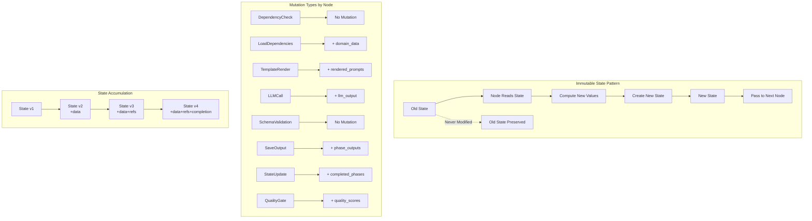

# State Mutations - Meta-Framework Patterns

## References

- [Workflow Graph System](workflow-graph-system.md)
- [Graph Architecture](GRAPH_ARCHITECTURE.md)
- [Node Catalog](NODE_CATALOG.md)
- [Data Flow Requirements](DATA_FLOW_REQUIREMENTS.md)
- [Graph Type Definitions](GRAPH_TYPE_DEFINITIONS.md)
- [State Mutations (this doc)](STATE_MUTATIONS.md)

## Overview

This document specifies state transformation patterns for the **meta-framework workflow system**. The state doesn't change directly, but rather through the immutable state pattern where new state objects are created rather than modifying existing ones, ensuring state integrity across the configuration-driven phase execution model.

### State Mutation Flow



This document specifies state transformation patterns for the **meta-framework workflow system**. Unlike traditional phase-specific mutations, the meta-framework uses universal mutation patterns that work across any domain. All mutations follow the immutable state pattern where new state objects are created rather than modifying existing ones, ensuring state integrity across the configuration-driven phase execution model.

## Core Mutation Principles

### 1. Immutability
```python
# NEVER do this:
ctx.state.some_field = new_value  # ❌ Mutating state

# ALWAYS do this:
new_state = replace(ctx.state, some_field=new_value)  # ✅ Creating new state
```

### 2. Accumulation
```python
# State accumulates data, doesn't lose it
new_state = replace(
    ctx.state,
    new_field=computed_value,  # Add new
    # Existing fields preserved automatically
)
```

### 3. Reference Storage
```python
# Store references, not data
ref = StorageRef(storage_type='kv', key='workflow/123/data')  # Key without prefix
new_state = ctx.state.with_storage_ref('data_ref', ref)
```

## State Mutation Patterns

### Pattern 1: Simple Field Update

```python
from dataclasses import dataclass, replace

@dataclass
class SimpleUpdateNode(BaseNode[WorkflowState, WorkflowDeps, WorkflowState]):
    """Update a single field in state."""
    
    async def run(self, ctx: GraphRunContext[WorkflowState, WorkflowDeps]) -> BaseNode:
        # Compute new value
        new_value = await self.compute_value(ctx.state)
        
        # Create new state with updated field
        new_state = replace(
            ctx.state,
            some_field=new_value
        )
        
        return self.next  # Return next node in graph
```

## Atomic Node State Mutations

### Atomic Node Mutation Patterns

```python
# Each atomic node has specific mutation responsibilities
from dataclasses import dataclass, replace
from datetime import datetime

@dataclass
class DependencyCheckNode(BaseNode[WorkflowState, WorkflowDeps, WorkflowState]):
    """Check dependencies - no state mutation."""
    
    async def run(self, ctx: GraphRunContext[WorkflowState, WorkflowDeps]) -> BaseNode | End[WorkflowState]:
        # Read dependencies from phase definition in state
        phase_def = ctx.state.workflow_def.phases[ctx.state.current_phase]
        dependencies = phase_def.dependencies
        
        # Read-only operation - no mutation
        for dep in dependencies:
            if dep not in ctx.state.completed_phases:
                raise NonRetryableError(f"Missing dependency: {dep}")
        return LoadDependenciesNode()

@dataclass
class LoadDependenciesNode(BaseNode[WorkflowState, WorkflowDeps, WorkflowState]):
    """Load dependencies - updates domain_data."""
    
    async def run(self, ctx: GraphRunContext[WorkflowState, WorkflowDeps]) -> BaseNode | End[WorkflowState]:
        # Read dependencies from phase definition in state
        phase_def = ctx.state.workflow_def.phases[ctx.state.current_phase]
        dependencies = phase_def.dependencies
        
        try:
            # Load data from storage
            loaded_data = {}
            for dep in dependencies:
                ref = ctx.state.phase_outputs.get(dep)
                if ref:
                    data = await ctx.deps.storage_client.load_kv(ref.key)
                    loaded_data[dep] = data
            
            # MUTATION: Add loaded dependencies to domain_data
            new_domain_data = {
                **ctx.state.domain_data,
                'loaded_dependencies': loaded_data
            }
            
            new_state = replace(
                ctx.state,
                domain_data=new_domain_data
            )
            
            return TemplateRenderNode()  # Next atomic node
            
        except StorageError as e:
            raise RetryableError(f"Failed to load dependencies: {e}", retry_after=2.0)

@dataclass
class SavePhaseOutputNode(BaseNode[WorkflowState, WorkflowDeps, WorkflowState]):
    """Save output - updates phase_outputs."""
    
    async def run(self, ctx: GraphRunContext[WorkflowState, WorkflowDeps]) -> BaseNode | End[WorkflowState]:
        # Read configuration from state
        phase_name = ctx.state.current_phase
        phase_def = ctx.state.workflow_def.phases[phase_name]
        storage_pattern = phase_def.storage_pattern
        
        try:
            # Get data to save from domain_data
            data = ctx.state.domain_data.get(f'{phase_name}_output')
            
            # Generate storage key
            key = self.storage_pattern.format(
                domain=ctx.state.domain,
                workflow_id=ctx.state.workflow_id,
                phase=self.phase_name
            )
            
            # Save to storage
            await ctx.deps.storage_client.save_kv(key, data)
            
            # Create reference
            ref = StorageRef(
                storage_type='kv',
                key=key,
                created_at=datetime.now()
            )
            
            # MUTATION: Update phase_outputs with new reference
            new_phase_outputs = {
                **ctx.state.phase_outputs,
                self.phase_name: ref
            }
            
            new_state = replace(
                ctx.state,
                phase_outputs=new_phase_outputs
            )
            
            return StateUpdateNode()  # Next atomic node
            
        except StorageError as e:
            raise RetryableError(f"Failed to save output: {e}", retry_after=2.0)

@dataclass
class StateUpdateNode(BaseNode[WorkflowState, WorkflowDeps, WorkflowState]):
    """Update phase completion status."""
    
    async def run(self, ctx: GraphRunContext[WorkflowState, WorkflowDeps]) -> BaseNode | End[WorkflowState]:
        # Read current phase from state
        phase_name = ctx.state.current_phase
        
        # MUTATION: Mark phase as complete
        new_completed = ctx.state.completed_phases | {phase_name}
        
        # Determine next phase
        next_phase = self._get_next_phase(ctx.state)
        
        new_state = replace(
            ctx.state,
            completed_phases=new_completed,
            current_phase=next_phase
        )
        
        return QualityGateNode()  # Next atomic node
```

### Pattern 2: Nested Field Update

```python
@dataclass
class NestedUpdateNode(BaseNode[WorkflowState, WorkflowDeps, WorkflowState]):
    """Update nested fields in state."""
    
    async def run(self, ctx: GraphRunContext[WorkflowState, WorkflowDeps]) -> BaseNode:
        # Update nested field (phase_status.analysis_complete)
        new_phase_status = replace(
            ctx.state.phase_status,
            analysis_complete=True
        )
        
        # Update state with new nested object
        new_state = replace(
            ctx.state,
            phase_status=new_phase_status
        )
        
        return self.next  # Return next node in graph
```

### Pattern 3: Collection Updates

```python
@dataclass
class CollectionUpdateNode(BaseNode[WorkflowState, WorkflowDeps, WorkflowState]):
    """Update collections in state."""
    
    async def run(self, ctx: GraphRunContext[WorkflowState, WorkflowDeps]) -> BaseNode:
        # Add to list
        new_list = ctx.state.missing_tools + ['new_tool']
        
        # Update dictionary
        new_dict = {
            **ctx.state.quality_metrics,
            'new_tool': QualityMetrics(...)
        }
        
        # Create new state
        new_state = replace(
            ctx.state,
            missing_tools=new_list,
            quality_metrics=new_dict
        )
        
        return self.next  # Return next node in graph
```

### Pattern 4: Storage Reference Updates

```python
@dataclass
class StorageRefUpdateNode(BaseNode[WorkflowState, WorkflowDeps, WorkflowState]):
    """Update storage references."""
    
    async def run(self, ctx: GraphRunContext[WorkflowState, WorkflowDeps]) -> BaseNode:
        # Save data and get reference
        data = getattr(ctx.state, 'tool_specifications', [])  # Use actual field
        ref = await self.save_to_storage(data)
        
        # Use helper method for storage refs
        new_state = ctx.state.with_storage_ref(
            ref_type='analysis_ref',
            ref=ref
        )
        
        return self.next  # Return next node in graph
```

## Meta-Framework Universal Mutations

### Generic Phase Completion Pattern (Orchestrated by Atomic Nodes)

```python
def mutate_after_phase(
    state: WorkflowState,
    phase_name: str,
    output_data: BasePhaseOutput,
    storage_ref: StorageRef
) -> WorkflowState:
    """Universal pattern for phase completion - now decomposed into atomic nodes.
    
    This function shows the complete mutation, but in practice it's split across:
    1. SavePhaseOutputNode - Updates phase_outputs with storage_ref
    2. StateUpdateNode - Updates completed_phases and current_phase
    3. QualityGateNode - Updates quality_scores
    
    Each atomic node performs its specific mutation independently.
    """
    
    # SavePhaseOutputNode performs this mutation:
    new_phase_outputs = {
        **state.phase_outputs,
        phase_name: storage_ref
    }
    
    # LLMCallNode already updated domain_data with output
    new_domain_data = {
        **state.domain_data,
        f'{phase_name}_output': output_data.data
    }
    
    # QualityGateNode performs this mutation:
    new_quality_scores = state.quality_scores
    if output_data.quality_score is not None:
        new_quality_scores = {
            **state.quality_scores,
            phase_name: output_data.quality_score
        }
    
    # StateUpdateNode performs this mutation:
    new_completed = state.completed_phases | {phase_name}
    next_phase = _get_next_phase(state, phase_name)
    
    return replace(
        state,
        completed_phases=new_completed,
        current_phase=next_phase,
        phase_outputs=new_phase_outputs,
        domain_data=new_domain_data,
        quality_scores=new_quality_scores
    )
```

### Atomic Node Mutation Decomposition

```python
class GenericPhaseNode:
    """Orchestrates atomic nodes, each with specific mutations."""
    
    # Nodes chain by returning next node, not executing sub-graphs
    # GenericPhaseNode now returns first atomic node which chains to rest
    
    async def run(self, ctx) -> BaseNode:
        """Start phase by returning first atomic node."""
        # Each atomic node chains to next:
        # DependencyCheckNode → LoadDependenciesNode → TemplateRenderNode →
        # LLMCallNode → SchemaValidationNode → SavePhaseOutputNode →
        # StateUpdateNode → QualityGateNode
        return DependencyCheckNode()
```

### Domain-Agnostic Storage Pattern

```python
def store_phase_output(
    state: WorkflowState,
    phase_def: PhaseDefinition,
    output: BaseModel,
    deps: WorkflowDeps
) -> Tuple[WorkflowState, StorageRef]:
    """Store output using phase definition pattern."""
    
    # Generate storage key from pattern
    storage_key = phase_def.storage_pattern.format(
        domain=state.domain,
        workflow_id=state.workflow_id,
        phase=phase_def.phase_name
    )
    
    # Add versioning if refinement occurred
    if phase_def.allow_refinement:
        version = state.refinement_count.get(phase_def.phase_name, 0)
        storage_key = f"{storage_key}/v{version}"
    
    # Store based on type
    if phase_def.storage_type == 'kv':
        await deps.storage_client.save_kv(storage_key, output.model_dump())
    else:
        await deps.storage_client.save_fs(storage_key, output.model_dump_json())
    
    # Create reference
    ref = StorageRef(
        storage_type=phase_def.storage_type,
        key=storage_key,
        created_at=datetime.now(),
        version=version if phase_def.allow_refinement else None
    )
    
    # Update state with reference
    new_state = state.with_phase_complete(phase_def.phase_name, ref)
    
    return new_state, ref
```

### Meta-Framework Refinement Mutations

```python
def mutate_for_refinement(
    state: WorkflowState,
    phase_name: str,
    feedback: str,
    quality_score: float
) -> WorkflowState:
    """Universal refinement state update."""
    
    # Increment refinement count
    new_refinement_count = {
        **state.refinement_count,
        phase_name: state.refinement_count.get(phase_name, 0) + 1
    }
    
    # Add refinement feedback to domain data
    new_domain_data = {
        **state.domain_data,
        f'{phase_name}_feedback': feedback,
        f'{phase_name}_previous_score': quality_score
    }
    
    # Create refinement record
    record = RefinementRecord(
        iteration=new_refinement_count[phase_name],
        timestamp=datetime.now(),
        previous_score=state.quality_scores.get(phase_name, 0.0),
        new_score=quality_score,
        feedback=feedback,
        changes_made=[],
        code_before_ref=state.phase_outputs.get(phase_name),
        code_after_ref=None  # Will be set after re-execution
    )
    
    # Update refinement history
    phase_history = state.refinement_history.get(phase_name, [])
    new_refinement_history = {
        **state.refinement_history,
        phase_name: phase_history + [record]
    }
    
    return replace(
        state,
        current_phase=phase_name,  # Re-execute this phase
        refinement_count=new_refinement_count,
        domain_data=new_domain_data,
        refinement_history=new_refinement_history
    )
```

### Universal Quality Gate Mutations

```python
def mutate_for_quality_gate(
    state: WorkflowState,
    phase_name: str,
    phase_def: PhaseDefinition,
    validation_result: ValidationResult
) -> WorkflowState:
    """Update state at quality gate."""
    
    # Update validation results
    new_validation_results = {
        **state.validation_results,
        phase_name: validation_result
    }
    
    # Determine next action based on quality
    quality_score = validation_result.metadata.get('quality_score', 0.0)
    meets_threshold = quality_score >= phase_def.quality_threshold
    can_refine = (
        phase_def.allow_refinement and
        state.refinement_count.get(phase_name, 0) < phase_def.max_refinements
    )
    
    if meets_threshold:
        # Quality met, move to next phase
        next_phase = _get_next_phase(state, phase_name)
        return replace(
            state,
            current_phase=next_phase,
            validation_results=new_validation_results,
            quality_scores={
                **state.quality_scores,
                phase_name: quality_score
            }
        )
    elif can_refine:
        # Trigger refinement
        return mutate_for_refinement(
            state,
            phase_name,
            _generate_refinement_feedback(validation_result),
            quality_score
        )
    else:
        # Cannot refine further, accept current quality
        next_phase = _get_next_phase(state, phase_name)
        return replace(
            state,
            current_phase=next_phase,
            validation_results=new_validation_results,
            quality_scores={
                **state.quality_scores,
                phase_name: quality_score
            },
            domain_data={
                **state.domain_data,
                f'{phase_name}_accepted_below_threshold': True
            }
        )
```

## Parallel Execution State Mutations

### Fork State for Parallel Processing

```python
def fork_state_for_parallel(
    state: WorkflowState,
    items: List[Any]
) -> List[WorkflowState]:
    """Create isolated state copies for parallel execution."""
    
    forked_states = []
    for i, item in enumerate(items):
        # Deep copy state for isolation
        item_state = replace(
            state,
            processing=replace(
                state.processing,
                current_item=item,
                parallel_index=i
            )
        )
        forked_states.append(item_state)
    
    return forked_states
```

### Merge Parallel Results

```python
def merge_parallel_results(
    base_state: WorkflowState,
    parallel_states: List[WorkflowState]
) -> WorkflowState:
    """Merge results from parallel executions."""
    
    # Aggregate results
    all_results = []
    all_errors = []
    
    for pstate in parallel_states:
        if pstate.processing.last_result:
            all_results.append(pstate.processing.last_result)
        if pstate.processing.last_error:
            all_errors.append(pstate.processing.last_error)
    
    # Merge token usage
    total_usage = base_state.total_token_usage
    for pstate in parallel_states:
        for phase, usage in pstate.total_token_usage.items():
            if phase in total_usage:
                total_usage[phase] = total_usage[phase] + usage
            else:
                total_usage[phase] = usage
    
    # Create merged state
    return replace(
        base_state,
        processing=replace(
            base_state.processing,
            parallel_results=all_results,
            parallel_errors=all_errors
        ),
        total_token_usage=total_usage
    )
```

## Conditional State Mutations

### Branching State Updates

```python
def update_state_for_branch(
    state: WorkflowState,
    condition_result: bool,
    branch_name: str
) -> WorkflowState:
    """Update state when taking a branch."""
    
    return replace(
        state,
        processing=replace(
            state.processing,
            last_condition=condition_result,
            branch_taken=branch_name,
            branch_history=state.processing.branch_history + [branch_name]
        )
    )
```

## State Validation During Mutations

### Pre-Mutation Validation

```python
def validate_before_mutation(state: WorkflowState) -> None:
    """Validate state before mutation."""
    
    # Check required fields
    if not state.metadata.workflow_id:
        raise ValueError("workflow_id is required")
    
    # Check phase progression
    if state.phase_status.specification_complete:
        if not state.phase_status.analysis_complete:
            raise ValueError("Cannot complete specification before analysis")
    
    # Check data consistency
    if state.storage.analysis_ref and not state.phase_status.analysis_complete:
        raise ValueError("Analysis ref exists but phase not marked complete")
```

### Post-Mutation Validation

```python
def validate_after_mutation(
    old_state: WorkflowState,
    new_state: WorkflowState
) -> None:
    """Validate state after mutation."""
    
    # Ensure workflow_id unchanged
    if old_state.metadata.workflow_id != new_state.metadata.workflow_id:
        raise ValueError("workflow_id cannot be changed")
    
    # Ensure no data loss (accumulation principle)
    if len(new_state.missing_tools) < len(old_state.missing_tools):
        raise ValueError("Data loss detected in missing_tools")
    
    # Validate new references using proper field access
    from dataclasses import asdict
    storage_dict = asdict(new_state.storage)
    for ref_name, ref in storage_dict.items():
        if ref and not isinstance(ref, (StorageRef, dict)):
            raise ValueError(f"Invalid storage reference: {ref_name}")
```

## Token Usage Accumulation

```python
def accumulate_token_usage(
    state: WorkflowState,
    phase: str,
    usage: TokenUsage
) -> WorkflowState:
    """Accumulate token usage for a phase."""
    
    current_usage = state.total_token_usage.get(
        phase,
        TokenUsage(0, 0, 0, usage.model)
    )
    
    new_usage = current_usage + usage
    
    return replace(
        state,
        total_token_usage={
            **state.total_token_usage,
            phase: new_usage
        }
    )
```

## Error State Mutations

```python
def mutate_for_error(
    state: WorkflowState,
    error: Exception,
    node_name: str
) -> WorkflowState:
    """Update state when error occurs - different handling by error type."""
    
    if isinstance(error, RetryableError):
        # For retryable errors, track retry attempts
        retry_counts = state.retry_counts.copy()
        retry_counts[node_name] = retry_counts.get(node_name, 0) + 1
        
        return replace(
            state,
            retry_counts=retry_counts,
            processing=replace(
                state.processing,
                last_retryable_error=str(error),
                retry_after=error.retry_after
            )
        )
    
    elif isinstance(error, NonRetryableError):
        # For non-retryable errors, record failure
        return replace(
            state,
            processing=replace(
                state.processing,
                tools_failed=state.processing.tools_failed + [node_name],
                processing_errors={
                    **state.processing.processing_errors,
                    node_name: str(error)
                },
                last_error=str(error),
                error_count=state.processing.error_count + 1
            )
        )
    
    else:
        # Unknown error type - treat as non-retryable
        return mutate_for_error(state, NonRetryableError(str(error)), node_name)

# Atomic node error handling
class AtomicNodeErrorHandler:
    """Handles errors at atomic node level."""
    
    @staticmethod
    def handle_storage_error(state: WorkflowState, node: BaseNode, error: StorageError):
        """Storage errors are retryable."""
        # State-based retry configured in NodeConfig
        # Node retries by returning self with updated retry count in state
        return node.__class__()  # Return new instance of same node class
    
    @staticmethod
    def handle_llm_error(state: WorkflowState, node: BaseNode, error: APIError):
        """LLM errors bubble up to orchestrator."""
        # Don't retry at node level - too expensive
        # Orchestrator decides whether to retry entire phase
        raise NonRetryableError(f"LLM call failed: {error}")
    
    @staticmethod
    def handle_validation_error(state: WorkflowState, node: BaseNode, error: ValidationError):
        """Validation errors trigger refinement."""
        # REMOVED: RefinementLoopNode - use QualityGateNode that returns refinement node
        # Trigger refinement by updating state and returning appropriate node
        return QualityGateNode()
```

## State Recovery Patterns

```python
def create_recovery_point(state: WorkflowState) -> StorageRef:
    """Create a recovery point for state."""
    
    # Serialize state
    state_json = json.dumps(asdict(state), default=str)
    
    # Save to storage
    ref = StorageRef(
        storage_type='kv',
        key=f'workflow/{state.metadata.workflow_id}/recovery/{datetime.now().isoformat()}',
        size_bytes=len(state_json)
    )
    
    return ref

def restore_from_recovery_point(ref: StorageRef, deps: WorkflowDeps) -> WorkflowState:
    """Restore state from recovery point."""
    
    # Load from storage
    state_json = deps.storage_client.load_kv(ref.key)
    
    # Deserialize to state
    state_dict = json.loads(state_json)
    
    # Reconstruct state object
    return WorkflowState(**state_dict)
```

## Meta-Framework Best Practices

### 1. Use Atomic Node Patterns
```python
# Good - State-based retry and chaining
class SavePhaseOutputNode:
    """Save with state-based retry."""
    async def run(self, ctx):
        config = ctx.state.workflow_def.node_configs["save_output"]
        retry_key = f"{ctx.state.current_phase}_save"
        retry_count = ctx.state.retry_counts.get(retry_key, 0)
        
        try:
            ref = await self.save_to_storage(ctx.state.domain_data)
            # Chain to next node
            return StateUpdateNode()
        except Exception as e:
            if config.retryable and retry_count < config.max_retries:
                # Retry by returning self
                new_state = replace(
                    ctx.state,
                    retry_counts={**ctx.state.retry_counts, retry_key: retry_count + 1}
                )
                return SavePhaseOutputNode()
            else:
                return ErrorNode(str(e))

# Bad - Monolithic node doing everything
class DoEverythingNode:
    async def run(self, ctx):
        # Save data
        ref = await self.save(...)
        # Update state
        new_state = replace(ctx.state, ...)
        # Check quality
        if quality < threshold:
            # Trigger refinement
            ...
        return new_state
```

### 2. Configure Retry in State
```python
# Good - State-driven retry configuration
node_configs = {
    "llm_call": NodeConfig(
        retryable=True,  # LLM can have transient failures
        max_retries=3,
        retry_backoff="exponential"
    ),
    "load_local": NodeConfig(
        retryable=False,  # Local storage rarely fails
        max_retries=0
    )
}

# Good - Node checks its config
class LLMCallNode:
    async def run(self, ctx):
        config = ctx.state.workflow_def.node_configs["llm_call"]
        if error and config.retryable:
            return LLMCallNode()  # Retry by returning self
```

### 2. Atomic Multi-Field Updates
```python
# Good - Update related fields together
new_state = replace(
    state,
    tool_specifications=specs,
    phase_status=replace(state.phase_status, specification_complete=True),
    storage=replace(state.storage, specs_refs=refs)
)

# Bad - Multiple separate updates
state1 = replace(state, tool_specifications=specs)
state2 = replace(state1, phase_status=...)
state3 = replace(state2, storage=...)
```

### 3. Validate Mutations
```python
# Good - Validate before and after
validate_before_mutation(state)
new_state = perform_mutation(state)
validate_after_mutation(state, new_state)

# Bad - No validation
new_state = perform_mutation(state)
```

### 4. Track Mutation History
```python
# Good - Track what changed
new_state = replace(
    state,
    some_field=new_value,
    mutation_log=state.mutation_log + [
        f"Updated some_field from {state.some_field} to {new_value}"
    ]
)
```

### 5. Domain-Agnostic Mutations
```python
# Good - Domain-agnostic pattern
def update_phase_state(state: WorkflowState, phase_def: PhaseDefinition, output: Any):
    """Works for any domain."""
    return state.with_phase_complete(phase_def.phase_name, create_storage_ref(output))

# Bad - Domain-specific logic
def update_agentool_state(state: WorkflowState, ...):
    """Only works for AgenTool domain."""
    ...
```

## Meta-Framework State Evolution Summary

The meta-framework with atomic decomposition transforms state mutations from monolithic phase operations to fine-grained atomic node mutations. This enables:

1. **Atomic Operations**: Each node performs a single, specific mutation
2. **Selective Retry**: Only retry failed atomic operations, not entire phases
3. **Resource Efficiency**: Don't repeat expensive operations (LLM) when storage fails
4. **Clear Responsibility**: Each atomic node has one mutation responsibility
5. **Error Isolation**: Different error handling strategies by node type
6. **Observable Mutations**: Track exactly which atomic operation modified state

### State-Based Node Configuration Summary

| Node Type | State Mutation | Retryable | Retry Strategy | Iteration |
|-----------|---------------|-----------|----------------|----------|
| DependencyCheckNode | None (read-only) | No | N/A | No |
| LoadDependenciesNode | Updates domain_data | Configurable | State-based | No |
| TemplateRenderNode | None (deterministic) | No | N/A | No |
| LLMCallNode | Updates domain_data | Yes | State-based retry | No |
| SchemaValidationNode | None (validation) | No | Triggers refinement | No |
| SavePhaseOutputNode | Updates phase_outputs | Configurable | State-based | No |
| StateUpdateNode | Updates completed_phases | No | N/A | No |
| QualityGateNode | Updates quality_scores | No | Returns next node | No |
| IterableNode | Updates iter_index, iter_results | Configurable | Self-return | Yes |