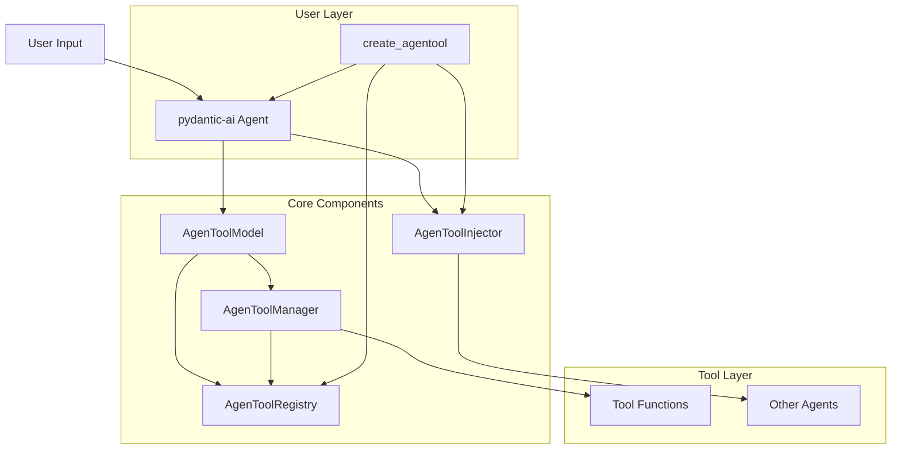
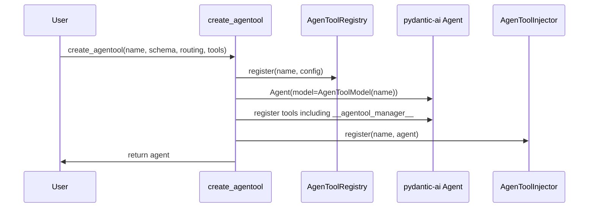
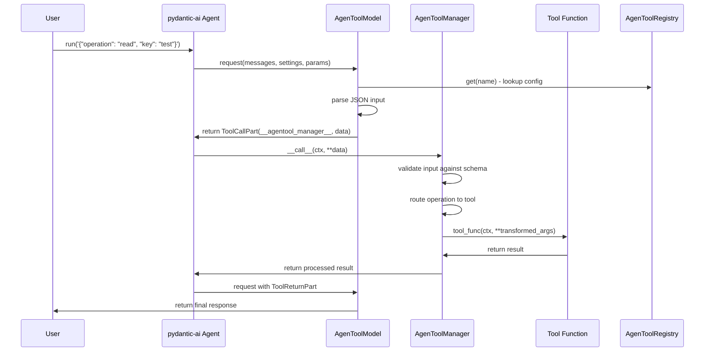
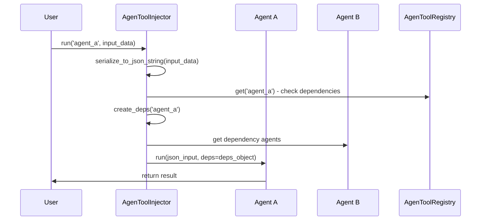

# AgenTool Architecture Guide

This document provides a comprehensive overview of the AgenTool framework architecture, explaining how the components work together to provide deterministic tool execution within pydantic-ai.

## Table of Contents

- [High-Level Architecture](#high-level-architecture)
- [Component Details](#component-details)
- [Data Flow](#data-flow)
- [Integration Points](#integration-points)
- [Design Patterns](#design-patterns)
- [Extension Points](#extension-points)

## High-Level Architecture



## Component Details

### 1. AgenToolModel (`core/model.py`)

The `AgenToolModel` is a synthetic LLM model provider that mimics the behavior of language models while providing deterministic execution.

#### Responsibilities
- **Message Processing**: Parses user messages and extracts JSON input
- **Tool Call Generation**: Creates tool calls to the special `__agentool_manager__` tool
- **Response Formatting**: Converts tool results back to model responses
- **pydantic-ai Integration**: Implements the `Model` interface for seamless integration

#### Key Methods
```python
async def request(
    self,
    messages: list[ModelMessage],
    model_settings: ModelSettings | None,
    model_request_parameters: ModelRequestParameters,
) -> ModelResponse
```

#### Execution Flow
1. **Phase 1 (Initial Request)**: Extracts JSON from user message and generates tool call
2. **Phase 2 (Tool Response)**: Processes tool results and returns final response

#### Configuration Lookup
```python
# Model checks registry for configuration
config = AgenToolRegistry.get(self.name)
if config is None:
    return error_response("No configuration found")
```

### 2. AgenToolManager (`core/manager.py`)

The `AgenToolManager` handles the core routing logic and payload transformation between input schemas and tool function signatures.

#### Responsibilities
- **Input Validation**: Validates input against the configured Pydantic schema
- **Operation Routing**: Determines which tool to call based on operation field
- **Payload Transformation**: Transforms input data to match tool signatures
- **Tool Execution**: Calls the actual tool functions with proper context
- **Output Handling**: Manages output type validation and serialization

#### Key Methods
```python
async def __call__(self, ctx: RunContext[Any], **kwargs) -> Any:
    # 1. Create input model from kwargs
    input_data = self.input_schema(**kwargs)
    
    # 2. Extract operation
    operation = getattr(input_data, operation_field)
    
    # 3. Look up routing
    tool_name, transform_func = self.routing_config.operation_map[operation]
    
    # 4. Transform arguments
    tool_args = transform_func(input_data)
    
    # 5. Execute tool
    result = await tool_func(ctx, **tool_args)
    
    # 6. Handle output type validation
    return self._process_output(result)
```

#### Routing Configuration
The manager uses a `RoutingConfig` to map operations to tools:

```python
routing = RoutingConfig(
    operation_field='operation',  # Field containing the operation
    operation_map={
        'read': ('storage_read', lambda x: {'key': x.key}),
        'write': ('storage_write', lambda x: {'key': x.key, 'data': x.data}),
    }
)
```

### 3. AgenToolRegistry (`core/registry.py`)

The `AgenToolRegistry` serves as a global configuration store and metadata provider for all AgenTool instances.

#### Responsibilities
- **Configuration Storage**: Stores input schemas and routing configurations
- **Dynamic Lookup**: Enables runtime configuration retrieval
- **Metadata Management**: Tracks tool metadata and dependency information
- **Documentation Generation**: Provides introspection and documentation capabilities

#### Data Structures

```python
@dataclass
class AgenToolConfig:
    input_schema: Type[BaseModel]          # Pydantic schema for validation
    routing_config: RoutingConfig          # Operation to tool mapping
    output_type: Optional[Type[BaseModel]] # Expected output type
    description: Optional[str]             # Human-readable description
    version: str                          # Version information
    tags: List[str]                       # Categorization tags
    tools_metadata: List[ToolMetadata]    # Tool function metadata
    dependencies: List[str]               # Required dependencies
    examples: List[Dict[str, Any]]        # Usage examples
    created_at: datetime                  # Creation timestamp
    updated_at: datetime                  # Last update timestamp
```

#### Registry Operations
```python
# Registration
AgenToolRegistry.register('storage', config)

# Retrieval
config = AgenToolRegistry.get('storage')

# Introspection
names = AgenToolRegistry.list_names()
detailed_info = AgenToolRegistry.list_detailed()
schema = AgenToolRegistry.get_schema('storage')
```

### 4. AgenToolInjector (`core/injector.py`)

The `AgenToolInjector` provides dependency injection capabilities for complex multi-agent systems.

#### Responsibilities
- **Instance Management**: Maintains singleton instances of agents
- **Dependency Resolution**: Automatically wires up agent dependencies
- **JSON Serialization**: Handles automatic serialization of input data
- **Override Support**: Provides dependency overrides for testing

#### Key Features

```python
class AgenToolInjector:
    async def run(self, agent_name: str, input_data: Union[str, Dict, BaseModel, Any]) -> Any:
        # Automatic JSON serialization
        json_input = serialize_to_json_string(input_data)
        
        # Get agent and dependencies
        agent = self.get(agent_name)
        deps = self.create_deps(agent_name)
        
        # Execute with dependency injection
        return await agent.run(json_input, deps=deps)
    
    @contextmanager
    def override(self, **overrides: Agent):
        # Temporary dependency overrides for testing
        ...
```

#### Serialization Support
The injector supports automatic serialization of various Python types:

```python
def serialize_to_json_string(data: Any) -> str:
    # Handles:
    # - Strings (validates if already valid JSON)
    # - Dicts, lists, tuples
    # - BaseModel instances (uses model_dump_json())
    # - Basic types (int, float, bool, None)
    # - Datetime objects (ISO format)
    # - Decimal objects
```

### 5. Factory Functions (`factory.py`)

The factory module provides high-level functions for creating and registering AgenTool instances.

#### Key Functions

```python
def create_agentool(
    name: str,
    input_schema: Type[BaseModel],
    routing_config: RoutingConfig,
    tools: List[Callable],
    **kwargs
) -> Agent:
    # 1. Extract tool metadata
    tools_metadata = [extract_tool_metadata(tool) for tool in tools]
    
    # 2. Infer output type from tool annotations
    output_type = infer_output_type(tools_metadata)
    
    # 3. Create and register configuration
    config = AgenToolConfig(...)
    AgenToolRegistry.register(name, config)
    
    # 4. Create agent with AgenToolModel
    agent = Agent(model=AgenToolModel(name), ...)
    
    # 5. Register manager tool
    manager = AgenToolManager(name, config, tool_functions)
    agent.tool(name='__agentool_manager__')(manager)
    
    # 6. Register actual tools
    for tool_func in tools:
        agent.tool(tool_func)
    
    # 7. Register with injector
    get_injector().register(name, agent)
    
    return agent
```

#### Metadata Extraction
The factory automatically extracts metadata from tool functions:

```python
def extract_tool_metadata(tool_func: Callable) -> ToolMetadata:
    return ToolMetadata(
        name=tool_func.__name__,
        description=inspect.getdoc(tool_func),
        is_async=inspect.iscoroutinefunction(tool_func),
        parameters=list(signature.parameters.keys()),
        parameter_types=extract_type_annotations(tool_func),
        return_type=extract_return_type(tool_func)
    )
```

## Data Flow

### 1. Agent Creation Flow



### 2. Request Execution Flow



### 3. Dependency Injection Flow



## Integration Points

### 1. pydantic-ai Integration

AgenTool integrates with pydantic-ai through several key points:

#### Model Registry Integration
```python
def register_agentool_models():
    # Patches pydantic-ai's model inference
    def patched_infer_model(model):
        if isinstance(model, str) and model.startswith('agentool:'):
            _, name = model.split(':', maxsplit=1)
            return AgenToolModel(name)
        return original_infer_model(model)
    
    models.infer_model = patched_infer_model
```

#### Agent Tool Registration
```python
# Manager registered as special tool
@agent.tool(name='__agentool_manager__')
async def agentool_manager_tool(ctx: RunContext[Any], **kwargs: Any) -> Any:
    return await manager(ctx, **kwargs)

# Actual tools registered normally
for tool_func in tools:
    agent.tool(tool_func)
```

### 2. Schema Integration

AgenTool leverages Pydantic's schema system:

```python
# Tool schema override for proper validation
tool = agent._function_toolset.tools['__agentool_manager__']
if hasattr(tool, 'function_schema'):
    schema = manager.get_tool_schema()
    tool.function_schema._json_schema_dict = {
        'type': 'object',
        'properties': schema.get('properties', {}),
        'required': schema.get('required', []),
        'additionalProperties': False
    }
```

### 3. Type System Integration

AgenTool supports automatic output type inference:

```python
def infer_output_type(tools_metadata: List[ToolMetadata]) -> Optional[Type[Any]]:
    # Analyzes tool return annotations
    # Returns common BaseModel type if all tools are compatible
    # Handles dict/BaseModel compatibility
    # Returns None for incompatible or built-in types
```

## Design Patterns

### 1. Synthetic Model Pattern

The `AgenToolModel` implements a synthetic model that provides deterministic behavior while maintaining the LLM interface:

```python
class AgenToolModel(Model):
    async def request(self, messages, settings, params) -> ModelResponse:
        # Extract JSON input
        # Generate tool call
        # Process tool results
        # Return model response
```

### 2. Registry Pattern

The `AgenToolRegistry` implements a global registry pattern for configuration management:

```python
class AgenToolRegistry:
    _configs: Dict[str, AgenToolConfig] = {}
    
    @classmethod
    def register(cls, name: str, config: AgenToolConfig) -> None:
        cls._configs[name] = config
```

### 3. Dependency Injection Pattern

The `AgenToolInjector` implements dependency injection with automatic serialization:

```python
class AgenToolInjector:
    def __init__(self):
        self._instances: Dict[str, Agent] = {}
        self._dependency_overrides: Dict[str, Agent] = {}
    
    async def run(self, agent_name: str, input_data: Any) -> Any:
        # Serialize input
        # Resolve dependencies
        # Execute with injection
```

### 4. Factory Pattern

The factory functions implement creation and registration patterns:

```python
def create_agentool(...) -> Agent:
    # Extract metadata
    # Infer types
    # Register configuration
    # Create agent
    # Register tools
    # Register with injector
```

### 5. Transform Pattern

The routing configuration uses transformation functions to adapt data:

```python
operation_map = {
    'read': ('storage_read', lambda x: {'key': x.key}),
    'write': ('storage_write', lambda x: {'key': x.key, 'data': x.data}),
}
```

## Extension Points

### 1. Custom Input Schemas

Create custom schemas by extending `BaseOperationInput`:

```python
class CustomOperationInput(BaseOperationInput):
    operation: Literal['custom_op1', 'custom_op2']
    custom_field: str
    optional_field: Optional[int] = None
```

### 2. Custom Output Types

Define structured output types for validation:

```python
class CustomOutput(BaseModel):
    result: str
    metadata: Dict[str, Any]
    timestamp: datetime

# Framework will automatically validate and serialize
```

### 3. Custom Tool Functions

Implement tools with any signature:

```python
async def custom_tool(
    ctx: RunContext[Any], 
    param1: str, 
    param2: Optional[int] = None
) -> CustomOutput:
    # Implementation
    return CustomOutput(...)
```

### 4. Custom Transformation Functions

Create sophisticated data transformations:

```python
def complex_transform(input_data: MySchema) -> Dict[str, Any]:
    # Complex transformation logic
    return {
        'processed_field': process(input_data.raw_field),
        'computed_value': compute(input_data.a, input_data.b),
        'context': build_context(input_data)
    }
```

### 5. Custom Dependency Injection

Extend the injector for complex scenarios:

```python
class CustomInjector(AgenToolInjector):
    def create_deps(self, agent_name: str) -> Optional[Any]:
        # Custom dependency resolution logic
        # Support for different dependency patterns
        # Integration with external systems
```

## Performance Considerations

### 1. Registry Lookup Performance
- Registry uses in-memory dictionaries for O(1) lookup
- No database or file I/O during runtime
- Minimal overhead for configuration access

### 2. JSON Serialization
- Uses Python's built-in `json` module
- Pydantic's `model_dump_json()` for optimal serialization
- Caching not implemented (stateless design)

### 3. Tool Execution
- Direct function calls with minimal wrapper overhead
- Async execution preserves concurrency
- No artificial delays or throttling

### 4. Memory Usage
- Singleton pattern for agents reduces memory overhead
- Metadata stored only during registration
- No persistent state in core components

## Security Considerations

### 1. Input Validation
- All inputs validated against Pydantic schemas
- No arbitrary code execution from user input
- JSON parsing uses safe built-in parser

### 2. Tool Isolation
- Tools execute in the same process (no sandboxing)
- Responsibility for security lies with tool implementations
- No privilege escalation mechanisms

### 3. Dependency Management
- Dependency injection uses explicit registration
- No dynamic module loading or code injection
- Override system requires explicit agent instances

## Testing Strategies

### 1. Unit Testing
```python
@pytest.mark.asyncio
async def test_calculator_add():
    result = await calculator.run('{"operation": "add", "a": 5, "b": 3}')
    assert float(result.output) == 8.0
```

### 2. Integration Testing
```python
@pytest.mark.asyncio
async def test_dependency_injection():
    injector = get_injector()
    with injector.override(storage=mock_storage_agent):
        result = await injector.run('complex_agent', test_input)
        assert result.output == expected_output
```

### 3. Schema Testing
```python
def test_schema_validation():
    with pytest.raises(ValidationError):
        invalid_input = CalculatorInput(operation="invalid", a=1, b=2)
```

This architecture provides a robust, extensible foundation for deterministic tool execution within the pydantic-ai ecosystem, enabling developers to build sophisticated agent hierarchies with predictable behavior and comprehensive tooling support.