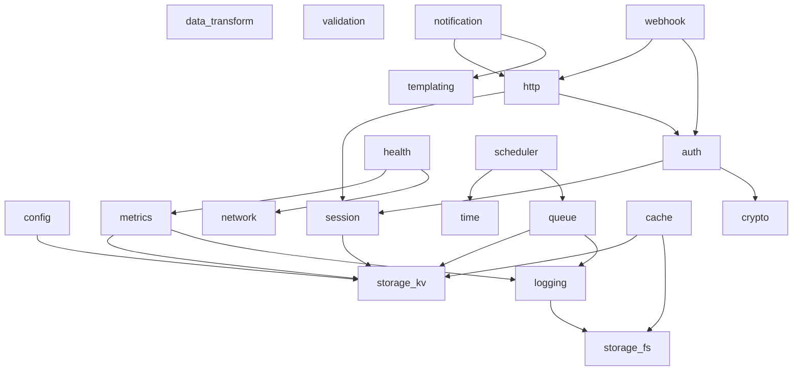

# Foundational AgentTool Kits Architecture

## Overview

This document outlines the comprehensive ecosystem of foundational AgentTool kits that provide primitive capabilities for building sophisticated multi-agent systems. These kits follow a layered architecture where higher-level capabilities are built on top of lower-level primitives through dependency injection.

## Core Philosophy

- **Layered Architecture**: Each toolkit builds on simpler primitives
- **Dependency Injection**: Clean separation of concerns through the injector
- **Type Safety**: Full Pydantic validation throughout
- **Composability**: Mix and match toolkits as needed
- **Testability**: Each toolkit can be tested independently
- **Observability**: Built-in Logfire integration

## Foundational Toolkit Categories

### 1. Storage Layer (No Dependencies)
- **storage_fs**: File system operations (read, write, list, delete files/directories)
- **storage_kv**: Key-value storage with TTL support (in-memory, Redis-compatible)

### 2. System Primitives (Minimal Dependencies)
- **config**: Configuration management (uses storage_kv)
- **logging**: Structured logging with multiple outputs (uses storage_fs)
- **crypto**: Encryption, hashing, signing operations (no deps)
- **time**: Time operations, scheduling, timezone handling (no deps)

### 3. Data Processing (No Dependencies)
- **data_transform**: JSON, CSV, XML, YAML processing and transformation
- **validation**: Advanced data validation beyond Pydantic basics
- **templating**: Template rendering (Jinja2-style)

### 4. Authentication & Session Management
- **session**: User session management (uses storage_kv)
- **auth**: Authentication operations, token management (uses session, crypto)

### 5. Network & Communication
- **http**: HTTP client with auth, cookies, headers (uses session, auth)
- **network**: Network utilities (ping, DNS, port scanning)
- **webhook**: Webhook handling and delivery (uses http, auth)

### 6. Monitoring & Observability
- **metrics**: Metrics collection and reporting (uses storage_kv, logging)
- **health**: Health checks and monitoring (uses metrics, network)

### 7. Advanced Capabilities
- **cache**: Intelligent caching layer (uses storage_kv, storage_fs)
- **queue**: Task queue management (uses storage_kv, logging)
- **scheduler**: Job scheduling system (uses time, queue)
- **notification**: Multi-channel notifications (uses http, templating)

## File Tree Structure

```
src/
├── agentool/
│   ├── core/
│   │   ├── __init__.py
│   │   ├── injector.py
│   │   ├── manager.py
│   │   ├── model.py
│   │   └── registry.py
│   ├── __init__.py
│   ├── base.py
│   └── factory.py
├── agentoolkit/
│   ├── __init__.py
│   ├── storage/
│   │   ├── __init__.py
│   │   ├── fs.py           # storage_fs toolkit
│   │   └── kv.py           # storage_kv toolkit
│   ├── system/
│   │   ├── __init__.py
│   │   ├── config.py       # config toolkit
│   │   ├── logging.py      # logging toolkit
│   │   ├── crypto.py       # crypto toolkit
│   │   └── time.py         # time toolkit
│   ├── data/
│   │   ├── __init__.py
│   │   ├── transform.py    # data_transform toolkit
│   │   ├── validation.py   # validation toolkit
│   │   └── templating.py   # templating toolkit
│   ├── auth/
│   │   ├── __init__.py
│   │   ├── session.py      # session toolkit
│   │   └── auth.py         # auth toolkit
│   ├── network/
│   │   ├── __init__.py
│   │   ├── http.py         # http toolkit
│   │   ├── network.py      # network toolkit
│   │   └── webhook.py      # webhook toolkit
│   ├── monitoring/
│   │   ├── __init__.py
│   │   ├── metrics.py      # metrics toolkit
│   │   └── health.py       # health toolkit
│   └── advanced/
│       ├── __init__.py
│       ├── cache.py        # cache toolkit
│       ├── queue.py        # queue toolkit
│       ├── scheduler.py    # scheduler toolkit
│       └── notification.py # notification toolkit
├── examples/
│   ├── foundational/
│   │   ├── __init__.py
│   │   ├── basic_storage.py    # storage_fs + storage_kv demo
│   │   ├── config_management.py # config toolkit demo
│   │   ├── auth_flow.py        # session + auth demo
│   │   ├── http_client.py      # http with auth demo
│   │   └── full_stack.py       # Multi-toolkit integration
│   └── use_cases/
│       ├── __init__.py
│       ├── api_client.py       # Real API integration example
│       ├── data_pipeline.py    # ETL pipeline example
│       ├── monitoring_system.py # Health monitoring example
│       └── notification_bot.py  # Multi-channel notifications
├── tests/
│   ├── agentoolkit/
│   │   ├── __init__.py
│   │   ├── test_storage_fs.py
│   │   ├── test_storage_kv.py
│   │   ├── test_config.py
│   │   ├── test_auth.py
│   │   ├── test_http.py
│   │   └── ...
│   └── integration/
│       ├── __init__.py
│       ├── test_storage_integration.py
│       ├── test_auth_flow.py
│       └── test_full_stack.py
└── docs/
    ├── foundational-agentoolkits.md  # This document
    ├── toolkit-reference/
    │   ├── storage.md
    │   ├── system.md
    │   ├── data.md
    │   ├── auth.md
    │   ├── network.md
    │   ├── monitoring.md
    │   └── advanced.md
    └── patterns/
        ├── dependency-chains.md
        ├── testing-toolkits.md
        └── extending-toolkits.md
```

## Toolkit Dependency Graph



## Implementation Strategy

### Phase 1: Core Storage & System (Week 1)
1. **Create directory structure** for agentoolkit
2. **Implement storage_fs toolkit** with comprehensive file operations
3. **Implement storage_kv toolkit** with TTL support and Redis compatibility
4. **Build config toolkit** on top of storage_kv with environment variable support
5. **Create basic logging toolkit** with structured output
6. **Add comprehensive tests** for all core toolkits
7. **Create basic examples** demonstrating toolkit usage

### Phase 2: Authentication & Data (Week 2)
1. **Implement crypto toolkit** with encryption, hashing, and signing
2. **Build session toolkit** for user session management
3. **Create auth toolkit** with token management and authentication flows
4. **Implement data_transform toolkit** for JSON, CSV, XML, YAML processing
5. **Add validation toolkit** with advanced validation patterns
6. **Create time toolkit** with scheduling and timezone support
7. **Integration testing** for auth flows and data processing

### Phase 3: Network & Communication (Week 3)
1. **Implement http toolkit** with full auth integration
2. **Add network utilities toolkit** for network operations
3. **Create webhook toolkit** for webhook handling and delivery
4. **Build comprehensive HTTP client examples** with real-world scenarios
5. **Test real-world API integrations** with various services
6. **Performance testing** for network operations

### Phase 4: Monitoring & Advanced (Week 4)
1. **Implement metrics toolkit** for metrics collection and reporting
2. **Create health toolkit** for system monitoring
3. **Build advanced toolkits**: cache, queue, scheduler
4. **Implement notification toolkit** for multi-channel notifications
5. **Create full-stack examples** showing complete system integration
6. **Performance optimization** and benchmarking
7. **Documentation completion** with comprehensive guides

## Key Design Principles

### 1. Consistent Interface Patterns
All toolkits follow these standards:
- Use `BaseOperationInput` schema pattern from `agentool.base`
- Standardized success/error response formats
- Uniform logging and metrics integration
- Consistent parameter naming conventions

```python
from agentool.base import BaseOperationInput
from typing import Literal, Optional, Any

class MyToolkitInput(BaseOperationInput):
    operation: Literal['create', 'read', 'update', 'delete']
    # ... toolkit-specific fields
```

### 2. Dependency Management
- **Clear dependency declarations** in toolkit metadata
- **Automatic dependency resolution** through injector
- **Support for dependency overrides** for testing and mocking
- **Circular dependency prevention** through design

```python
# Example: HTTP toolkit depends on session and auth
def create_http_agent():
    return create_agentool(
        name='http',
        input_schema=HttpInput,
        routing_config=http_routing,
        tools=[http_get, http_post, http_put, http_delete],
        dependencies=['session', 'auth'],  # Clear dependency declaration
        # ... other config
    )
```

### 3. Configuration Standards
- **Environment variable support** with sensible defaults
- **Configuration validation** using Pydantic models
- **Hot-reloading capabilities** where applicable
- **Hierarchical configuration** support

```python
class HttpConfig(BaseModel):
    timeout: int = Field(default=30, description="Request timeout in seconds")
    max_retries: int = Field(default=3, description="Maximum retry attempts")
    base_url: Optional[str] = Field(default=None, description="Base URL for requests")
    
    @classmethod
    def from_env(cls) -> 'HttpConfig':
        return cls(
            timeout=int(os.getenv('HTTP_TIMEOUT', '30')),
            max_retries=int(os.getenv('HTTP_MAX_RETRIES', '3')),
            base_url=os.getenv('HTTP_BASE_URL')
        )
```

### 4. Testing Standards
- **Unit tests** for each toolkit function
- **Integration tests** for toolkit combinations
- **Mock support** for external dependencies
- **Performance benchmarks** for critical operations
- **Test data fixtures** for consistent testing

```python
# Example test structure using injector pattern
@pytest.mark.asyncio
async def test_storage_fs_read_write():
    from agentool.core.injector import get_injector
    
    # Setup - ensure storage_fs toolkit is registered
    injector = get_injector()
    
    # Test write operation
    write_result = await injector.run('storage_fs', {
        "operation": "write",
        "path": "/tmp/test.txt",
        "content": "Hello, World!"
    })
    # With automatic JSON handling, access data directly
    assert write_result.data["success"] is True
    
    # Test read operation
    read_result = await injector.run('storage_fs', {
        "operation": "read",
        "path": "/tmp/test.txt"
    })
    assert read_result.data["success"] is True
    assert read_result.data["content"] == "Hello, World!"
```

### 5. Documentation Standards
- **API reference** for each toolkit with complete schemas
- **Usage examples** and common patterns
- **Troubleshooting guides** for common issues
- **Best practices documentation** for each toolkit
- **Integration patterns** showing toolkit combinations

## Toolkit Specifications

### Storage Layer

#### storage_fs (File System Operations)
```python
class StorageFsInput(BaseOperationInput):
    operation: Literal['read', 'write', 'append', 'delete', 'list', 'exists', 'mkdir', 'rmdir']
    path: str = Field(description="File or directory path")
    content: Optional[str] = Field(None, description="Content for write/append operations")
    encoding: str = Field(default="utf-8", description="Text encoding")
    recursive: bool = Field(default=False, description="Recursive operation for list/delete")
    pattern: Optional[str] = Field(None, description="Pattern for file filtering")
```

**Operations:**
- `read`: Read file content
- `write`: Write content to file (overwrite)
- `append`: Append content to file
- `delete`: Delete file or directory
- `list`: List directory contents
- `exists`: Check if file/directory exists
- `mkdir`: Create directory
- `rmdir`: Remove directory

#### storage_kv (Key-Value Storage)
```python
class StorageKvInput(BaseOperationInput):
    operation: Literal['get', 'set', 'delete', 'exists', 'keys', 'clear', 'expire']
    key: Optional[str] = Field(None, description="Key for operation")
    value: Optional[Any] = Field(None, description="Value to store")
    ttl: Optional[int] = Field(None, description="Time to live in seconds")
    pattern: Optional[str] = Field(None, description="Pattern for keys operation")
    namespace: str = Field(default="default", description="Key namespace")
```

**Operations:**
- `get`: Retrieve value by key
- `set`: Store key-value pair with optional TTL
- `delete`: Delete key
- `exists`: Check if key exists
- `keys`: List keys matching pattern
- `clear`: Clear all keys in namespace
- `expire`: Set TTL for existing key

### System Primitives

#### config (Configuration Management)
```python
class ConfigInput(BaseOperationInput):
    operation: Literal['get', 'set', 'delete', 'list', 'reload', 'validate']
    key: Optional[str] = Field(None, description="Configuration key")
    value: Optional[Any] = Field(None, description="Configuration value")
    namespace: str = Field(default="app", description="Configuration namespace")
    format: Literal['json', 'yaml', 'env'] = Field(default="json", description="Configuration format")
```

#### logging (Structured Logging)
```python
class LoggingInput(BaseOperationInput):
    operation: Literal['log', 'configure', 'get_logs', 'clear_logs']
    level: Literal['DEBUG', 'INFO', 'WARN', 'ERROR', 'CRITICAL'] = Field(default="INFO")
    message: Optional[str] = Field(None, description="Log message")
    data: Optional[Dict[str, Any]] = Field(None, description="Structured log data")
    logger_name: str = Field(default="default", description="Logger name")
    output: Literal['console', 'file', 'both'] = Field(default="console")
```

### Authentication & Session Management

#### session (Session Management)
```python
class SessionInput(BaseOperationInput):
    operation: Literal['create', 'get', 'update', 'delete', 'list', 'cleanup']
    session_id: Optional[str] = Field(None, description="Session identifier")
    user_id: Optional[str] = Field(None, description="User identifier")
    data: Optional[Dict[str, Any]] = Field(None, description="Session data")
    ttl: int = Field(default=3600, description="Session TTL in seconds")
```

#### auth (Authentication)
```python
class AuthInput(BaseOperationInput):
    operation: Literal['login', 'logout', 'verify', 'refresh', 'create_token', 'revoke_token']
    username: Optional[str] = Field(None, description="Username")
    password: Optional[str] = Field(None, description="Password")
    token: Optional[str] = Field(None, description="Authentication token")
    session_id: Optional[str] = Field(None, description="Session identifier")
    permissions: Optional[List[str]] = Field(None, description="User permissions")
```

### Network & Communication

#### http (HTTP Client)
```python
class HttpInput(BaseOperationInput):
    operation: Literal['get', 'post', 'put', 'patch', 'delete', 'head', 'options']
    url: str = Field(description="Request URL")
    headers: Optional[Dict[str, str]] = Field(None, description="Request headers")
    params: Optional[Dict[str, Any]] = Field(None, description="URL parameters")
    data: Optional[Any] = Field(None, description="Request body data")
    json: Optional[Dict[str, Any]] = Field(None, description="JSON request body")
    session_id: Optional[str] = Field(None, description="Session for authentication")
    timeout: int = Field(default=30, description="Request timeout")
    follow_redirects: bool = Field(default=True, description="Follow HTTP redirects")
```

## Integration Examples

### Simple File + Config Management
```python
from agentool.core.injector import get_injector

async def setup_config():
    """Initialize configuration from file system."""
    injector = get_injector()
    
    # Write configuration file using storage_fs toolkit
    await injector.run('storage_fs', {
        "operation": "write",
        "path": "/app/config.json",
        "content": '{"api_url": "https://api.example.com", "timeout": 30}'
    })
    
    # Load configuration using config toolkit
    await injector.run('config', {
        "operation": "set",
        "key": "api_url",
        "value": "https://api.example.com"
    })
    
    # Retrieve configuration
    config_result = await injector.run('config', {
        "operation": "get",
        "key": "api_url"
    })
    
    return config_result
```

### Authenticated HTTP Requests
```python
from agentool.core.injector import get_injector

async def authenticated_request():
    """Make authenticated HTTP request using session and auth toolkits."""
    injector = get_injector()
    
    # Create user session
    session_result = await injector.run('session', {
        "operation": "create",
        "user_id": "alice",
        "data": {"role": "admin"}
    })
    # injector.run() returns AgentRunResult, access .output for JSON string
    import json
    session_data = json.loads(session_result.output)
    session_id = session_data["session_id"]
    
    # Authenticate user
    await injector.run('auth', {
        "operation": "login",
        "username": "alice",
        "password": "secret",
        "session_id": session_id
    })
    
    # Make authenticated HTTP request
    http_result = await injector.run('http', {
        "operation": "get",
        "url": "https://api.example.com/protected/data",
        "session_id": session_id
    })
    
    return http_result
```

### Data Processing Pipeline
```python
from agentool.core.injector import get_injector

async def process_data_pipeline():
    """Process data through multiple transformation stages."""
    injector = get_injector()
    
    # Read raw data from file system
    raw_data_result = await injector.run('storage_fs', {
        "operation": "read",
        "path": "/data/input.csv"
    })
    
    # Extract content from file read result
    import json
    raw_content = json.loads(raw_data_result.output)["content"]
    
    # Transform CSV to JSON
    transformed_result = await injector.run('data_transform', {
        "operation": "csv_to_json",
        "data": raw_content
    })
    
    # Extract transformed data
    transformed_data = json.loads(transformed_result.output)["result"]
    
    # Validate transformed data
    validated_result = await injector.run('validation', {
        "operation": "validate_schema",
        "data": transformed_data,
        "schema": {"type": "array", "items": {"type": "object"}}
    })
    
    # Extract validated data and store in key-value storage
    validated_data = json.loads(validated_result.output)["data"]
    await injector.run('storage_kv', {
        "operation": "set",
        "key": "processed_data",
        "value": validated_data,
        "ttl": 3600
    })
    
    return validated_result
```

## Performance Considerations

### Caching Strategy
- **Toolkit-level caching** for expensive operations
- **Cross-toolkit caching** through shared cache toolkit
- **TTL-based expiration** with configurable policies
- **Cache invalidation** patterns for data consistency

### Connection Pooling
- **HTTP connection reuse** in http toolkit
- **Database connection pooling** for storage adapters
- **Session management** to minimize authentication overhead

### Async/Await Patterns
- **Full async support** throughout all toolkits
- **Concurrent operations** where beneficial
- **Proper resource cleanup** with context managers
- **Timeout handling** for external operations

## Security Considerations

### Data Protection
- **Sensitive data encryption** in storage toolkits
- **Token security** in auth toolkit
- **Secure session management** with proper TTL
- **Input sanitization** in all user-facing operations

### Access Control
- **Permission-based access** in auth toolkit
- **File system permissions** respect in storage_fs
- **Network security** in http and network toolkits
- **Audit logging** for security-relevant operations

This comprehensive plan provides a solid foundation for building a robust ecosystem of AgentTool kits that can be composed together to create sophisticated multi-agent systems while maintaining clean separation of concerns, testability, and security.