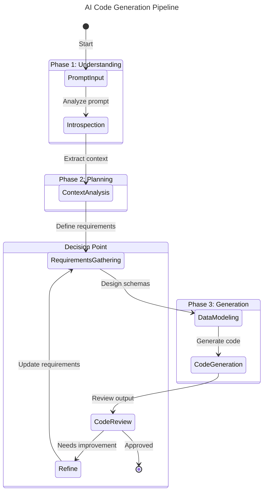

# Pydantic-Graph with Pydantic-AI: Complete Workflow Guide

📚 **See [Workflow Graph System](workflow-graph-system.md) for the current meta-framework architecture** 📚

## Table of Contents
1. [Introduction](#introduction)
2. [Core Concepts](#core-concepts)
3. [Workflow Architecture](#workflow-architecture)
4. [Implementation Example: AI Code Generation Pipeline](#implementation-example-ai-code-generation-pipeline)
5. [Execution Patterns](#execution-patterns)
6. [State Persistence and Recovery](#state-persistence-and-recovery)
7. [Best Practices](#best-practices)
8. [Advanced Patterns](#advanced-patterns)

## Introduction

Pydantic-Graph is a powerful state machine library that integrates seamlessly with Pydantic-AI to create complex, type-safe workflows. This guide demonstrates how to build a sophisticated AI-powered code generation pipeline using graph-based architecture.

### When to Use Pydantic-Graph

Use graph-based workflows when you need:
- **Complex multi-step processes** with conditional branching
- **State persistence** across long-running operations
- **Human-in-the-loop** interactions
- **Visual documentation** of workflow logic
- **Coordinated multi-agent** systems

## Core Concepts

### 1. Nodes
Nodes represent discrete steps in your workflow. Each node:
- Inherits from `BaseNode[StateType, DepsType, ReturnType]`
- Implements an async `run()` method
- Returns the next node or `End` to terminate

### 2. State
State carries data between nodes throughout the workflow:
- Defined as a dataclass
- Passed via `GraphRunContext`
- Persisted across interruptions

### 3. Graph
The graph orchestrates node execution:
- Defines available nodes
- Manages state transitions
- Handles persistence

## Workflow Architecture

Here's our AI code generation pipeline architecture:



## Implementation Example: AI Code Generation Pipeline

Let's implement a complete code generation workflow that progresses through multiple AI-powered stages.

### Step 1: Define the State

```python
from __future__ import annotations
from dataclasses import dataclass, field
from typing import List, Dict, Optional, Any
from pydantic import BaseModel
from pydantic_ai.messages import ModelMessage
from pydantic_graph import BaseNode, End, Graph, GraphRunContext

@dataclass
class CodeGenState:
    """State container for the code generation workflow."""
    
    # Input
    original_prompt: str = ""
    
    # Analysis results
    introspection_result: Dict[str, Any] = field(default_factory=dict)
    context_analysis: Dict[str, Any] = field(default_factory=dict)
    requirements: List[str] = field(default_factory=list)
    
    # Data models
    input_schema: Optional[BaseModel] = None
    output_schema: Optional[BaseModel] = None
    data_flow: Dict[str, Any] = field(default_factory=dict)
    
    # Generated artifacts
    generated_code: str = ""
    review_feedback: List[str] = field(default_factory=list)
    iteration_count: int = 0
    max_iterations: int = 3
    
    # Agent message histories
    introspection_messages: List[ModelMessage] = field(default_factory=list)
    analysis_messages: List[ModelMessage] = field(default_factory=list)
    requirements_messages: List[ModelMessage] = field(default_factory=list)
    modeling_messages: List[ModelMessage] = field(default_factory=list)
    generation_messages: List[ModelMessage] = field(default_factory=list)
    review_messages: List[ModelMessage] = field(default_factory=list)
```

### Step 2: Create AI Agents

```python
from pydantic_ai import Agent
from pydantic import BaseModel, Field
from typing import List, Dict

# Define output schemas for structured responses
class IntrospectionOutput(BaseModel):
    """Output from prompt introspection."""
    intent: str = Field(description="The main intent of the prompt")
    domain: str = Field(description="Technical domain (web, data, ml, etc)")
    complexity: str = Field(description="simple, moderate, or complex")
    key_concepts: List[str] = Field(description="Key technical concepts identified")
    assumptions: List[str] = Field(description="Assumptions made about the request")

class ContextAnalysisOutput(BaseModel):
    """Output from context analysis."""
    technical_stack: List[str] = Field(description="Suggested technology stack")
    design_patterns: List[str] = Field(description="Applicable design patterns")
    constraints: List[str] = Field(description="Technical constraints identified")
    dependencies: List[str] = Field(description="External dependencies needed")

class RequirementsOutput(BaseModel):
    """Structured requirements specification."""
    functional_requirements: List[str]
    non_functional_requirements: List[str]
    acceptance_criteria: List[str]
    edge_cases: List[str]

class DataModelOutput(BaseModel):
    """Data model specifications."""
    input_fields: Dict[str, str] = Field(description="Input field names and types")
    output_fields: Dict[str, str] = Field(description="Output field names and types")
    transformations: List[str] = Field(description="Data transformations needed")
    validations: List[str] = Field(description="Validation rules")

class CodeReviewOutput(BaseModel):
    """Code review results."""
    approved: bool
    issues: List[str] = Field(default_factory=list)
    suggestions: List[str] = Field(default_factory=list)
    score: float = Field(ge=0, le=1)

# Initialize AI agents with specific roles
introspection_agent = Agent(
    'openai:gpt-4o',
    output_type=IntrospectionOutput,
    system_prompt="""You are a prompt analysis expert. Analyze user prompts to understand:
    - The core intent and purpose
    - Technical domain and complexity
    - Key concepts and requirements
    - Implicit assumptions that need validation"""
)

context_agent = Agent(
    'openai:gpt-4o',
    output_type=ContextAnalysisOutput,
    system_prompt="""You are a software architect. Based on the introspection results:
    - Recommend appropriate technology stack
    - Identify relevant design patterns
    - List technical constraints
    - Determine necessary dependencies"""
)

requirements_agent = Agent(
    'openai:gpt-4o',
    output_type=RequirementsOutput,
    system_prompt="""You are a requirements analyst. Create detailed specifications including:
    - Functional requirements (what the system must do)
    - Non-functional requirements (performance, security, etc)
    - Clear acceptance criteria
    - Edge cases to handle"""
)

modeling_agent = Agent(
    'openai:gpt-4o',
    output_type=DataModelOutput,
    system_prompt="""You are a data modeling expert. Design the data flow:
    - Define input data structures
    - Define output data structures
    - Specify transformations
    - List validation rules"""
)

generation_agent = Agent(
    'openai:gpt-4o',
    output_type=str,
    system_prompt="""You are an expert programmer. Generate production-ready code that:
    - Implements all requirements
    - Follows best practices
    - Includes error handling
    - Has comprehensive comments
    - Uses type hints throughout"""
)

review_agent = Agent(
    'openai:gpt-4o',
    output_type=CodeReviewOutput,
    system_prompt="""You are a senior code reviewer. Review generated code for:
    - Correctness and completeness
    - Code quality and best practices
    - Security vulnerabilities
    - Performance considerations
    - Suggest improvements if needed"""
)
```

### Step 3: Implement Workflow Nodes

```python
from pydantic_graph import Edge
from typing import Annotated
import json

@dataclass
class PromptInput(BaseNode[CodeGenState]):
    """Initial node to capture and validate user prompt."""
    
    user_prompt: str
    
    async def run(self, ctx: GraphRunContext[CodeGenState]) -> Introspection:
        """Capture the initial prompt and prepare for analysis."""
        ctx.state.original_prompt = self.user_prompt
        print(f"📝 Received prompt: {self.user_prompt[:100]}...")
        return Introspection()

@dataclass
class Introspection(BaseNode[CodeGenState]):
    """Analyze the prompt to understand intent and context."""
    
    async def run(
        self, ctx: GraphRunContext[CodeGenState]
    ) -> Annotated[ContextAnalysis, Edge(label="Extract context")]:
        """Perform deep introspection of the user prompt."""
        
        print("🔍 Performing prompt introspection...")
        
        result = await introspection_agent.run(
            f"Analyze this prompt:\n{ctx.state.original_prompt}",
            message_history=ctx.state.introspection_messages
        )
        
        ctx.state.introspection_messages += result.new_messages()
        ctx.state.introspection_result = result.output.model_dump()
        
        print(f"  Intent: {result.output.intent}")
        print(f"  Domain: {result.output.domain}")
        print(f"  Complexity: {result.output.complexity}")
        
        return ContextAnalysis()

@dataclass
class ContextAnalysis(BaseNode[CodeGenState]):
    """Analyze technical context and architecture needs."""
    
    async def run(
        self, ctx: GraphRunContext[CodeGenState]
    ) -> RequirementsGathering:
        """Determine technical context and architecture."""
        
        print("🏗️ Analyzing technical context...")
        
        prompt = f"""
        Based on this introspection:
        {json.dumps(ctx.state.introspection_result, indent=2)}
        
        Original prompt: {ctx.state.original_prompt}
        
        Determine the technical architecture needed.
        """
        
        result = await context_agent.run(
            prompt,
            message_history=ctx.state.analysis_messages
        )
        
        ctx.state.analysis_messages += result.new_messages()
        ctx.state.context_analysis = result.output.model_dump()
        
        print(f"  Stack: {', '.join(result.output.technical_stack[:3])}")
        print(f"  Patterns: {', '.join(result.output.design_patterns[:2])}")
        
        return RequirementsGathering()

@dataclass
class RequirementsGathering(BaseNode[CodeGenState]):
    """Gather and structure detailed requirements."""
    
    additional_context: str = ""
    
    async def run(
        self, ctx: GraphRunContext[CodeGenState]
    ) -> DataModeling:
        """Define comprehensive requirements."""
        
        print("📋 Gathering requirements...")
        
        prompt = f"""
        Based on:
        - Original prompt: {ctx.state.original_prompt}
        - Introspection: {json.dumps(ctx.state.introspection_result, indent=2)}
        - Context: {json.dumps(ctx.state.context_analysis, indent=2)}
        {f"- Additional context: {self.additional_context}" if self.additional_context else ""}
        
        Create detailed requirements specification.
        """
        
        result = await requirements_agent.run(
            prompt,
            message_history=ctx.state.requirements_messages
        )
        
        ctx.state.requirements_messages += result.new_messages()
        ctx.state.requirements = (
            result.output.functional_requirements +
            result.output.non_functional_requirements
        )
        
        print(f"  Functional: {len(result.output.functional_requirements)} requirements")
        print(f"  Non-functional: {len(result.output.non_functional_requirements)} requirements")
        print(f"  Acceptance criteria: {len(result.output.acceptance_criteria)} items")
        
        return DataModeling()

@dataclass
class DataModeling(BaseNode[CodeGenState]):
    """Design input/output data models and transformations."""
    
    async def run(
        self, ctx: GraphRunContext[CodeGenState]
    ) -> CodeGeneration:
        """Create data model specifications."""
        
        print("📊 Designing data models...")
        
        prompt = f"""
        Design data models for:
        - Original request: {ctx.state.original_prompt}
        - Requirements: {json.dumps(ctx.state.requirements, indent=2)}
        - Technical context: {json.dumps(ctx.state.context_analysis, indent=2)}
        
        Define input/output schemas and transformations.
        """
        
        result = await modeling_agent.run(
            prompt,
            message_history=ctx.state.modeling_messages
        )
        
        ctx.state.modeling_messages += result.new_messages()
        ctx.state.data_flow = result.output.model_dump()
        
        # Create actual Pydantic models from specifications
        input_fields = result.output.input_fields
        output_fields = result.output.output_fields
        
        print(f"  Input fields: {len(input_fields)}")
        print(f"  Output fields: {len(output_fields)}")
        print(f"  Transformations: {len(result.output.transformations)}")
        
        return CodeGeneration()

@dataclass
class CodeGeneration(BaseNode[CodeGenState]):
    """Generate the actual code based on all gathered information."""
    
    async def run(
        self, ctx: GraphRunContext[CodeGenState]
    ) -> CodeReview:
        """Generate production-ready code."""
        
        print("💻 Generating code...")
        
        prompt = f"""
        Generate production-ready Python code for:
        
        **Original Request**: {ctx.state.original_prompt}
        
        **Requirements**:
        {json.dumps(ctx.state.requirements, indent=2)}
        
        **Data Models**:
        {json.dumps(ctx.state.data_flow, indent=2)}
        
        **Technical Context**:
        {json.dumps(ctx.state.context_analysis, indent=2)}
        
        Include:
        - Complete implementation
        - Error handling
        - Type hints
        - Docstrings
        - Example usage
        """
        
        result = await generation_agent.run(
            prompt,
            message_history=ctx.state.generation_messages
        )
        
        ctx.state.generation_messages += result.new_messages()
        ctx.state.generated_code = result.output
        
        # Display preview
        lines = result.output.split('\n')
        print(f"  Generated {len(lines)} lines of code")
        print(f"  Preview: {lines[0][:80]}..." if lines else "  No code generated")
        
        return CodeReview()

@dataclass
class CodeReview(BaseNode[CodeGenState, None, str]):
    """Review the generated code for quality and completeness."""
    
    async def run(
        self, ctx: GraphRunContext[CodeGenState]
    ) -> Annotated[End[str], Edge(label="Approved")] | Refine:
        """Review generated code and decide on next steps."""
        
        print("🔍 Reviewing generated code...")
        
        prompt = f"""
        Review this generated code:
        
        ```python
        {ctx.state.generated_code}
        ```
        
        Against these requirements:
        {json.dumps(ctx.state.requirements, indent=2)}
        
        Check for correctness, completeness, and quality.
        """
        
        result = await review_agent.run(
            prompt,
            message_history=ctx.state.review_messages
        )
        
        ctx.state.review_messages += result.new_messages()
        review = result.output
        
        print(f"  Score: {review.score:.2f}/1.00")
        print(f"  Issues: {len(review.issues)}")
        print(f"  Approved: {'✅ Yes' if review.approved else '❌ No'}")
        
        if review.approved or ctx.state.iteration_count >= ctx.state.max_iterations:
            # Approved or max iterations reached
            return End(ctx.state.generated_code)
        else:
            # Need refinement
            ctx.state.review_feedback = review.issues + review.suggestions
            ctx.state.iteration_count += 1
            return Refine(feedback=review.issues, suggestions=review.suggestions)

@dataclass
class Refine(BaseNode[CodeGenState]):
    """Refine requirements based on review feedback."""
    
    feedback: List[str]
    suggestions: List[str]
    
    async def run(
        self, ctx: GraphRunContext[CodeGenState]
    ) -> RequirementsGathering:
        """Prepare refinement context for next iteration."""
        
        print(f"♻️ Refining (Iteration {ctx.state.iteration_count}/{ctx.state.max_iterations})...")
        
        refinement_context = f"""
        Previous review feedback:
        Issues: {json.dumps(self.feedback, indent=2)}
        Suggestions: {json.dumps(self.suggestions, indent=2)}
        
        Please address these concerns in the next iteration.
        """
        
        return RequirementsGathering(additional_context=refinement_context)
```

### Step 4: Create and Configure the Graph

```python
# Create the code generation workflow graph
code_gen_graph = Graph(
    nodes=(
        PromptInput,
        Introspection,
        ContextAnalysis,
        RequirementsGathering,
        DataModeling,
        CodeGeneration,
        CodeReview,
        Refine
    ),
    state_type=CodeGenState
)

# Visualize the workflow
def visualize_workflow():
    """Generate and display the workflow diagram."""
    mermaid_code = code_gen_graph.mermaid_code(
        start_node=PromptInput(user_prompt=""),
        direction='TB'
    )
    print(mermaid_code)
    
    # If in Jupyter notebook:
    # from IPython.display import Image, display
    # display(Image(code_gen_graph.mermaid_image(start_node=PromptInput(""))))
```

## Execution Patterns

### Pattern 1: Simple Execution

```python
async def generate_code_simple(prompt: str) -> str:
    """Simple execution - run to completion."""
    
    state = CodeGenState()
    result = await code_gen_graph.run(
        PromptInput(user_prompt=prompt),
        state=state
    )
    
    return result.output
```

### Pattern 2: Monitored Execution

```python
async def generate_code_monitored(prompt: str) -> str:
    """Monitor each step of the workflow."""
    
    state = CodeGenState()
    nodes_executed = []
    
    async with code_gen_graph.iter(
        PromptInput(user_prompt=prompt),
        state=state
    ) as run:
        async for node in run:
            nodes_executed.append(type(node).__name__)
            print(f"✓ Completed: {type(node).__name__}")
            
            # Optional: Add custom logic between nodes
            if isinstance(node, RequirementsGathering):
                print("  [Monitor] Requirements phase reached")
    
    print(f"\nWorkflow path: {' → '.join(nodes_executed)}")
    return run.result.output if run.result else ""
```

### Pattern 3: Interactive Execution

```python
async def generate_code_interactive(prompt: str) -> str:
    """Allow user interaction at key points."""
    
    state = CodeGenState()
    
    async with code_gen_graph.iter(
        PromptInput(user_prompt=prompt),
        state=state
    ) as run:
        
        node = run.next_node
        while not isinstance(node, End):
            print(f"\n▶️ Executing: {type(node).__name__}")
            
            # Pause before requirements for user confirmation
            if isinstance(node, RequirementsGathering):
                user_input = input("Press Enter to continue with requirements gathering...")
                if user_input.lower() == 'modify':
                    # Allow user to modify context
                    additional = input("Additional context: ")
                    node.additional_context = additional
            
            # Execute the node
            node = await run.next(node)
            
            # Show state after certain nodes
            if isinstance(node, DataModeling):
                print("\n📌 Current Requirements:")
                for req in state.requirements[:3]:
                    print(f"  - {req}")
    
    return run.result.output if run.result else ""
```

## State Persistence and Recovery

### Save and Resume Workflow

```python
from pathlib import Path
from pydantic_graph.persistence.file import FileStatePersistence

async def generate_code_with_persistence(prompt: str, session_id: str) -> str:
    """Execute with ability to pause and resume."""
    
    persistence_file = Path(f'workflows/{session_id}.json')
    persistence = FileStatePersistence(persistence_file)
    persistence.set_graph_types(code_gen_graph)
    
    # Check if resuming existing session
    if snapshot := await persistence.load_next():
        print(f"📂 Resuming session: {session_id}")
        state = snapshot.state
        node = snapshot.node
    else:
        print(f"🆕 Starting new session: {session_id}")
        state = CodeGenState()
        node = PromptInput(user_prompt=prompt)
        
        # Initialize the workflow
        await code_gen_graph.initialize(
            node,
            state=state,
            persistence=persistence
        )
    
    # Run with persistence
    async with code_gen_graph.iter_from_persistence(persistence) as run:
        while True:
            node = await run.next()
            
            if isinstance(node, End):
                print("✅ Workflow completed!")
                return node.data
            
            # Optional: Allow manual interruption
            if isinstance(node, CodeGeneration):
                if input("Continue to code review? (y/n): ").lower() == 'n':
                    print("⏸️ Workflow paused. Run again to resume.")
                    return None
```

### Distributed Execution

```python
async def execute_single_node(session_id: str) -> bool:
    """Execute just the next pending node - useful for distributed systems."""
    
    persistence_file = Path(f'workflows/{session_id}.json')
    persistence = FileStatePersistence(persistence_file)
    
    async with code_gen_graph.iter_from_persistence(persistence) as run:
        node = await run.next()
        
        print(f"Executed: {type(node).__name__}")
        return isinstance(node, End)

# Can be called from different workers/processes
async def distributed_execution(session_id: str):
    """Execute workflow across multiple workers."""
    while not await execute_single_node(session_id):
        await asyncio.sleep(0.1)  # Small delay between nodes
```

## Best Practices

### 1. State Design

```python
@dataclass
class WellDesignedState:
    """Example of well-structured state."""
    
    # Group related fields
    input_data: InputSection = field(default_factory=InputSection)
    processing_results: ProcessingSection = field(default_factory=ProcessingSection)
    output_data: OutputSection = field(default_factory=OutputSection)
    
    # Separate message histories by agent
    agent_messages: Dict[str, List[ModelMessage]] = field(default_factory=dict)
    
    # Include metadata
    metadata: WorkflowMetadata = field(default_factory=WorkflowMetadata)
    
    def get_agent_messages(self, agent_name: str) -> List[ModelMessage]:
        """Helper method for accessing agent messages."""
        return self.agent_messages.setdefault(agent_name, [])
```

### 2. Error Handling

```python
@dataclass
class RobustNode(BaseNode[CodeGenState]):
    """Example node with comprehensive error handling."""
    
    async def run(self, ctx: GraphRunContext[CodeGenState]) -> BaseNode | End:
        try:
            # Main logic
            result = await self.process(ctx)
            return self.next_node(result)
            
        except ValidationError as e:
            # Handle validation errors
            ctx.state.errors.append(f"Validation failed: {e}")
            return ErrorRecovery(error=str(e))
            
        except Exception as e:
            # Log unexpected errors
            print(f"❌ Unexpected error in {self.__class__.__name__}: {e}")
            
            # Decide whether to retry or fail
            if ctx.state.retry_count < 3:
                ctx.state.retry_count += 1
                return RetryNode(previous_node=self.__class__.__name__)
            else:
                return End(f"Workflow failed: {e}")
```

### 3. Testing Workflows

```python
import pytest
from unittest.mock import AsyncMock, patch

@pytest.mark.asyncio
async def test_code_generation_workflow():
    """Test the complete workflow with mocked agents."""
    
    # Mock agent responses
    with patch.object(introspection_agent, 'run', new_callable=AsyncMock) as mock_intro:
        mock_intro.return_value.output = IntrospectionOutput(
            intent="Create API",
            domain="web",
            complexity="moderate",
            key_concepts=["REST", "FastAPI"],
            assumptions=[]
        )
        mock_intro.return_value.new_messages.return_value = []
        
        # Run workflow
        state = CodeGenState()
        result = await code_gen_graph.run(
            PromptInput(user_prompt="Create a REST API"),
            state=state
        )
        
        # Assertions
        assert state.introspection_result["intent"] == "Create API"
        assert mock_intro.called

@pytest.mark.asyncio
async def test_node_transition():
    """Test specific node transitions."""
    
    state = CodeGenState()
    state.original_prompt = "Test prompt"
    
    # Test introspection node
    node = Introspection()
    ctx = GraphRunContext(state=state, deps=None)
    
    with patch.object(introspection_agent, 'run', new_callable=AsyncMock) as mock:
        mock.return_value.output = IntrospectionOutput(...)
        next_node = await node.run(ctx)
        
        assert isinstance(next_node, ContextAnalysis)
```

## Advanced Patterns

### 1. Subgraphs for Reusable Components

```python
# Define a reusable validation subgraph
validation_subgraph = Graph(
    nodes=[ValidateInput, ValidateRequirements, ValidateOutput],
    state_type=ValidationState
)

@dataclass
class ValidationPhase(BaseNode[CodeGenState]):
    """Node that runs a validation subgraph."""
    
    async def run(self, ctx: GraphRunContext[CodeGenState]) -> BaseNode:
        # Convert state for subgraph
        validation_state = ValidationState.from_code_gen_state(ctx.state)
        
        # Run subgraph
        result = await validation_subgraph.run(
            ValidateInput(),
            state=validation_state
        )
        
        # Merge results back
        ctx.state.validation_results = result.output
        
        return NextNode()
```

### 2. Dynamic Node Selection

```python
@dataclass
class DynamicRouter(BaseNode[CodeGenState]):
    """Dynamically route to different nodes based on state."""
    
    async def run(self, ctx: GraphRunContext[CodeGenState]) -> BaseNode:
        complexity = ctx.state.introspection_result.get("complexity", "simple")
        
        # Route based on complexity
        if complexity == "simple":
            return SimpleGeneration()
        elif complexity == "moderate":
            return StandardGeneration()
        else:
            return ComplexGeneration()
```

### 3. Parallel Processing

```python
@dataclass
class ParallelAnalysis(BaseNode[CodeGenState]):
    """Run multiple analyses in parallel."""
    
    async def run(self, ctx: GraphRunContext[CodeGenState]) -> BaseNode:
        # Run multiple agents concurrently
        results = await asyncio.gather(
            security_agent.run(ctx.state.original_prompt),
            performance_agent.run(ctx.state.original_prompt),
            scalability_agent.run(ctx.state.original_prompt)
        )
        
        # Merge results
        ctx.state.security_analysis = results[0].output
        ctx.state.performance_analysis = results[1].output
        ctx.state.scalability_analysis = results[2].output
        
        return NextNode()
```

### 4. Human-in-the-Loop Patterns

```python
@dataclass
class HumanReview(BaseNode[CodeGenState]):
    """Pause for human review and input."""
    
    async def run(self, ctx: GraphRunContext[CodeGenState]) -> BaseNode | End:
        print("\n🤔 Human Review Required")
        print("-" * 50)
        print(f"Generated Code Preview:")
        print(ctx.state.generated_code[:500])
        print("-" * 50)
        
        # In a web application, this would save state and wait for user response
        decision = input("Approve? (yes/no/modify): ").lower()
        
        if decision == "yes":
            return End(ctx.state.generated_code)
        elif decision == "modify":
            modifications = input("Enter modifications: ")
            ctx.state.user_modifications = modifications
            return IncorporateModifications()
        else:
            feedback = input("Enter feedback: ")
            return Refine(feedback=[feedback], suggestions=[])
```

## Complete Example Usage

```python
async def main():
    """Complete example of using the code generation workflow."""
    
    # Example prompt
    prompt = """
    Create a FastAPI application for a todo list with:
    - CRUD operations for todo items
    - User authentication
    - SQLAlchemy for database
    - Pydantic models for validation
    - Proper error handling
    """
    
    print("🚀 Starting AI Code Generation Workflow")
    print("=" * 60)
    
    # Method 1: Simple execution
    code = await generate_code_simple(prompt)
    
    # Method 2: With monitoring
    # code = await generate_code_monitored(prompt)
    
    # Method 3: With persistence (can be interrupted)
    # code = await generate_code_with_persistence(prompt, "session_001")
    
    # Method 4: Interactive mode
    # code = await generate_code_interactive(prompt)
    
    if code:
        print("\n📄 Generated Code:")
        print("=" * 60)
        print(code)
        
        # Save to file
        output_file = Path("generated_code.py")
        output_file.write_text(code)
        print(f"\n💾 Code saved to: {output_file}")
    else:
        print("\n⚠️ Code generation incomplete or interrupted")

if __name__ == "__main__":
    import asyncio
    asyncio.run(main())
```

## Workflow Visualization

The complete workflow can be visualized using the built-in Mermaid support:

```python
# Generate Mermaid diagram
mermaid_code = code_gen_graph.mermaid_code(
    start_node=PromptInput(user_prompt=""),
    direction='TB'
)

# The generated diagram will show:
# - All nodes and their connections
# - Edge labels for annotated transitions  
# - Clear start and end points
# - Decision branches (Review → Refine loop)
```

## Summary

This comprehensive guide demonstrates how to build sophisticated AI-powered workflows using Pydantic-Graph with Pydantic-AI. Key takeaways:

1. **Graph-based architecture** provides clear structure for complex multi-step processes
2. **Type safety** ensures reliable state management across nodes
3. **Persistence support** enables long-running and interruptible workflows
4. **AI agent integration** allows each node to leverage specialized AI capabilities
5. **Visual debugging** through automatic Mermaid diagram generation
6. **Flexible execution patterns** support various use cases from simple to interactive

The code generation pipeline example shows how to combine multiple AI agents in a coordinated workflow, with proper error handling, state management, and the ability to refine outputs through iteration.

This pattern can be adapted for many complex AI workflows including:
- Document processing pipelines
- Multi-stage data analysis
- Automated testing and validation
- Content generation and review
- Decision support systems