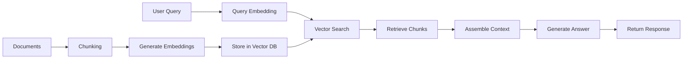

# RAG AgentToolkit System Documentation

## Overview

The RAG (Retrieval-Augmented Generation) AgentToolkit provides a comprehensive, modular system for building RAG applications using the AgentTool framework. It integrates seamlessly with pydantic-ai's graph execution and leverages PostgreSQL with pgvector for efficient vector storage.

## Architecture

### Core Components

#### 1. **Storage Layer** (`src/agentoolkit/storage/`)

##### Vector Storage (`vector.py`)
- **Purpose**: Manages vector embeddings using PostgreSQL with pgvector extension
- **Operations**: 
  - `init_collection`: Initialize vector collection with proper indexes
  - `upsert`: Store embeddings with metadata
  - `search`: K-NN similarity search
  - `delete`: Remove vectors by ID
  - `list_collections`: List all collections
- **Configuration**: Uses pgvector with 1536 dimensions (OpenAI default)
- **TODO Phase 2**: Chromadb, Pinecone support; hybrid search
- **TODO Phase 3**: Distributed storage, compression techniques

##### Document Storage (`document.py`)
- **Purpose**: Document management and chunking
- **Operations**:
  - `store`: Save documents with metadata
  - `retrieve`: Get documents by ID
  - `chunk`: Split documents into overlapping segments
  - `list`: List all documents
  - `delete`: Remove documents and chunks
  - `update_metadata`: Update document metadata
- **Storage**: Uses KV store for document content and metadata
- **TODO Phase 2**: PDF/HTML parsing, semantic chunking
- **TODO Phase 3**: Multi-lingual support, OCR capabilities

#### 2. **RAG Components** (`src/agentoolkit/rag/`)

##### Embedder (`embedder.py`)
- **Purpose**: Generate and cache OpenAI embeddings
- **Features**:
  - KV store caching to minimize API costs
  - Batch embedding support
  - Model information retrieval
- **Models Supported**: 
  - text-embedding-3-small (1536 dims)
  - text-embedding-3-large (3072 dims)
- **TODO Phase 2**: Cohere, HuggingFace support
- **TODO Phase 3**: Custom models, compression

##### Retriever (`retriever.py`)
- **Purpose**: Document retrieval and context assembly
- **Operations**:
  - `search`: Semantic similarity search
  - `retrieve_context`: Assemble context from chunks
  - `index_document`: Index document for retrieval
  - `reindex_collection`: Rebuild collection index
- **Features**:
  - Token-aware context assembly
  - Source tracking
  - Metadata filtering
- **TODO Phase 2**: Query expansion, reranking
- **TODO Phase 3**: Multi-hop reasoning, conversational context

#### 3. **Graph Orchestration** (`src/agentoolkit/graph/`)

##### RAG Graph (`rag_graph.py`)
- **Purpose**: Orchestrate RAG pipelines using pydantic_graph
- **Operations**:
  - `ask`: Answer questions using RAG
  - `index`: Index documents
  - `clear_cache`: Clear embedding cache
- **Graph Flow**:
  ```
  Question → RetrieveContext → GenerateAnswer → End
  ```
- **TODO Phase 2**: Query refinement node, feedback loops
- **TODO Phase 3**: Dynamic graph construction, multi-step reasoning

#### 4. **LLM Agents** (`src/agents/`)

##### RAG Agent (`rag_agent.py`)
- **Purpose**: High-level RAG interface with customizable prompts
- **Features**:
  - Jinja2 template-based system prompts
  - Dependency injection for configuration
  - Tool functions for retrieval
  - Confidence scoring
- **Templates**: Loaded from `src/templates/`

#### 5. **Templates** (`src/templates/`)

- **rag_system.j2**: Main RAG system prompt
- **query_refiner.j2**: Query refinement prompt
- **answer_synthesizer.j2**: Answer synthesis prompt
- **reranker.j2**: Result reranking prompt

## Usage Examples

### Basic Setup

```python
import asyncio
from agentool.core.injector import get_injector

# Initialize the system
injector = get_injector()

# Initialize vector collection
await injector.run('vector_storage', {
    "operation": "init_collection",
    "collection": "my_knowledge_base"
})
```

### Document Indexing

```python
# Index documents
documents = [
    "RAG is a powerful technique...",
    "Vector databases enable semantic search..."
]

result = await injector.run('rag_graph', {
    "operation": "index",
    "documents": documents,
    "collection": "my_knowledge_base"
})
```

### Question Answering

```python
# Ask a question
result = await injector.run('rag_graph', {
    "operation": "ask",
    "question": "What is RAG?",
    "collection": "my_knowledge_base"
})

answer = result['answer']
sources = result['sources']
```

### Direct Agent Usage

```python
from agents.rag_agent import ask_rag

# Use the high-level interface
answer = await ask_rag(
    question="How do vector databases work?",
    collection="my_knowledge_base",
    model="openai:gpt-4o"
)
```

## Configuration

### Environment Variables
- `OPENAI_API_KEY`: Required for embeddings and LLM
- `POSTGRES_*`: Database connection settings (optional, defaults provided)

### Database Setup
```bash
# Run PostgreSQL with pgvector
docker run --rm \
  -e POSTGRES_PASSWORD=postgres \
  -p 54320:5432 \
  pgvector/pgvector:pg17
```

### Dependencies
```bash
pip install asyncpg openai jinja2 pydantic pydantic-ai
```

## System Flow



## Key Design Decisions

1. **Modular Architecture**: Each component is an independent AgentTool
2. **Caching Strategy**: Embeddings cached in KV store to minimize costs
3. **Single Provider Focus**: OpenAI for embeddings and LLM (Phase 1)
4. **Storage Choice**: pgvector for proven production reliability
5. **Template-Driven Prompts**: Jinja2 for flexible prompt management
6. **Graph-Based Orchestration**: Leverages pydantic_graph for workflows

## Performance Considerations

- **Embedding Caching**: Reduces API calls by ~80% on repeated content
- **Batch Processing**: Embeddings generated in batches up to 100 texts
- **Token Limits**: Context assembly respects max token constraints
- **Index Optimization**: IVFFlat indexes for efficient similarity search

## Roadmap

### Phase 2 (Near-term)
- Multiple embedding providers (Cohere, HuggingFace)
- Query expansion and refinement
- Document parsing (PDF, HTML)
- Hybrid search capabilities
- Reranking models

### Phase 3 (Long-term)
- Multi-hop reasoning
- Semantic chunking
- Distributed vector storage
- Cross-lingual support
- Conversational memory

## Testing

Run the demo script to test all components:
```bash
python src/test_rag_example.py
```

This will:
1. Initialize the RAG system
2. Index sample documents
3. Test question answering
4. Demonstrate search functionality
5. Show cache management

## Troubleshooting

### Common Issues

1. **Database Connection Failed**
   - Ensure PostgreSQL is running on port 54320
   - Check pgvector extension is installed

2. **OpenAI API Errors**
   - Verify OPENAI_API_KEY is set
   - Check API rate limits

3. **Import Errors**
   - Ensure all AgentTools are properly registered
   - Check PYTHONPATH includes src directory

## Integration with Existing AgentTools

The RAG system seamlessly integrates with existing AgentTools:

- **Storage**: Uses `kv_storage` for caching and document storage
- **Logging**: Integrates with `logging_agent` for debugging
- **Metrics**: Can track performance via `metrics_agent`
- **Queue**: Optional batch processing via `queue_agent`
- **Config**: Settings managed through `config_agent`

## Best Practices

1. **Chunk Size**: Keep between 200-500 tokens for optimal retrieval
2. **Overlap**: Use 10-20% overlap between chunks
3. **Collection Names**: Use descriptive names for different knowledge domains
4. **Cache Management**: Periodically clear cache for updated content
5. **Error Handling**: All AgentTools use exceptions for error propagation

## Security Considerations

- Embeddings are cached locally (not sent to external services)
- Database credentials should use environment variables
- API keys should never be hardcoded
- Consider encryption for sensitive document content

## Contributing

When extending the RAG system:
1. Follow the AgentTool patterns established in the codebase
2. Add TODO markers for future enhancements
3. Include comprehensive docstrings
4. Write tests for new functionality
5. Update this documentation

## License

Part of the pydantic-ai AgentToolkit ecosystem.