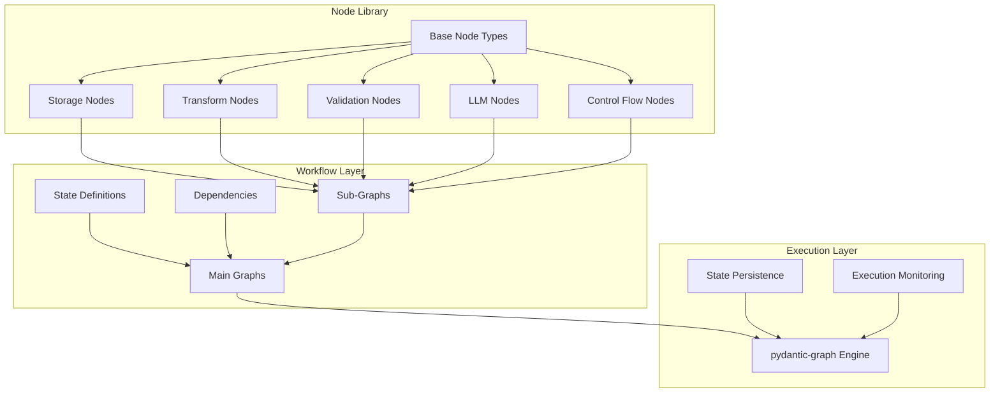

# Workflow Graph System

## Overview

The Workflow Graph System is a modular, composable architecture for building complex AI-powered code generation workflows using pydantic-graph as the execution engine. It replaces monolithic workflow agents with atomic, reusable nodes that can be composed into directed acyclic graphs (DAGs) for parallel execution, conditional flows, and iterative refinement.

## References

- [Workflow Graph System (this doc)](workflow-graph-system.md)
- [Graph Architecture](GRAPH_ARCHITECTURE.md)
- [Data Flow Requirements](DATA_FLOW_REQUIREMENTS.md)
- [Node Catalog](NODE_CATALOG.md)
- [Graph Type Definitions](GRAPH_TYPE_DEFINITIONS.md)

Make sure you have read and understand all the above before proceeding.

## Horizontal Quick Flow

```
Input → [Analysis Graph] → [Specification Graph] → [Crafting Graph] → [Evaluation Graph] → Output
                ↓                    ↓                    ↓                    ↓
            State Store         State Store         State Store         State Store
                                                                              ↑ ↓
                                                                      [Refinement Loop]
```

## Motivation and Purpose

### Current Limitations
- **Monolithic Design**: Each workflow phase is a standalone AgenTool with 500+ lines of duplicated code
- **Sequential Execution**: Tools are processed one-by-one even when they could run in parallel
- **No Reusability**: Common operations (storage, validation, LLM calls) are reimplemented in each workflow
- **Limited Iteration**: No built-in support for refinement loops or quality gates
- **Poor Composability**: Workflows cannot be easily combined or extended

### Vision
Transform the workflow system into a **graph-based architecture** where:
- Each operation is an atomic, testable node
- Nodes compose into sub-graphs and full workflows
- Parallel execution is native and automatic
- Iteration and refinement are first-class citizens
- State management is type-safe and persistent

## Design & Architecture

### Core Principles

1. **Single Responsibility**: Each node performs exactly one operation
2. **Type Safety**: Full generic typing with `BaseNode[StateT, DepsT, OutputT]`
3. **Immutable State**: Nodes receive state, produce new state (functional approach)
4. **Dependency Injection**: Configuration and services via `GraphDeps`
5. **Composability**: Small nodes combine into larger workflows

### Pattern & Style

#### Node Definition Pattern
```python
@dataclass
class SomeOperationNode(BaseNode[StateT, DepsT, OutputT]):
    """Single-purpose node description."""
    config_param: str  # Node-specific configuration
    
    async def run(
        self, 
        ctx: GraphRunContext[StateT, DepsT]
    ) -> NextNode | End[OutputT]:
        # Access state: ctx.state
        # Access deps: ctx.deps
        # Perform operation
        ...
        # Return next node or end
        return NextNode(...)
```

#### State Management Pattern
```python
@dataclass
class WorkflowState:
    """Immutable state passed between nodes."""
    # Data references (not actual data)
    catalog_ref: str
    specs_ref: List[str]
    code_refs: Dict[str, str]
    ...
```

#### Dependency Injection Pattern
```python
@dataclass
class WorkflowDeps:
    """Services and configuration."""
    models: ModelConfig
    storage: StorageConfig
    process_executor: ProcessPoolExecutor
    thread_executor: ThreadPoolExecutor
    ...
```

## System Architecture Diagrams

### High-Level Component Architecture



### Data Flow Through Workflow Phases

```mermaid
graph LR
    subgraph "Analysis Phase"
        A1[Load Catalog] --> A2[Analyze Requirements]
        A2 --> A3[Identify Gaps]
        A3 --> A4[Store Analysis]
    end
    
    subgraph "Specification Phase"
        S1[Load Analysis] --> S2[Generate Specs]
        S2 --> S3[Validate Specs]
        S3 --> S4[Store Specs]
    end
    
    subgraph "Crafting Phase"
        C1[Load Specs] --> C2[Generate Code]
        C2 --> C3[Format Code]
        C3 --> C4[Store Code]
    end
    
    subgraph "Evaluation Phase"
        E1[Load Code] --> E2[Validate Syntax]
        E2 --> E3[Check Quality]
        E3 --> E4{Pass?}
        E4 -->|Yes| E5[Store Final]
        E4 -->|No| E6[Refine]
        E6 --> E2
    end
    
    A4 --> S1
    S4 --> C1
    C4 --> E1
```



## Major Vertical Segregations

### 1. Node Types Enumeration

#### Base Node Categories
- **StorageNode**: Operations on storage_kv and storage_fs
- **TransformNode**: Data transformation and formatting
- **ValidationNode**: Syntax, schema, and quality validation
- **LLMNode**: LLM interactions and prompt management
- **ControlNode**: Flow control, parallelism, conditionals

#### Storage Nodes
- `LoadKVNode`: Load data from storage_kv
- `SaveKVNode`: Save data to storage_kv
- `LoadFSNode`: Load files from storage_fs
- `SaveFSNode`: Save files to storage_fs
- `BatchLoadNode`: Parallel loading of multiple items
- `BatchSaveNode`: Parallel saving of multiple items

#### Transform Nodes
- `JSONParseNode`: Parse JSON strings to objects
- `JSONSerializeNode`: Serialize objects to JSON
- `TemplateRenderNode`: Render Jinja templates
- `CodeFormatNode`: Format Python code
- `DataMergeNode`: Merge multiple data sources
- `DataFilterNode`: Filter collections based on criteria

#### Validation Nodes
- `SyntaxValidationNode`: Python syntax checking via AST
- `ImportValidationNode`: Verify import availability
- `SchemaValidationNode`: Pydantic schema validation
- `QualityGateNode`: Threshold-based quality checks
- `DependencyCheckNode`: Verify required dependencies

#### LLM Nodes
- `PromptBuilderNode`: Construct prompts from templates and data
- `LLMCallNode`: Execute LLM API calls
- `ResponseParserNode`: Parse structured LLM responses
- `RefinementNode`: Iterative improvement with feedback
- `BatchLLMNode`: Parallel LLM calls for multiple items

#### Control Flow Nodes
- `ConditionalNode`: Branch based on state conditions
- `ParallelMapNode`: Map operation over collection in parallel
- `SequentialMapNode`: Map operation over collection sequentially
- `AggregatorNode`: Combine results from parallel operations
- `RetryNode`: Retry failed operations with backoff
- `LoopNode`: Iterate until condition met

### 2. State Requirements by Phase

#### Analysis Phase Data Requirements
```
Input:
  - task_description: str
  - workflow_id: str
  
Required State:
  - catalog_ref: str (→ storage_kv:catalog)
  
Output State:
  - analysis_ref: str (→ storage_kv:workflow/{id}/analysis)
  - missing_tools: List[str]
  - existing_tools: List[str]
```

#### Specification Phase Data Requirements
```
Input State:
  - analysis_ref: str
  - missing_tools: List[str]
  
Required Data:
  - Analysis results from storage_kv
  - Template refs from storage_fs
  
Output State:
  - specs_refs: List[str] (→ storage_kv:workflow/{id}/specs/*)
  - tool_specs: List[ToolSpec]
```

#### Crafting Phase Data Requirements
```
Input State:
  - specs_refs: List[str]
  - tool_specs: List[ToolSpec]
  
Required Data:
  - Specifications from storage_kv
  - Code templates from storage_fs
  
Output State:
  - code_refs: Dict[str, str] (→ storage_fs:generated/{id}/*.py)
  - implementation_refs: List[str] (→ storage_kv:workflow/{id}/implementations/*)
```

#### Evaluation Phase Data Requirements
```
Input State:
  - code_refs: Dict[str, str]
  - specs_refs: List[str]
  
Required Data:
  - Generated code from storage_fs
  - Specifications from storage_kv
  - Quality thresholds from deps
  
Output State:
  - validation_results: Dict[str, QualityMetrics]  # Quality metrics per tool
  - quality_scores: Dict[str, float]
  - final_code_refs: Dict[str, str] (→ storage_fs:generated/{id}/final/*.py)
  - needs_refinement: List[str]
```

### 3. Graph Composition Patterns

#### Sequential Composition
```python
sequential_graph = Graph(
    nodes=[NodeA, NodeB, NodeC],
    ...
)
```

#### Parallel Composition
```python
@dataclass
class ParallelExecutor(BaseNode[...]):
    async def run(self, ctx):
        # Launch parallel nodes
        return ParallelMapNode(
            items_key="tools_to_process",
            sub_graph=processing_graph
        )
```

#### Conditional Composition
```python
@dataclass
class QualityCheck(BaseNode[...]):
    async def run(self, ctx):
        if ctx.state.quality_score >= ctx.deps.threshold:
            return ApprovalNode(...)
        else:
            return RefinementNode(...)
```

#### Loop Composition
```python
@dataclass
class RefinementLoop(BaseNode[...]):
    async def run(self, ctx):
        if ctx.state.iteration < ctx.deps.max_iterations:
            return ImproveNode(...)
        else:
            return End(ctx.state.best_result)
```

## Integration with pydantic_graph

### State Persistence
Per pydantic_graph documentation, state can be persisted and resumed:
```python
# Reference: pydantic_graph persistence pattern
from pydantic_graph import FileStatePersistence
persistence = FileStatePersistence(Path('workflow_state.json'))
async with graph.iter(StartNode(), state=state, persistence=persistence) as run:
    ...
```

### Dependency Injection
Following pydantic_graph's dependency pattern:
```python
# Reference: pydantic_graph GraphDeps pattern
from pydantic_graph import Graph
deps = WorkflowDeps(
    process_executor=ProcessPoolExecutor(),
    thread_executor=ThreadPoolExecutor(),
    models=ModelConfig(...)
)
result = await graph.run(StartNode(), deps=deps, state=state)
```

### Node Return Types
Based on pydantic_graph's type system:
- Return another node: `return NextNode(state=new_state, node=NextNodeClass())`
- End with result: `return End(output)`
- Conditional returns: `return NodeA() if condition else NodeB()`

## Execution Model

### Parallelism Strategy
1. **Automatic Detection**: Graph engine identifies independent nodes
2. **Explicit Parallel Nodes**: `ParallelMapNode` for collection processing
3. **Dependency-Based**: Nodes with no shared state dependencies run in parallel
4. **Resource Limits**: Controlled via `WorkflowDeps.executor` configuration

### Error Handling
1. **Node-Level**: Each node handles its own errors
2. **Retry Nodes**: Wrap failing operations with `RetryNode`
3. **Fallback Paths**: Conditional nodes route around failures
4. **State Recovery**: Persistence enables resumption after crashes

### Monitoring & Observability
1. **Node Execution Events**: Each node transition logged
2. **State Snapshots**: Periodic state persistence
3. **Performance Metrics**: Timing and resource usage per node
4. **Visualization**: Mermaid diagrams of execution paths

## Next Steps

This Phase 1 documentation establishes the technical architecture without implementation details. Phase 2 will add:
- Detailed type definitions with fields
- Inter-node data contracts
- State mutation specifications
- Dependency requirements per node

Phase 3 will add:
- Complete code examples
- Integration patterns
- Usage scenarios
- Migration guides