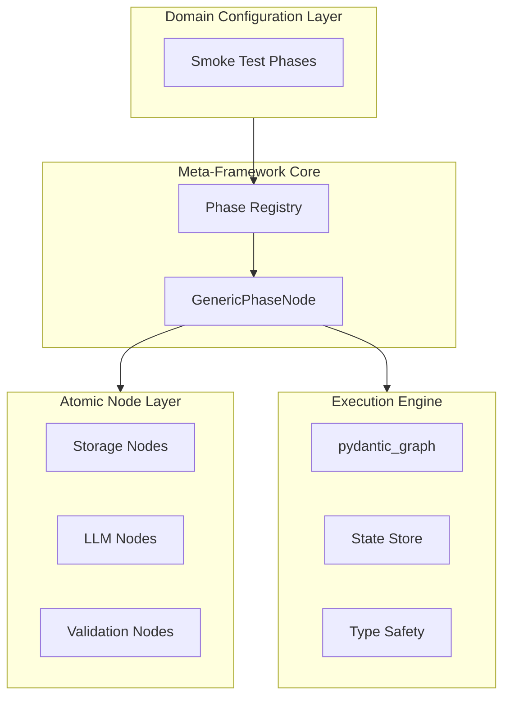
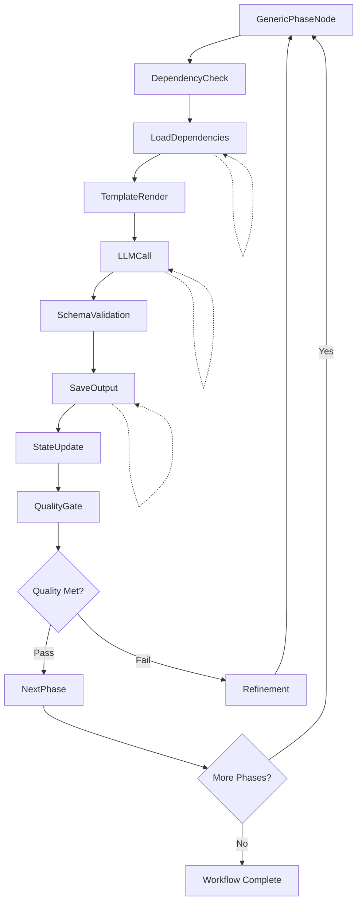
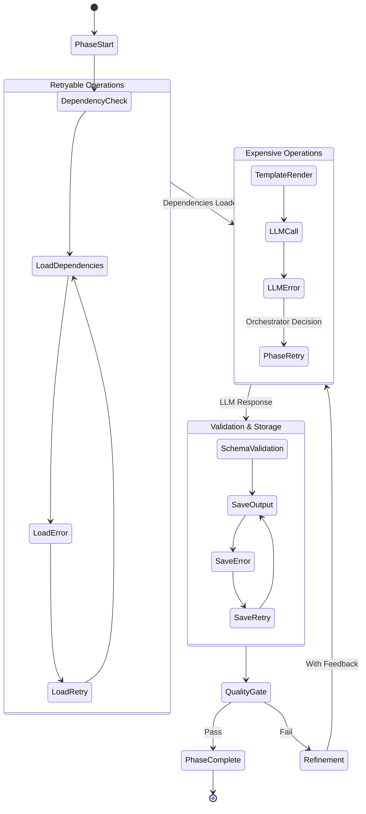

# Workflow Graph System - Meta-Framework Architecture

## Overview

The Workflow Graph System is a **state-driven meta-framework** for building domain-agnostic, AI-powered workflows using pydantic_graph as the execution engine. It provides a uniform plane where the entire workflow structure, behavior, and types are defined in state configuration, with nodes acting as simple executors that chain together based on state.

The system uses **atomic node chaining** where each phase consists of atomic nodes that return the next node in sequence. This ensures resilience (configurable retry per node type), efficiency (iteration without sub-graphs), and observability (fine-grained execution tracking).

**Universal Pattern**: `InputSchema → Variables → TemplateRender → LLM Call → OutputSchema → Storage`

**State-Driven Execution**: Workflow definition in state → Nodes read config → Return next node → Graph engine handles flow

## References

- [Workflow Graph System (this doc)](workflow-graph-system.md)
- [Graph Architecture](GRAPH_ARCHITECTURE.md)
- [Data Flow Requirements](DATA_FLOW_REQUIREMENTS.md)
- [Node Catalog](NODE_CATALOG.md)
- [Graph Type Definitions](GRAPH_TYPE_DEFINITIONS.md)
- [State Mutations](STATE_MUTATIONS.md)

Make sure you have read and understand all the above before proceeding.

## Universal Phase Flow Pattern

```
Input → [Phase 1: Domain Analysis] → [Phase 2: Specification] → [Phase 3: Generation] → [Phase 4: Validation] → Output
              ↓                            ↓                          ↓                        ↓
         GenericPhaseNode              GenericPhaseNode          GenericPhaseNode        GenericPhaseNode
              ↓                            ↓                          ↓                        ↓
         PhaseDefinition              PhaseDefinition            PhaseDefinition         PhaseDefinition
              ↓                            ↓                          ↓                        ↓
         State Store                  State Store                State Store             State Store
                                                                                              ↑ ↓
                                                                                      [Refinement Loop]
```

### Domain Example:
- **Smoke Workflow**: Ingredient Analyzer → Recipe Designer → Recipe Crafter → Recipe Evaluator

## Motivation and Purpose

### Current Limitations (Solved by Meta-Framework)
- **Monolithic Design**: ~~Each workflow phase is a standalone AgenTool with 500+ lines of duplicated code~~ → Single GenericPhaseNode handles all phases
- **Domain Lock-in**: ~~Workflows hardcoded for AgenTools only~~ → Domain-agnostic phase definitions
- **Template Duplication**: ~~Same LLM interaction pattern repeated~~ → Unified template rendering system
- **No Reusability**: ~~Common operations reimplemented~~ → Shared meta-framework for all domains
- **Static Workflows**: ~~Fixed phase sequences~~ → Dynamic graph construction from definitions

### Vision
Transform the workflow system into a **meta-framework architecture** where:
- Workflow phases are data (configurations), not code
- Any domain can define workflows through phase definitions
- Template + Schema = Complete phase behavior
- Dynamic graph construction from phase registry
- Universal type validation across all domains
- Parallel execution is native and automatic
- Iteration and refinement are first-class citizens

## Design & Architecture

### Core Principles

1. **Phase as Configuration**: Phases defined by data (PhaseDefinition), not code
2. **Universal Execution**: Single GenericPhaseNode executes any phase
3. **Type Safety**: Full validation via InputSchema/OutputSchema pairs
4. **Immutable State**: Nodes receive state, produce new state (functional approach)
5. **Template-Driven**: System/user prompts are external templates
6. **Domain Agnostic**: Same engine for any domain (currently implemented: smoke testing)
7. **Dependency Injection**: Configuration and services via `GraphDeps`

### Pattern & Style

#### State-Driven Workflow Pattern
```python
# See [Graph Type Definitions](GRAPH_TYPE_DEFINITIONS.md#state-based-configuration-types-canonical) for WorkflowDefinition
# This is the canonical type definition - we reference it here for consistency
# WorkflowDefinition contains: domain, phases, phase_sequence, node_configs
    
# See [Graph Type Definitions](GRAPH_TYPE_DEFINITIONS.md#phasedefinition-canonical) for PhaseDefinition
# This is the canonical type definition - we reference it here for consistency
# PhaseDefinition contains: phase_name, atomic_nodes, input_schema, output_schema, templates, quality_threshold

# See [Graph Type Definitions](GRAPH_TYPE_DEFINITIONS.md#nodeconfig) for NodeConfig
# This is the canonical type definition - we reference it here for consistency
# NodeConfig contains: node_type
    retryable: bool = False
    max_retries: int = 0
    retry_backoff: str = "exponential"
    # For iteration
    iter_enabled: bool = False
    iter_in_type: Optional[Type] = None
    iter_out_type: Optional[Type] = None

@dataclass
class GenericPhaseNode(BaseNode[WorkflowState, WorkflowDeps, WorkflowState]):
    """Starts a phase by returning its first atomic node."""
    
    async def run(self, ctx: GraphRunContext[WorkflowState, WorkflowDeps]) -> BaseNode | End[WorkflowState]:
        # Get current phase from state
        phase_def = ctx.state.workflow_def.phases[ctx.state.current_phase]
        
        # Mark phase as started
        new_state = replace(
            ctx.state,
            current_node=phase_def.atomic_nodes[0]
        )
        
        # Return first atomic node - each will chain to the next
        first_node_id = phase_def.atomic_nodes[0]
        return self.create_node_instance(first_node_id, new_state)
    
    def create_node_instance(self, node_id: str, state: WorkflowState) -> BaseNode:
        """Create node instance based on ID."""
        # Node instances read their config from state
        if node_id == "dependency_check":
            return DependencyCheckNode()
        elif node_id == "load_dependencies":
            return LoadDependenciesNode()
        elif node_id == "template_render":
            return TemplateRenderNode()
        elif node_id == "llm_call":
            return LLMCallNode()
        elif node_id == "save_output":
            return SavePhaseOutputNode()
        elif node_id == "state_update":
            return StateUpdateNode()
        elif node_id == "quality_gate":
            return QualityGateNode()
        else:
            raise ValueError(f"Unknown node ID: {node_id}")
```

#### Universal State Pattern
```python
@dataclass(frozen=True)
class WorkflowState:
    """State-driven workflow execution."""
    # Workflow definition (the uniform plane)
    workflow_def: WorkflowDefinition
    
    # Execution position
    current_phase: str
    current_node: str
    completed_phases: Set[str]
    
    # Iteration state
    iter_items: List[Any] = field(default_factory=list)
    iter_results: List[Any] = field(default_factory=list)
    iter_index: int = 0
    
    # Retry tracking (per node instance)
    retry_counts: Dict[str, int] = field(default_factory=dict)
    
    # Phase outputs
    phase_outputs: Dict[str, StorageRef] = field(default_factory=dict)
    
    # Domain data
    domain_data: Dict[str, Any] = field(default_factory=dict)
    
    # Quality tracking
    quality_scores: Dict[str, float] = field(default_factory=dict)
    
    def get_current_node_config(self) -> NodeConfig:
        """Get configuration for current node."""
        return self.workflow_def.node_configs[self.current_node]
    
    def get_next_atomic_node(self) -> Optional[str]:
        """Get next node in current phase."""
        phase_def = self.workflow_def.phases[self.current_phase]
        current_idx = phase_def.atomic_nodes.index(self.current_node)
        if current_idx + 1 < len(phase_def.atomic_nodes):
            return phase_def.atomic_nodes[current_idx + 1]
        return None
```

#### Dependency Injection Pattern
```python
@dataclass(frozen=True)
class WorkflowDeps:
    """Services and configuration."""
    # Core services
    models: ModelConfig
    storage: StorageConfig
    template_engine: TemplateEngine
    
    # Phase registry
    phase_registry: Dict[str, PhaseDefinition]
    
    # Executors
    process_executor: ProcessPoolExecutor
    thread_executor: ThreadPoolExecutor
    
    # Domain validators
    domain_validators: Dict[str, DomainValidator]
    ...
```

## System Architecture Diagrams

### High-Level Meta-Framework Architecture



### Generic Phase Execution Flow



## Major Vertical Segregations

### 1. Meta-Framework Components

#### Phase Registry Architecture
```python
PHASE_REGISTRY: Dict[str, PhaseDefinition] = {
    # Smoke domain phases
    'smoke.ingredient_analyzer': PhaseDefinition(
        phase_name='ingredient_analyzer',
        domain='smoke',
        input_schema=IngredientAnalyzerInput,
        output_schema=IngredientAnalyzerOutput,
        system_template='templates/system/smoke/analyzer.jinja',
        user_template='templates/prompts/smoke/analyze_ingredients.jinja',
        storage_pattern='workflow/{workflow_id}/ingredient_analysis',
        dependencies=[],
        model_config=ModelParameters(temperature=0.7)
    ),
    'smoke.recipe_designer': PhaseDefinition(...),
    'smoke.recipe_crafter': PhaseDefinition(...),
    'smoke.recipe_evaluator': PhaseDefinition(...),
}
```

#### Dynamic Graph Construction
```python
def build_domain_workflow(
    domain: str,
    phases: List[str],
    config: WorkflowConfig
) -> Graph:
    """Dynamically construct workflow graph from phase definitions."""
    nodes = []
    for phase in phases:
        phase_key = f'{domain}.{phase}'
        if phase_key not in PHASE_REGISTRY:
            raise ValueError(f"Unknown phase: {phase_key}")
        
        phase_def = PHASE_REGISTRY[phase_key]
        # Store phase def in registry for nodes to access via state
        # GenericPhaseNode reads from state, no constructor params
        nodes.append(GenericPhaseNode())
    
    # Add control flow nodes
    if config.enable_refinement:
        nodes.append(RefinementNode())
    
    return Graph(nodes=nodes, deps=config.deps)
```

### 2. Atomic Node Chaining Pattern

#### How Atomic Nodes Chain
Each atomic node:
1. Reads its configuration from state
2. Performs its single operation
3. Updates state if needed
4. Returns the next node in the chain

```python
@dataclass
class AtomicNode(BaseNode[WorkflowState, WorkflowDeps, WorkflowState]):
    """Base pattern for atomic nodes."""
    
    async def run(self, ctx: GraphRunContext[WorkflowState, WorkflowDeps]) -> BaseNode | End[WorkflowState]:
        # Get our configuration from state
        node_config = ctx.state.get_current_node_config()
        
        # Check if we should retry
        retry_key = f"{ctx.state.current_phase}_{ctx.state.current_node}_{ctx.state.workflow_id}"
        retry_count = ctx.state.retry_counts.get(retry_key, 0)
        
        if retry_count > 0 and retry_count < node_config.max_retries:
            # Perform retry with backoff
            await self.apply_backoff(retry_count, node_config.retry_backoff)
        
        try:
            # Execute our specific operation
            result = await self.execute(ctx)
            
            # Update state with result
            new_state = self.update_state(ctx.state, result)
            
            # Get next node
            next_node_id = new_state.get_next_atomic_node()
            if next_node_id:
                # Continue in current phase
                new_state = replace(new_state, current_node=next_node_id)
                return self.create_next_node(next_node_id)
            else:
                # Phase complete, check for next phase
                return self.complete_phase(new_state)
                
        except Exception as e:
            if node_config.retryable and retry_count < node_config.max_retries:
                # Retry by returning ourselves
                new_state = replace(
                    ctx.state,
                    retry_counts={**ctx.state.retry_counts, retry_key: retry_count + 1}
                )
                return self.__class__()  # Return same node type
            else:
                # Move to error handling
                return ErrorNode(error=str(e), node_id=ctx.state.current_node)
```

#### Atomic Node Categories with State-Driven Config

**Example Node Configurations in WorkflowDefinition**:
```python
node_configs = {
    # Storage operations - usually not retryable (local)
    "load_dependencies": NodeConfig(
        node_type="storage_load",
        retryable=False,  # Local storage rarely fails
        max_retries=0
    ),
    "save_output": NodeConfig(
        node_type="storage_save",
        retryable=False,
        max_retries=0
    ),
    
    # LLM operations - retryable (API can have transient failures)
    "llm_call": NodeConfig(
        node_type="llm_inference",
        retryable=True,  # Retry on API errors
        max_retries=3,
        retry_backoff="exponential"
    ),
    
    # Iteration-enabled nodes (if needed in future)
    # "process_items": NodeConfig(
    #     node_type="item_processor",
    #     retryable=False,
    #     iter_enabled=True,
    #     iter_in_type=List[Item],
    #     iter_out_type=List[Result],
    #     max_retries=0
    # ),
    
    # Deterministic operations - no retry needed
    "template_render": NodeConfig(
        node_type="template",
        retryable=False,  # Bugs, not transient failures
        max_retries=0
    ),
    
    # Validation - triggers refinement, not retry
    "quality_gate": NodeConfig(
        node_type="validation",
        retryable=False,
        max_retries=0
    )
}
```

#### Core Nodes Actually Used by Smoke Domain
The smoke domain uses these 8 atomic nodes in sequence:
- `dependency_check` → `DependencyCheckNode`: Verify required dependencies
- `load_dependencies` → `LoadDependenciesNode`: Load phase dependencies (not in phase 1)
- `template_render` → `TemplateRenderNode`: Render Jinja templates
- `llm_call` → `LLMCallNode`: Execute LLM API calls
- `schema_validation` → `SchemaValidationNode`: Pydantic schema validation
- `save_phase_output` → `SavePhaseOutputNode`: Save phase outputs
- `state_update` → `StateUpdateNode`: Update workflow state
- `quality_gate` → `QualityGateNode`: Threshold-based quality checks

Additional control nodes (returned by quality gate):
- `NextPhaseNode`: Transition to next phase
- `RefinementNode`: Trigger refinement when quality check fails

**State-Based Retry Pattern**: All nodes can retry via self-return with state tracking when configured as retryable in NodeConfig

### 2. Universal State Requirements

This section defines the state data structures and transformations that are common across all phases in any domain. The YAML format below shows the canonical data flow pattern that every GenericPhaseNode follows.

#### Generic Phase Data Flow
```yaml
Phase Input:
  workflow_state:
    workflow_id: str
    domain: str
    completed_phases: Set[str]
    phase_outputs: Dict[str, StorageRef]
  
  phase_definition:
    dependencies: List[str]  # Previous phases to load
    input_schema: Type[BaseModel]  # Validation schema
  
Phase Processing:
  1. Load dependency data from phase_outputs
  2. Validate against input_schema
  3. Extract template variables
  4. Render templates
  5. Execute LLM with output_schema
  6. Validate response
  
Phase Output:
  updated_state:
    completed_phases: Set[str] + {current_phase}
    phase_outputs: Dict + {current_phase: storage_ref}
    domain_data: Updated domain-specific data
    quality_scores: Dict[str, float]  # If validation phase
```

This YAML specification defines the universal pattern that all phases follow regardless of domain. The workflow_state contains the minimal required fields, while domain_data provides flexibility for domain-specific information.

#### Domain-Specific Data Examples

**Smoke Domain**:
```python
domain_data = {
    'ingredients': [...],  # Available ingredients
    'recipe_design': {...},  # From recipe designer
    'recipe_implementation': {...},  # From recipe crafter
    'quality_metrics': {...}  # From recipe evaluator
}
```

### 3. Iteration Pattern (Note: Not currently used in smoke domain)

#### State-Based Iteration (when needed)
Nodes can iterate by returning themselves with updated state. This pattern is available but not currently utilized in the smoke domain implementation.

#### Parallel Execution with Graph.iter()
```python
async def run_workflow_with_parallel_iteration(workflow_def, items):
    """Use Graph.iter() for controlled parallel execution."""
    
    state = WorkflowState(
        workflow_def=workflow_def,
        iter_items=items
    )
    
    graph = Graph(nodes=[...])  # All workflow nodes
    
    async with graph.iter(StartNode(), state=state) as run:
        parallel_tasks = []
        
        async for node in run:
            if hasattr(node, 'iter_enabled') and node.iter_enabled:
                # Check if we should parallelize
                node_config = state.get_current_node_config()
                
                if node_config.iter_enabled and len(state.iter_items) > 1:
                    # Create parallel execution tasks
                    for item in state.iter_items:
                        item_state = replace(state, iter_items=[item])
                        task = asyncio.create_task(
                            process_single_item(graph, node, item_state)
                        )
                        parallel_tasks.append(task)
                    
                    # Wait for all parallel tasks
                    results = await asyncio.gather(*parallel_tasks)
                    
                    # Aggregate results back into state
                    new_state = replace(
                        state,
                        iter_results=results,
                        iter_index=len(items)
                    )
                    
                    # Continue with next node
                    next_node = node.get_next_node(new_state)
                    await run.next(next_node)
```

#### Conditional Composition
```python
@dataclass
class QualityGateNode(BaseNode[WorkflowState, WorkflowDeps, WorkflowState]):
    async def run(self, ctx):
        if ctx.state.quality_scores[ctx.state.current_phase] >= ctx.state.workflow_def.phases[ctx.state.current_phase].quality_threshold:
            return NextPhaseNode()
        else:
            return RefinementNode(feedback="Quality threshold not met")
```

## Integration with pydantic_graph

### State Persistence
Per pydantic_graph documentation, state can be persisted and resumed:
```python
# Reference: pydantic_graph persistence pattern
from pydantic_graph import FileStatePersistence
persistence = FileStatePersistence(Path('workflow_state.json'))
async with graph.iter(StartNode(), state=state, persistence=persistence) as run:
    ...
```

### Dependency Injection
Following pydantic_graph's dependency pattern:
```python
# Reference: pydantic_graph GraphDeps pattern
from pydantic_graph import Graph
deps = WorkflowDeps(
    process_executor=ProcessPoolExecutor(),
    thread_executor=ThreadPoolExecutor(),
    models=ModelConfig(...)
)
result = await graph.run(StartNode(), deps=deps, state=state)
```

### Node Return Types
Based on pydantic_graph's type system:
- Return another node: `return AnotherNodeClass()  # State managed by GraphRunContext`
- End with result: `return End(output)`
- Conditional returns: `return NodeA() if condition else NodeB()`

## Atomic Execution Model

### Execution Flow with Atomic Nodes


### Benefits of Atomic Decomposition

1. **Resilience**: Storage failures don't require re-running LLM
2. **Efficiency**: Only retry what failed
3. **Cost Control**: Expensive operations (LLM) are isolated
4. **Observability**: Track success/failure/duration per operation
5. **Parallelism**: Run independent atomic operations concurrently

### Error Handling by Node Type

**State-Based Retry Pattern**:
```python
class LoadDependenciesNode(BaseNode):
    async def run(self, ctx):
        node_config = ctx.state.get_current_node_config()
        retry_key = f"{ctx.state.current_phase}_load_deps"
        retry_count = ctx.state.retry_counts.get(retry_key, 0)
        
        try:
            # Attempt operation
            deps = await load_from_storage(ctx)
            # Success - move to next node
            return TemplateRenderNode()
            
        except Exception as e:
            if node_config.retryable and retry_count < node_config.max_retries:
                # Retry by returning self with updated retry count
                new_state = replace(
                    ctx.state,
                    retry_counts={**ctx.state.retry_counts, retry_key: retry_count + 1}
                )
                return LoadDependenciesNode()
            else:
                # Max retries exceeded or non-retryable
                return ErrorNode(error=str(e))
```

**Node Types by Retry Strategy**:
- **LLM Nodes**: Retryable (API transient failures)
- **Storage Nodes**: Usually not retryable (local storage)
- **Template Nodes**: Not retryable (deterministic failures = bugs)
- **Validation Nodes**: Not retryable (trigger refinement instead)

### Monitoring & Observability
1. **Node Execution Events**: Each node transition logged
2. **State Snapshots**: Periodic state persistence
3. **Performance Metrics**: Timing and resource usage per node
4. **Visualization**: Mermaid diagrams of execution paths

## Meta-Framework Benefits

### Code Efficiency
- **Traditional Approach**: Would require ~500 lines per phase × 4 phases × N domains = 2000N lines
- **Meta-Framework Approach**: 
  - 1 GenericPhaseNode orchestrator (~100 lines)
  - 10 reusable atomic nodes (~50 lines each)
  - N phase definitions (~30 lines each)
  - Total: 100 + 500 + 30N lines
- **Efficiency**: ~95% less code for 10 domains

### Operational Benefits

**Without Atomic Decomposition**:
- Storage failure after LLM call = Re-run entire phase ($$$)
- Can't retry specific operations
- All-or-nothing execution
- Poor observability

**With Atomic Decomposition**:
- Storage failure after LLM call = Retry only storage (¢)
- Selective retry of failed operations
- Granular execution control
- Detailed metrics per operation

### Extensibility
```python
# Adding a new domain is just configuration:
new_phases = {
    'newdomain.phase1': PhaseDefinition(...),
    'newdomain.phase2': PhaseDefinition(...),
    'newdomain.phase3': PhaseDefinition(...),
}
PHASE_REGISTRY.update(new_phases)

# Instantly available:
workflow = build_domain_workflow('newdomain', ['phase1', 'phase2', 'phase3'])
```

### Type Safety Guarantees
1. **Input Validation**: Every phase input validated against schema
2. **Output Validation**: Every LLM response validated against schema
3. **State Validation**: State transitions validated at each step
4. **Domain Validation**: Domain-specific validators ensure data consistency

### Template Reusability
```
templates/
  system/
    base_analyzer.jinja      # Shared analyzer pattern
    base_generator.jinja     # Shared generator pattern
  prompts/
    smoke/                  # Domain-specific prompts
  fragments/               # Reusable template parts
    error_handling.jinja
    quality_criteria.jinja
```

## State-Driven Conditional Branching Example

The following example demonstrates the new state-driven conditional pattern that replaces hardcoded condition functions with configurable state-driven logic:

```python
# Configure state-driven conditions in WorkflowDefinition
workflow_def = WorkflowDefinition(
    domain="smoke",
    phases={"analysis": analysis_phase, "generation": generation_phase},
    phase_sequence=["analysis", "generation"],
    node_configs={
        "quality_gate": NodeConfig(node_type="validation"),
        "template_render": NodeConfig(node_type="template"),
        "llm_call": NodeConfig(node_type="llm")
    },
    conditions={
        # Quality gate - check if analysis meets threshold
        "quality_check": ConditionConfig(
            condition_type="quality_gate",
            quality_field="analysis",  # references quality_scores["analysis"]
            threshold=0.8
        ),
        
        # Complexity routing - route based on domain data
        "complexity_routing": ConditionConfig(
            condition_type="state_path",
            state_path="domain_data.complexity",
            operator="==",
            expected_value="high"
        ),
        
        # Refinement limit - prevent infinite refinement loops
        "refinement_limit": ConditionConfig(
            condition_type="threshold",
            state_path="refinement_count.analysis",
            operator=">=",
            expected_value=3
        )
    }
)

# Usage in nodes - conditions read from state, not hardcoded
@dataclass
class QualityGateNode(BaseNode[WorkflowState, WorkflowDeps, WorkflowState]):
    async def run(self, ctx: GraphRunContext[WorkflowState, WorkflowDeps]) -> BaseNode:
        # Use state-driven conditional logic
        quality_condition = ctx.state.workflow_def.conditions["quality_check"]
        
        if quality_condition.evaluate(ctx.state):
            # Quality passed - continue to next phase  
            return NextPhaseNode()
        else:
            # Quality failed - check refinement limit
            refinement_condition = ctx.state.workflow_def.conditions["refinement_limit"] 
            
            if refinement_condition.evaluate(ctx.state):
                # Too many refinements - accept current quality
                return NextPhaseNode()
            else:
                # Refine the analysis
                return RefinementNode(target_phase="analysis")

@dataclass
class PhaseRoutingNode(BaseNode[WorkflowState, WorkflowDeps, WorkflowState]):
    async def run(self, ctx: GraphRunContext[WorkflowState, WorkflowDeps]) -> BaseNode:
        # Route based on complexity analysis stored in state
        complexity_condition = ctx.state.workflow_def.conditions["complexity_routing"]
        
        if complexity_condition.evaluate(ctx.state):
            # High complexity - use different phase
            return NextPhaseNode()
        else:
            # Normal complexity - continue normally
            return StateUpdateNode()

# State evolution example - conditions react to state changes
initial_state = WorkflowState(
    workflow_def=workflow_def,
    domain="smoke",
    quality_scores={},  # Empty initially
    refinement_count={}, # Empty initially
    domain_data={"complexity": "high"}  # Set by analysis phase
)

# After analysis completes
post_analysis_state = replace(
    initial_state,
    quality_scores={"analysis": 0.6},  # Below threshold
    domain_data={"complexity": "high", "analysis_complete": True}
)

# Now conditions can be evaluated:
# quality_check.evaluate(post_analysis_state) -> False (0.6 < 0.8)
# complexity_routing.evaluate(post_analysis_state) -> True ("high" == "high") 
# refinement_limit.evaluate(post_analysis_state) -> False (0 < 3)

# This drives the workflow branching without hardcoded logic
```

**Benefits of State-Driven Conditions**:

1. **Configuration-Driven**: Conditions defined in data, not code
2. **Reusable**: Same condition types work across domains  
3. **Inspectable**: Condition logic visible in state
4. **Testable**: Easy to test condition evaluation
5. **Dynamic**: Conditions can be modified without code changes
6. **Type-Safe**: All condition types validated through schemas